# خواننده تلگرام

<!-- TOP_NAV START -->

<a href="https://github.com/ProAlit/aio-downloader/blob/main/telegram/content/archive_1.md" style="display:inline-block; padding:6px 12px; margin:0 4px; background-color:#2ea44f; color:white; text-decoration:none; border-radius:4px; font-weight:bold;">صفحه بعد</a>

<!-- TOP_NAV END -->

<!-- MSG START -->

---
📅 بروزرسانی: 1405/03/01 22:30
---

## VahidOOnLine — post 241584

  

اکسیوس به نقل از یک منبع نزدیک به ترامپ نوشت که رییس‌جمهوری آمریکا در روزهای اخیر به‌طور فزاینده‌ای کلافه شده و احتمال انجام یک عملیات نظامی نهایی و گسترده را مطرح کرده است؛ عملیاتی که پس از آن بتواند اعلام پیروزی کرده و به جنگ پایان دهد.

اکسیوس همچنین به نقل از یک منبع امنیتی پاکستان اعلام کرد که عاصم منیر، فرمانده ارتش پاکستان، جمعه در چارچوب تلاش‌ها برای دستیابی به توافقی میان جمهوری اسلامی و آمریکا وارد تهران شد؛ توافقی که بر اساس آن دو طرف جنگ را متوقف کرده و مذاکراتی گسترده‌تر را آغاز کنند.
‌🏁 🇬🇧 IranintlTV

🤖 @VahidOOnLine

## VahidOOnLine — post 241583

  

♦️ اسماعیل بقایی، سخنگوی وزارت خارجه جمهوری اسلامی، روز جمعه اول خرداد در گفتگو با صداوسیما، خواسته آمریکا برای خروج اورانیوم با غنای بالا از خاک ایران را «خواسته نامعقول» خواند و گفت: «موضع ما در قبال مباحث مرتبط با اورانیوم غنی‌شده مشخص است. اگر در این مرحله به جزئیات این موضوع بپردازیم، به نتیجه نخواهیم رسید.»

جمهوری اسلامی همچنین بر حاکمیت کامل بر تنگه هرمز و نظارت بر تردد شناورها پافشاری می‌کند.

این اظهارات در حالی مطرح می‌شود که دونالد ترامپ، رئیس‌جمهوری آمریکا تاکید کرده است که باقی ماندن اورانیوم با غنای بالا در خاک ایران، برای او یک خط قرمز است و به‌هیچ وجه آن را نخواهد پذیرفت. همچنین مارکو روبیو، وزیر امور خارجه آمریکا در گفتگو با خبرنگاران با تاکید بر موضع آمریکا در قبال تنگه هرمز، گفت در صورت تعیین هرگونه سازوکار عوارض‌گیری از سوی جمهوری اسلامی، امکان دستیابی به توافق از بین می‌رود.
‌🇸🇦 Indypersian

🤖 @VahidOOnLine

## VahidOOnLine — post 241582

هم‌زمان با ادامه کارزار جاویدنامان بیمارستان الغدیر، جزییات تازه‌ای از هویت و چگونگی کشته‌ شدن شماری از جان‌باختگان اعتراضات ۱۸ و ۱۹ دی‌ماه به دست ایران‌اینترنشنال رسیده است.
در این ویدیو نحوه قتل حکومتی ستاره رفیعی و حمیدرضا حق‌پرست و انتقال پیکر آن‌ها به بیمارستان را می‌‌‌شنوید.
فرنوش فرجی، عضو تحریریه ایران‌اینترنشنال گزارش می‌دهد.
‌🏁 🇬🇧 IranintlTV

🤖 @VahidOOnLine

## VahidOOnLine — post 241581

  

♦️زر امیرابراهیمی، شامگاه ۳۱ اردیبهشت در فرش قرمز نمایش فیلم «بزدل» در هفتادونهمین دوره جشنواره فیلم کن در جنوب فرانسه حاضر شد؛ جشنواره‌ای که نام او از سال ۲۰۲۲ جایگاه ویژه‌ای در تاریخ آن پیدا کرده است.
امیرابراهیمی در جشنواره کن ۲۰۲۲ با بازی در فیلم «عنکبوت مقدس» موفق شد جایزه بهترین بازیگر زن را دریافت کند و به یکی از معدود بازیگران ایرانی تبدیل شود که این جایزه مهم را از کن به دست آورده‌اند.
فیلم بزدل ساخته لوکاس دونت، کارگردان بلژیکی فیلمی درباره سربازان جوان در میدان نبرد جنگ جهانی اول است.
‌🇸🇦 Indypersian

🤖 @VahidOOnLine

## VahidOOnLine — post 241580

  

راجر ویکر، رییس کمیته نیروهای مسلح سنای آمریکا در شبکه ایکس نوشت: «باید کاری را که آغاز کرده‌ایم، به پایان برسانیم. آمریکا نباید به‌دنبال توافق با جمهوری اسلامی باشد و در عوض باید عملیات نظامی را از سر بگیرد.»
او افزود: «به دونالد ترامپ توصیه اشتباهی می‌شود تا توافقی را دنبال کند که ارزش نوشته شدن روی کاغذ را هم ندارد.»

ویکر ادامه داد: «فرمانده کل قوا باید به نیروهای مسلح حرفه‌ای آمریکا اجازه دهد نابودی توان نظامی متعارف تهران را تکمیل کرده و تنگه هرمز را بازگشایی کنند.»
‌🏁 🇬🇧 IranintlTV

🤖 @VahidOOnLine

## VahidOOnLine — post 241579

  <a href="telegram/content/VahidOOnLine_241579_1779476429.mp4" target="_blank">🎬 Download video</a>

♦️اسماعیل بقایی، سخنگوی وزارت امور خارجه جمهوری اسلامی، روز جمعه اول خردادماه اعلام کرد هیئتی از قطر در تهران حضور داشته و با عباس عراقچی، وزیر امور خارجه، درباره تحولات اخیر و کاهش تنش‌ها گفتگو کرده است.
او با اشاره به تلاش کشورهای مختلف برای ایفای نقش در روند دیپلماتیک گفت در روزهای اخیر، برخی کشورهای منطقه و خارج از منطقه در قالب «مساعی جمیله» به‌دنبال کمک به پایان درگیری‌ها هستند و این تلاش‌ها از نظر ایران قابل توجه است.
بقایی در عین حال تاکید کرد که با وجود این رایزنی‌ها، میانجی رسمی مذاکرات همچنان پاکستان است و مسیر اصلی گفتگوها از این کانال دنبال می‌شود.
‌🇸🇦 Indypersian

🤖 @VahidOOnLine

## VahidOOnLine — post 241578

  

علی خضریان، نماینده تهران در مجلس گفت: «ترامپ بارها می‌گوید جمهوری اسلامی برای رسیدن به توافق زمان ندارد. در این اظهارات رییس جمهور آمریکا فرامتن و اعترافی وجود دارد که اتفاقا زمان علیه آمریکاست. برای همین این لات کوچه خلوت فضای مجازی داد می‌زند که بگوید ایران است که زمان ندارد.»

او ادامه داد: «در سه حوزه کلیدی مدیریت تنگه هرمز، حمایت از جبهه مقاومت وعدم خروج مواد هسته‌ای از خاک کشور به هیچ عنوان مصالحه نخواهد کرد.»

او افزود: «فکر نمی‌کنم درباره متنی بتوانیم صحبت کنیم که روی آن به توافق نزدیک شده باشیم.»
‌🏁 🇬🇧 IranintlTV

🤖 @VahidOOnLine

## VahidOOnLine — post 241577

  

عبدالله حاجی‌صادقی، نماینده مجتبی خامنه‌ای در سپاه پاسداران گفت: «استکبار باید بداند که خلیج فارس و تنگه هرمز تحت کنترل کامل و هوشیارانه نیروی دریایی ماست. اگر دشمن نخواهد این واقعیت را بپذیرد و دست به ماجراجویی بزند، ما نه فقط در منطقه، بلکه فرای منطقه را هم برای آن‌ها ناامن و تنگ خواهیم کرد.»

او افزود: «اگر دشمن مرتکب کوچک‌ترین خطای محاسباتی شود، روزهایی به مراتب سخت‌تر از گذشته را تجربه خواهد کرد. سپاه پاسداران و نیروی دریایی مقتدر، پاسخی به آن‌ها خواهند داد که از نظر وسعت و شدت، فراتر از عملیات‌های ظفرمند وعده صادق خواهد بود.»
‌🏁 🇬🇧 IranintlTV

🤖 @VahidOOnLine

## VahidOOnLine — post 241576

  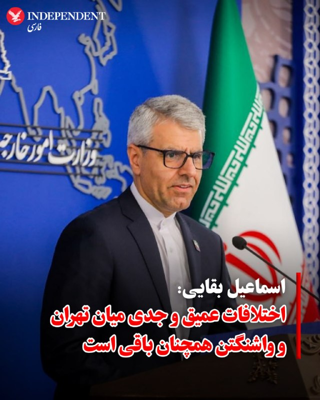

♦️ سخنگوی وزارت امور خارجه جمهوری اسلامی، جمعه‌شب، اول خرداد، اعلام کرد که مذاکرات صلح با ایالات متحده به مرحله «توافق نزدیک» نرسیده و دشوار است که بگوییم آیا توافقی «طی چند هفته یا چند ماه آینده» حاصل خواهد شد یا خیر.

بقایی در گفتگو با صداوسیما تاکید کرد که شکاف‌های موجود میان تهران و واشنگتن «عمیق و جدی» است.

او در این باره گفت: «لزوما نمی‌توانیم بگوییم به نقطه‌ای رسیده‌ایم که توافق نزدیک باشد. تمرکز اصلی این مذاکرات بر پایان دادن به جنگ است و در این مرحله، جزئیات مربوط به مسئله هسته‌ای مورد بحث قرار نمی‌گیرد.»
‌🇸🇦 Indypersian

🤖 @VahidOOnLine

## VahidOOnLine — post 241575

  <a href="telegram/content/VahidOOnLine_241575_1779476431.mp4" target="_blank">🎬 Download video</a>

دو شهروند در پیام‌هایی که با هوش مصنوعی خوانده شده، به ایران اینترنشنال گفتند که قیمت یک پرس قرمه‌سبزی در رستوران‌ها به حدود ۸۰۰ هزار تومان و یک عدد پیتزای دو نفره به بالای دو میلیون تومان رسیده است.
‌🏁 🇬🇧 IranintlTV

🤖 @VahidOOnLine

## VahidOOnLine — post 241574

  <a href="telegram/content/VahidOOnLine_241574_1779476433.mp4" target="_blank">🎬 Download video</a>

دو شهروند در پیام‌هایی که با هوش مصنوعی خوانده شده، به ایران اینترنشنال گفتند که قیمت یک پرس قرمه‌سبزی در رستوران‌ها به حدود ۸۰۰ هزار تومان و یک عدد پیتزای دو نفره به بالای دو میلیون تومان رسیده است.
‌🏁 🇬🇧 IranintlTV

🤖 @VahidOOnLine

## VahidOOnLine — post 241573

  

اسماعیل بقائی، سخنگوی وزارت خارجه جمهوری اسلامی گفت: «در مورد اورانیوم غنی‌شده با درجه بالا، مواضع‌مان را خیلی روشن بیان کرده‌ایم؛ در این مرحله اگر بخواهیم در این مباحث گفت‌وگو کنیم، قاعدتا به نتیجه نمی‌رسیم.»

او افزود: «ما قبلا این مسیر را رفتیم و اختلاف‌نظرها آن‌قدر زیاد بود که نتوانستیم به نتیجه برسیم و طرف مقابل به‌خاطر خواسته‌های نامعقولش میز مذاکرات را از بین برد و حمله کرد.»
‌🏁 🇬🇧 IranintlTV

🤖 @VahidOOnLine

## VahidOOnLine — post 241572

♦️علی خضریان، عضو کمیسیون امنیت ملی و سیاست خارجی مجلس، روز جمعه اول خردادماه در صداوسیما تأکید کرد جمهوری اسلامی ایران در موضوعاتی مانند تنگه هرمز، جبهه مقاومت و خروج مواد هسته‌ای «کوتاه نخواهد آمد» و هیچ مصالحه‌ای را نمی‌پذیرد.
او با انتقاد از سیاست‌های آمریکا گفت واشینگتن با «زیاده‌خواهی» و استفاده از جنگ روانی در فضای رسانه‌ای، به‌دنبال تحمیل شروط خود به ایران است.
خضریان در ادامه با اشاره به فاصله جدی میان مواضع دو طرف، تاکید کرد شرایط فعلی نشان می‌دهد امکان دستیابی به توافق در کوتاه‌مدت وجود ندارد و دو کشور در مسیرهای متفاوتی حرکت می‌کنند.
‌🇸🇦 Indypersian

🤖 @VahidOOnLine

## VahidOOnLine — post 241571

  

♦️ خبرگزاری سی‌ان‌ان به نقل از سه منبع آگاه گزارش داد که تولسی گابارد، مدیر اطلاعات ملی ایالات متحده (DNI)، از سمت خود استعفا می‌دهد.

این منابع اعلام کردند که گابارد به همکارانش اطلاع داده است که علت این تصمیم، مبارزه همسرش با بیماری سرطان است.

به گفته یکی از این منابع، گابارد تصمیم خود را به اطلاع رئیس‌جمهوری دونالد ترامپ رسانده است. با این حال، کاخ سفید و دفتر گابارد هنوز به درخواست‌ها برای اظهار نظر در این باره پاسخی نداده‌اند.
‌🇸🇦 Indypersian

🤖 @VahidOOnLine

## VahidOOnLine — post 241570

  

اسماعیل بقائی، سخنگوی وزارت خارجه جمهوری اسلامی گفت: «اختلاف‌نظر ما با آمریکا آن‌قدر عمیق و زیاد است که نمی‌شود گفت با چندبار رفت‌وآمد یا مذاکرات ظرف چند هفته ما باید حتما به نتیجه برسیم.»

او افزود: «نمی‌توانیم بگوییم ضرورتا به جایی رسیده‌ایم که توافق نزدیک است. تمرکز مذاکرات بر خاتمه جنگ است.»

او در واکنش به سفر عاصم منیر به تهران گفت: «این رفت‌وآمدها باوجود اینکه پرترافیک‌تر شده، تداوم همان روند دیپلماتیک است.»

بقائی ادامه داد: «یک هیئتی از قطر درحال مذاکره با وزیر خارجه کشورمان هستند اما میانجی مذاکرات همچنان طرف پاکستانی است.»
‌🏁 🇬🇧 IranintlTV

🤖 @VahidOOnLine

## VahidOOnLine — post 241569

  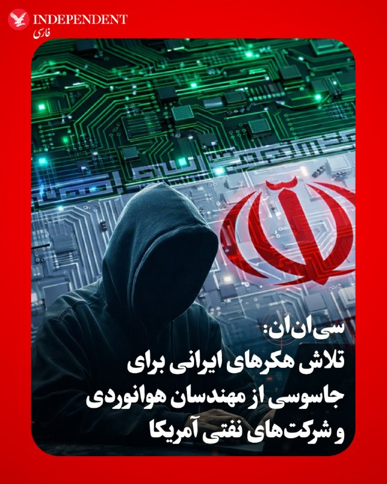

♦️ محققان امنیت سایبری روز جمعه اول خرداد به سی‌ان‌ان گفتند که هکرهای ایرانی در جریان جنگ با آمریکا و اسرائیل، در قالب کارشناسان جذب نیرو (اصطلاحا هد هانتر)، مهندسان نرم‌افزار بخش هوانوردی را در یک طرح جاسوسی پیچیده هدف قرار داده‌اند.

بر اساس گزارش واحد ۴۲ شرکت امنیت سایبری «پالو آلتو نتورکس»، این ماموران سایبری علاوه بر بخش هوانوردی، یک شرکت نفت و گاز آمریکایی و سازمان‌هایی را در اسرائیل و امارات هدف قرار داده‌اند. مقامات اطلاعاتی آمریکا پیش از این درباره این دست تهدیدات نامتقارن پس از حملات اواخر فوریه هشدار داده بودند؛ چرا که نفوذ به این بخش‌ها می‌تواند به جمهوری اسلامی امکان ردیابی فهرست پروازها به خاورمیانه یا درک بهتر وضعیت بازار متلاطم نفت را بدهد.

این شبکه جاسوسی با استفاده از آگهی‌های شغلی جعلی و نرم‌افزارهای جلسات ویدیویی آلوده به کدهای مخرب اجرا شده و در یک مورد، هکرها خود را به جای یک شرکت هواپیمایی آمریکایی جا زده‌اند. با این حال، محققان تاکید کردند که بر اساس داده‌های موجود، هکرها در نفوذ به شرکت‌های نفتی، گازی و هوانوردی آمریکایی مورد هدف موفق نبوده‌اند.
‌🇸🇦 Indypersian

🤖 @VahidOOnLine

## VahidOOnLine — post 241568

  <a href="telegram/content/VahidOOnLine_241568_1779476437.mp4" target="_blank">🎬 Download video</a>

«دلم براتون تنگ میشه اما امید دارم برگردید»
‌🏁 🇬🇧 ManotoTV

🤖 @VahidOOnLine

## VahidOOnLine — post 241567

  

فاکس‌نیوز گزارش داد که تولسی گبرد، مدیر اطلاعات ملی آمریکا از سمت خود استعفا داده است.
او پیش‌تر گفته بود گفت که اهداف تعیین‌شده از سوی ترامپ درباره جنگ با جمهوری اسلامی، با اهداف اسرائیل متفاوت است.

گبرد همچنین گفته بود که حکومت ایران برقرار به نظر می‌رسد، اما در نتیجه عملیات نظامی آمریکا به‌طور گسترده تضعیف شده است.
‌🏁 🇬🇧 IranintlTV

🤖 @VahidOOnLine

## VahidOOnLine — post 241566

  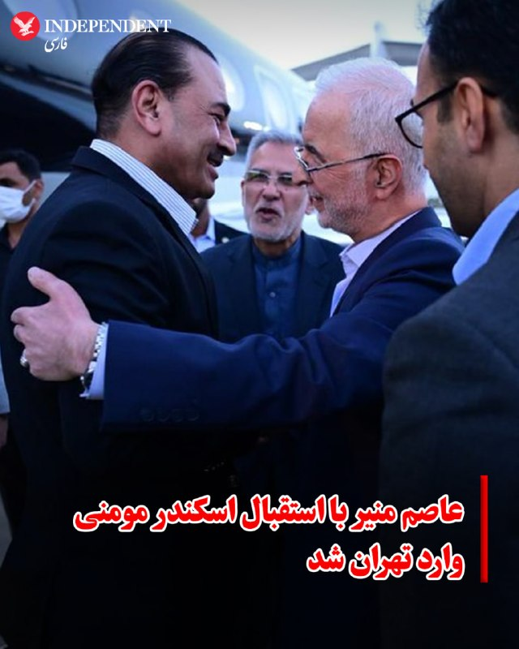

♦️ عاصم منیر، فرمانده کل ارتش پاکستان، عصر جمعه اول خرداد، به تهران وارد شد و از سوی اسکندر مومنی، وزیر کشور، مورد استقبال قرار گرفت. این سفر از پیش از سوی منابع دیپلماتیک اعلام شده بود اما پاکستان تا پیش از رسیدن منیر به تهران، حرکت او را تایید نکرده بود.

همزمان با منیر، محسن نقوی، وزیر کشور پاکستان نیز در تهران حضور دارد و انتظار می‌رود اختلافات میان تهران و واشنگتن برای امضای تفاهم‌نامه اولیه برای شروع مذاکرات، موضوع اصلی گفتگوهای منیر با مقام‌های جمهوری اسلامی باشد.
‌🇸🇦 Indypersian

🤖 @VahidOOnLine

## VahidOOnLine — post 241565

  <a href="telegram/content/VahidOOnLine_241565_1779476440.mp4" target="_blank">🎬 Download video</a>

رییس اورژانس پیش‌بیمارستانی و مدیریت حوادث دانشگاه علوم پزشکی البرز اعلام کرد بر اثر تصادف زنجیره‌ای در آزادراه کرج قزوین، سه نفر جان باختند و چهار نفر دیگر مجروح شدند.
به گزارش رسانه‌های داخلی، در این سانحه دو مرد و یک زن کشته شدند و سه مرد و یک زن دیگر نیز مجروح شدند.
مصدومان توسط نیروهای اورژانس به بیمارستان امام جعفر صادق نظرآباد منتقل شدند.
‌🏁 🇬🇧 ManotoTV

🤖 @VahidOOnLine

## WithYashar — post 12007

اکسیوس : ترامپ عصر امروز (به تایم امریکا)پس از یک سخنرانی برنامه‌ریزی شده در نیویورک به کاخ سفید باز خواهد گشت و آخره هفته در کاخ سفید میماند
@withyashar

## WithYashar — post 12006

مقام آمریکایی به اکسیوس:
مذاکرات بسیار دست و پا گیر است و پیش نویس‌ها هر روز بدون پیشرفت زیادی به این سو و آن سو می‌روند.
@withyashar

## WithYashar — post 12005

## WithYashar — post 12004

## WithYashar — post 12003

  

2300ton یا ۴۵۰۰$ 🥲😭

## WithYashar — post 12002

https://t.me/boost/withyashar ۵۰۰ بوست لازم داریم 😭🥲

## WithYashar — post 12001

https://t.me/boost/withyashar

۵۰۰ بوست لازم داریم 😭🥲

## WithYashar — post 12000

  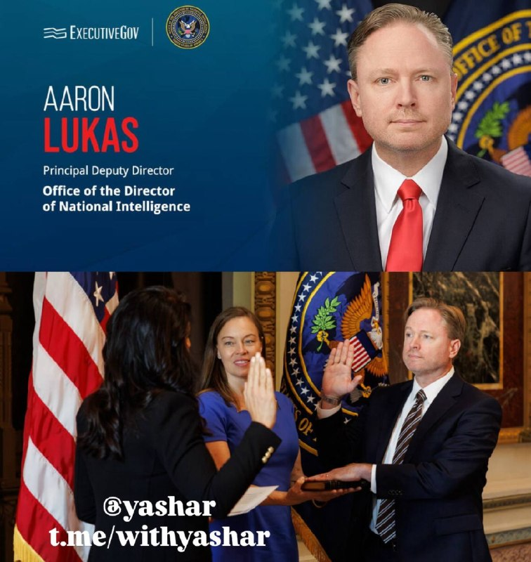

«دونالد ترامپ» اعلام کرد «آرون لوکاس» به عنوان مدیر موقت اطلاعات ملی منصوب شد.
@withyashar

## WithYashar — post 11999

سخنگوی وزارت خارجه اسمائیل باقری : یک هیئتی از قطر درحال مذاکره با وزیر خارجه کشورمان هستند اما میانجی مذاکرات همچنان طرف پاکستانی است
نمی‌توانیم بگوییم که به نقطه‌ای رسیده‌ایم که توافق نزدیک است؛ خیر، اینطور نیست.
تفاوت‌ها بین ایران و آمریکا آنقدر عمیق و متعدد است که نمی‌توان گفت با چند دور رفت و برگشت یا مذاکرات در چند هفته حتماً باید به نتیجه برسیم.
تمرکز این مذاکرات بر پایان جنگ است و در این مرحله، بحثی درباره مسائل مرتبط با موضوعات هسته‌ای نخواهد بود. مسائلی مانند «پایان جنگ در همه جبهه‌ها، وضعیت تنگه هرمز و پایان دزدی دریایی آمریکا» هنوز در حال بحث است.
موضوع مذاکرات هسته‌ای بسیار روشن است؛ ما عضو معاهده ان‌پی‌تی هستیم و حق استفاده از انرژی هسته‌ای برای اهداف صلح‌آمیز را داریم.
@withyashar

## WithYashar — post 11998

پرزیدنت ترامپ سفر خود به باشگاه ملی گلف ترامپ را هم لغو کرد و در آخر هفته در کاخ سفید خواهد ماند.
@withyashar

## WithYashar — post 11997

رویترز: کاخ سفید گابارد را مجبور به استعفا کرد

درحالی‌که ترامپ استعفای تولسی گابارد از سمت مدیر اطلاعات ملی آمریکا را به بیماری همسرش مرتبط کرده، خبرگزاری رویترز به نقل از منابعی نوشته کاخ سفید او را مجبور به استعفا کرده است.

گابارد در سمت مدیر اطلاعات ملی نظارت بر ۱۷ دستگاه اطلاعاتی آمریکا را برعهده داشت.
او چندی پیش هنگام ارائهٔ گزارش ارزیابی سالانهٔ تهدیدها علیه آمریکا نظراتی دربارهٔ ایران داشت که به مذاق ترامپ خوش نیامده بود.
محورهای اصلی اختلاف‌نظر گابارد با ترامپ دربارهٔ ایران چه بود
گابارد در کنگره صراحتاً اعلام کرد که ایران پس از حملات پیشین، تلاشی برای بازسازی برنامهٔ هسته‌ای خود نکرده است.
او همچنین از تایید اینکه ایران یک تهدید نظامی فوری علیه خاک آمریکاست خودداری کرد.
@withyashar

## WithYashar — post 11996

## WithYashar — post 11995

## WithYashar — post 11994

تحلیلت دست مریزاد داره واقعا❤️🔥 حتی اگه در آخر اینطوری نشه باتوجه به داده های موجود تحلیل واقعا عالی بوده

## WithYashar — post 11993

تحلیلت دست مریزاد داره واقعا❤️🔥
حتی اگه در آخر اینطوری نشه
باتوجه به داده های موجود
تحلیل واقعا عالی بوده

## WithYashar — post 11992

ولی اگه بخواهیم عقلانی بررسی کنیم این هفته احتمال حمله ۲۰٪ هست در صورتی که هفته دیگه ۸۰٪ ولی ترامپ هم اهل این حرف ها نیست و همیشه وسط مذاکره لحظه ای که همه فکر میکنن توافق شکل گرفته میزنه !
@withyashar

## WithYashar — post 11991

ترامپ دیدن رسما دقایقی پیش گفت که عروسی پسر ارشدش هم نمیره و برای‌ مسئله ایران کاخ سفید میمونه دست به ماشه ! دوشنبه امریکا تعطیل رسمی هست و این آخر هفته مارکت ۱ روز‌ بیشتر تعطیله و خیلی خاصش کرده !
@withyashar

## WithYashar — post 11990

پس رو کاغذ نشانه ها این رو نشون میدن حمله هفته دیگه انجام میشه و اینا یه پیش نویسی از مذاکره حتی شاید بنویسن ! ولی این چیزی‌ از عرزش های امشب ‌کم نمیکنه ! امشب بسیار روز مناسبی هست برای ترامپ ! و قانونی هم آتش بس تمام شده !
@withyashar

## WithYashar — post 11989

الان این ۹ مورد که میگن اینه ! خود سپاه این هفته آماد‌ه باش نیست و خیالش راحته خیلی هم مطمعن!
حالا هم آب و هوا هست هم وحیدی و هم حج !!! آمریکا داره یک تیر و چند نشان میزنه !
@withyashar

## WithYashar — post 11988

ادعای العربیه درمورد پیش‌نویس نهایی توافق مورد انتظار بین آمریکا و ایران که طی ساعات آینده برای توقف جنگ در همه جبهه‌ها تنظیم می‌شود: ۱. توقف کامل، فوری و بی‌قیدوشرط آتش‌بس در همه جبهه‌ها (زمینی، دریایی و هوایی). ۲. تعهد دو طرف به عدم هدف‌گیری هرگونه تأسیسات…

## mwarmonitor — post 9501

🔴« یک منبع ایرانی مسئول به الجزیره: توقف جنگ در تمامی جبهه‌ها پیش‌شرط و راه ورود اصلی برای صحبت درباره هرگونه مذاکره آینده است.»

🔸«هنوز هیچ توافق نهایی‌ای وجود ندارد و تلاش‌ها برای کاهش اختلافات میان تهران و واشنگتن ادامه دارد.»

🔹« فضای مثبت همراه با تحرکات دیپلماتیک مهم است، اما برای رسیدن به یک توافق واقعی کافی نیست.»

@mwarmonitor

## mwarmonitor — post 9500

🔴«مقام آمریکایی به آکسیوس: مذاکرات بسیار فرسایشی و خسته‌کننده است و پیش‌نویس‌ها به‌طور روزانه رفت و برگشت می‌شوند، بدون اینکه پیشرفت قابل توجهی حاصل شود.

🔸رئیس‌جمهور آمریکا طی چند روز گذشته احساس نارضایتی و ناامیدی فزاینده‌ای داشته است.

🔹رئیس‌جمهور احتمال اجرای یک عملیات نظامی بزرگ و نهایی را مطرح کرده و سپس اعلام پیروزی و پایان دادن به جنگ را در نظر دارد.»

@mwarmonitor

## mwarmonitor — post 9498

🔸«ایران ایده اینکه توافق “نزدیک” است را رد می‌کند و تهدیدهای آمریکا برای حمله در صورت عدم دستیابی به توافق در این آخر هفته را نادیده می‌گیرد.

🔹“ما نمی‌توانیم بگوییم که حتماً طی چند هفته یا چند ماه و با چند سفر یا مذاکره به نتیجه خواهیم رسید.” – رسانه دولتی ایران IRNA»

@mwarmonitor

## mwarmonitor — post 9497

🔴«آلکس مارکوارت، خبرنگار ارشد امنیت ملی سابق CNN می‌گوید جزئیاتی از پیشنهاد آمریکا به ایران را به دست آورده است:

🔸یک یادداشت تفاهم که شامل حجم زیادی از کمک‌های مالی و تسهیلات اقتصادی برای ایران است، در ازای توافق برای آغاز مذاکرات.»

@mwarmonitor

## mwarmonitor — post 9496

🔴سناتور راجر ویکر (جمهوری‌خواه از می‌سی‌سی‌پی)، رئیس کمیته نیروهای مسلح سنا، روز جمعه از رئیس‌جمهور دونالد ترامپ خواست حملات علیه ایران را از سر بگیرد تا «کاری را که شروع کرده‌ایم تمام کنیم» — و مدعی شد که به رئیس‌جمهور «مشاوره نادرست» داده شده است تا به دنبال…

## mwarmonitor — post 9495

🚨« یک حادثه امنیتی در پایگاه هوایی-دریایی پنساکولا در ایالت فلوریدای آمریکا رخ داده است.»

@mwarmonitor

## mwarmonitor — post 9494

  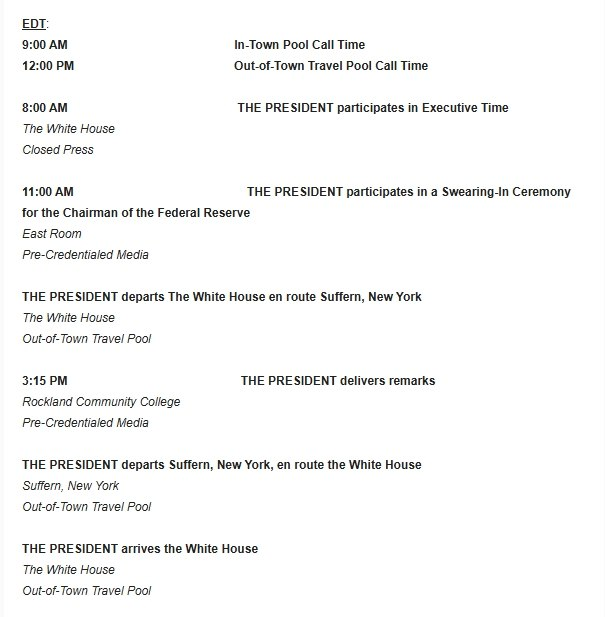

🗒بر اساس برنامه به‌روزشده، دونالد ترامپ سفر خود به باشگاه گلف «ترامپ نشنال گلف کلاب بدمینستر» را لغو کرده و در عوض آخر هفته را در کاخ سفید سپری خواهد کرد.

@mwarmonitor

## mwarmonitor — post 9493

🔴سناتور راجر ویکر (جمهوری‌خواه از می‌سی‌سی‌پی)، رئیس کمیته نیروهای مسلح سنا، روز جمعه از رئیس‌جمهور دونالد ترامپ خواست حملات علیه ایران را از سر بگیرد تا «کاری را که شروع کرده‌ایم تمام کنیم» — و مدعی شد که به رئیس‌جمهور «مشاوره نادرست» داده شده است تا به دنبال توافقی برای پایان دادن به جنگ برود. نیویورک پست

@mwarmonitor

## mwarmonitor — post 9492

🔸بقایی: تمرکز مذاکرات بر خاتمه جنگ است

سخنگوی وزارت خارجه:
🔹نمی‌توانیم بگوییم ضرورتا به جایی رسیده‌ایم که توافق نزدیک است.

🔹تمرکز مذاکرات بر خاتمه جنگ است.

@mwarmonitor

## mwarmonitor — post 9491

  

در حالی که بسیار مشتاق بودم در کنار پسرم، دان جونیور، و جدیدترین عضو خانواده ترامپ، یعنی همسر آینده‌اش، بتینا باشم، اما شرایط مربوط به دولت و عشق من به ایالات متحده آمریکا، این اجازه را به من نمی‌دهد. احساس می‌کنم لازم است در این بازه زمانی مهم، در واشنگتن دی.سی. و در کاخ سفید بمانم.
تبریک به دان و بتینا!

رئیس‌جمهور دونالد جی. ترامپ

@mwarmonitor

## mwarmonitor — post 9490

🔴 یک گزارش پاکستانی به نقل از منبعی در وزارت امور خارجه این کشور مدعی است که آمریکا و ایران در مسائل کلیدی انعطاف نشان نمی‌دهند و سفر فرمانده ارتش پاکستان به ایران، تلاشی «در آخرین لحظه» برای جلوگیری از آغاز دوباره جنگ است.» i24

@mwarmonitor

## mwarmonitor — post 9489

🚨«فوری | [Fox News] تولسی گبرد، مدیر اطلاعات ملی ایالات متحده آمریکا، استعفا داد.»

@mwarmonitor

## mwarmonitor — post 9488

🔴«فرمانده کل ارتش پاکستان، عاصم منیر، در چارچوب تلاش‌های میانجی‌گری برای دستیابی به توافقی جهت پایان دادن به جنگ میان ایالات متحده آمریکا و ایران، وارد تهران شد.» @mwarmonitor

## mwarmonitor — post 9487

  

✈️بله تایید میشود @mwarmonitor

## FoxNewsTwitter — post 342131

  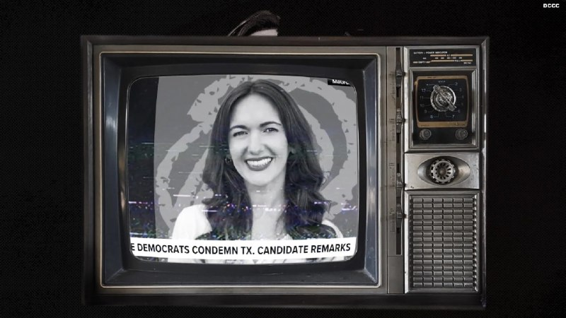

Fox News (Twitter/X)

NEW: Democrats are turning on their own congressional candidate in Texas.

The DCCC is now running ads against Maureen Galindo after backlash exploded over comments she made suggesting “American Zionists” should be sent to detention facilities.

Party leaders are increasingly distancing themselves from Galindo and condemning her comments despite her finishing first in the Democratic primary earlier this year.

Now national Democrats are spending money to stop her before the upcoming runoff election.

## FoxNewsTwitter — post 342130

  <a href="telegram/content/FoxNewsTwitter_342130_1779476444.mp4" target="_blank">🎬 Download video</a>

Fox News (Twitter/X)

BREAKING: 911 audio reveals Kyle Busch was overheating and coughing up blood before his death.

According to the audio, Busch was lying on a bathroom floor struggling to breathe and telling others he felt like he was going to pass out.

“I’ve got an individual that’s shortness of breath, very hot, thinks he’s going to pass out and is producing a little bit of blood — coughing up some blood,” the caller told dispatchers. | @SandraSmithFox @AmericaRpts

## FoxNewsTwitter — post 342129

  <a href="telegram/content/FoxNewsTwitter_342129_1779476446.mp4" target="_blank">🎬 Download video</a>

Fox News (Twitter/X)

A Georgia handyman swapped his car for a pink Barbie toy car to beat rising gas prices.

Mali Hightower pulled a broken Power Wheels Dream Camper out of the trash and installed a small gas engine from a power washer to give him an alternative to speed around town in instead of his usual mode of transportation.

His 1996 Mercedes-Benz convertible typically costs about $90 to fill.

The tiny pink vehicle tops out around 35 mph and is now turning heads everywhere he goes as Americans search for cheaper ways to get around.

## FoxNewsTwitter — post 342128

  

Fox News (Twitter/X)

BREAKING: President Trump says Principal Deputy Director of National Intelligence, Aaron Lukas, will serve as Acting Director of National Intelligence after Tulsi Gabbard's resignation.

## FoxNewsTwitter — post 342127

  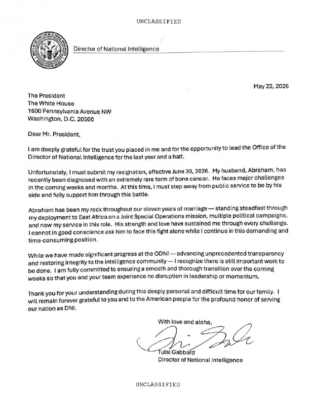

Fox News (Twitter/X)

READ IT: Director of National Intelligence Tulsi Gabbard submits her formal letter of resignation to President Trump, announcing she will be stepping down from her post after a year and a half leading the nation's intelligence community.

Gabbard informed the President of her decision during an Oval Office meeting on Friday, revealing that her husband has been diagnosed with an aggressive health battle.

Her final day leading the Office of the DNI will be June 30, 2026.

## FoxNewsTwitter — post 342126

  

Fox News (Twitter/X)

NEW: House Oversight Chairman James Comer is opening an investigation into whether users on Polymarket and Kalshi used nonpublic information to profit from prediction markets.

In letters sent to Polymarket CEO Shayne Coplan and Kalshi CEO Tarek Mansour, Comer says the Committee is examining potential insider trading tied to online betting platforms and whether users may have bypassed U.S. regulations through offshore access.

“Internal records held by prediction market platforms are the only means by which bad actors can be identified,” Comer wrote while demanding documents on user verification, geographic restrictions, and suspicious trading activity.

## FoxNewsTwitter — post 342125

  

Fox News (Twitter/X)

BREAKING: President Trump announces he will NOT attend his son Don Jr.'s wedding, saying government matters and his "love for the United States of America" are too important for him to leave the White House during this "important period of time."

"While I very much wanted to be with my son, Don Jr., and the newest member of the Trump Family, his soon to be wife, Bettina, circumstances pertaining to Government, and my love for the United States of America, do not allow me to do so."

## FoxNewsTwitter — post 342124

Fox News (Twitter/X)

Gabbard is resigning to support her husband through his battle with "an extremely rare form of bone cancer," Fox News Digital learned. She notified President Donald Trump during a meeting in the Oval Office Friday.

## FoxNewsTwitter — post 342123

  <a href="telegram/content/FoxNewsTwitter_342123_1779476450.mp4" target="_blank">🎬 Download video</a>

Fox News (Twitter/X)

BREAKING: Tulsi Gabbard has notified President Trump that she is resigning from her post as Director of National Intelligence.

Gabbard says she is leaving the administration to support her husband through his battle with “an extremely rare form of bone cancer,” Fox News Digital has exclusively learned.

Her final day in the post will be June 30, 2026. | @davidspunt

## FoxNewsTwitter — post 342122

‌Fox News (Twitter/X)

Read more about her departure from Trump's Cabinet:

## FoxNewsTwitter — post 342121

  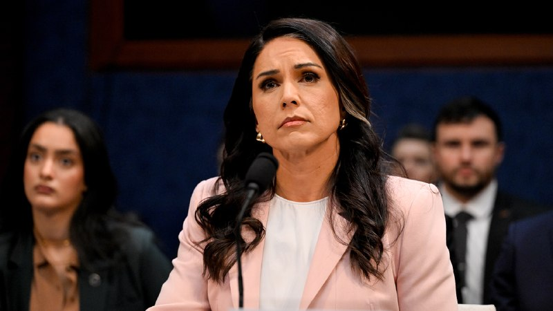

Fox News (Twitter/X)

BREAKING NEWS: Tulsi Gabbard is resigning as director of national intelligence

## FoxNewsTwitter — post 342117

Fox News (Twitter/X)

BREAKING: Kevin Warsh has officially been sworn in as the new Chairman of the Federal Reserve by Supreme Court Justice Clarence Thomas.

Warsh marked the moment by signaling the pressure and expectations now facing the central bank.

“After we leave this stage, the real work begins. So let’s begin that work."

## pm_afshaa — post 91223

  <a href="telegram/content/pm_afshaa_91223_1779476452.webm" target="_blank">🎬 Download video</a>

🔴مقام آمریکایی به اکسیوس:
مذاکرات بسیار دست و پا گیر است و پیش نویس‌ها هر روز بدون پیشرفت زیادی به این سو و آن سو می‌روند.

💧 Rainbet.com the #1 Non-KYC Crypto Casino & Sportsbook @rainbetcom

😁 @Pm_Afshaa

## pm_afshaa — post 91222

  <a href="telegram/content/pm_afshaa_91222_1779476452.webm" target="_blank">🎬 Download video</a>

🔴سخنگوی وزارت خارجه جمهوری اسلامی:
اختلاف نظر جمهوری اسلامی و آمریکا با چند بار رفت‌وآمد حل نمیشه.

💧 Rainbet.com the #1 Non-KYC Crypto Casino & Sportsbook @rainbetcom

😁 @Pm_Afshaa

## pm_afshaa — post 91221

  

ترامپ: با اینکه خیلی میخواهم در کنار پسرم برای مراسم عروسی باشم اما حس میکنم که مهم است در واشنگتن و کاخ سفید در طی زمان مهم پیش رو در روز شنبه و یکشنبه بمانم

💧 Rainbet.com the #1 Non-KYC Crypto Casino & Sportsbook @rainbetcom

😁 @Pm_Afshaa

## pm_afshaa — post 91220

من که میدونم همه اینا برا کشیدن وحیدی بیرونه😁

## pm_afshaa — post 91219

من که میدونم همه اینا برا کشیدن وحیدی بیرونه😁

## pm_afshaa — post 91218

🔴تولسی گبرد، مدیر اطلاعات ملی ایالات متحده آمریکا، استعفا داد

💧 Rainbet.com the #1 Non-KYC Crypto Casino & Sportsbook @rainbetcom

😁 @Pm_Afshaa

## pm_afshaa — post 91217

🔴رئیس کمیته نیروهای مسلح سنای آمریکا: ترامپ باید به ارتش اجازه دهد تا انهدام توانمندی‌های نظامی ایران را تکمیل کند

💧 Rainbet.com the #1 Non-KYC Crypto Casino & Sportsbook @rainbetcom

😁 @Pm_Afshaa

## pm_afshaa — post 91216

  <a href="telegram/content/pm_afshaa_91216_1779476453.webm" target="_blank">🎬 Download video</a>

🔴العربیه الجدید به نقل از منبعی در وزارت خارجه پاکستان: واشنگتن و تهران انعطاف کافی در پرونده‌های اصلی از خود نشان نمیده.

سفر فرمانده ارتش پاکستان به تهران ممکنه آخرین تلاش برای جلوگیری از بازگشت منطقه به جنگ باشه.

💧 Rainbet.com the #1 Non-KYC Crypto Casino & Sportsbook @rainbetcom

😁 @Pm_Afshaa

## iaghapour — post 2626

اکانت‌های هوش مصنوعی رو با یک‌دهم قیمت بخر 
🛍

🏳️‍🌈 Gemini Pro:
(گزینه‌ی اقتصادی)

- پلن مشابه GPT Plus از شرکت گوگل
- پشتیبانی از Antigravity
- ساخت عکس و ویدیوی فارسی
- تجزیه‌ و تحلیل و تحقیق عمیق
- فعال‌سازی روی ایمیل شما (اتوماتیک)
- کاملا اختصاصی (فمیلی نیست)

🌐 Kiro.dev Pro
(جایگزین اقتصادی Claude)

- ایجنت برنامه‌نویسی شرکت آمازون
- پشتیبانی از تمامی مدل‌های Claude
- ارزان، اقتصادی و باکیفیت
- مناسب فقط برنامه‌نویسان

خرید و توضیحات بیشتر از ربات:

🤖 @ChatGPT_StoreBOT

* اکانت هتزنر هم داخل ربات موجوده

## iaghapour — post 2625

  

⭕️ معرفی پروژه XPlex؛ راه‌حل هوشمندانه برای جلوگیری از قطعی و پکت‌لاس کانفیگ

اگر از کانفیگ‌های v2ray استفاده می‌کنید و پایداری اینترنت در کارهای حساسی مثل آزمون‌های آنلاین، جلسات ویدیویی یا ریموت‌ورک برای شما حیاتی است، پروژه جدید XPlex یک راه‌حل فنی و کاربردی برای شما دارد.

منطق این اسکریپت ساده اما بسیار کارآمد است و به شما کمک می‌کند تا یک اتصال بدون قطعی را تجربه کنید:

🔹 استفاده هم‌زمان از چند کانفیگ: منطق کلیدی این پروژه این است که اگر چند کانفیگ v2ray داشته باشید، اسکریپت به صورت هم‌زمان از آن‌ها استفاده می‌کند و ترافیک شما را روی کانفیگی می‌اندازد که کمترین پینگ ممکن را دارد.

🔸 خداحافظی با پکت‌لاس و تایم‌اوت: این ابزار برای افرادی که کارهای حساسی دارند و ثانیه‌ها برایشان مهم است طراحی شده؛ مثل شرکت‌کنندگان در آزمون‌های آیلتس آنلاین، جلسات کاری با خارج از کشور و...

🔹 هزینه مصرف حجم: باید توجه داشته باشید که به دلیل ماهیت کارکرد این ابزار، مصرف ترافیک و حجم v2ray شما تقریباً دو برابر خواهد شد که بهای به دست آوردن یک اینترنت کاملاً پایدار است.

🔗 اطلاعات بیشتر در گیت‌هاب پروژه

🆔 @iaghapour

## DEJradio — post 4855

  <a href="telegram/content/DEJradio_4855_1779476454.webm" target="_blank">🎬 Download video</a>

🚨📢 مارک روته دبیرکل ناتو اعلام کرد که آمریکا می‌تواند در عملیات‌های نظامی خود علیه جمهوری اسلامی از پایگاه‌های این سازمان در اروپا استفاده کند.

روته روز آدینه ابتدای خرداد در جریان نشست اعضای این سازمان که در سوئد برگزار شد گفت، به عنوان یک اتحاد غربی-اروپایی، ما می‌توانیم به ایالات متحده آمریکا در تلاش‌هایش برای بازگرداندن آزادی دریانوردی در تنگه هرمز کمک کنیم.

روته افزود، چندین کشور اروپایی تمایل خود را برای مشارکت در تلاش‌ها برای بازگشایی تنگه هرمز و تضمین آزادی دریانوردی ابراز کرده‌اند.

او ادامه داد: «این نه تنها برای متوازن کردن هزینه‌هایی است که با ایالات متحده انجام می‌دهیم، بلکه برای اطمینان یافتن آنچه برای دفاع قاطعانه در برابر دشمنانمان نیاز داریم، لازم است.»

#جنگ
@DEJradio

## DEJradio — post 4854

⭕️ روبیو گفت اولویت ترامپ دیپلماسی است، اما باید برای گزینه‌های دیگر هم آماده بود

مارکو روبیو، وزیر امور خارجۀ ایالات متحده روز آدینه گفت دونالد ترامپ همچنان مسیر دیپلماسی را ترجیح می‌دهد، اما آمریکا باید برای گزینه‌های دیگر نیز آماده باشد.
به گفتۀ روبیو، جلوگیری از دستیابی جمهوری اسلامی به سلاح هسته‌ای، تحویل همۀ ذخایر اورانیوم غنی‌شده و بازگشایی تنگۀ هرمز، از اصول خلل‌ناپذیر واشینگتن در مذاکره با تهران است.

#مارکو_روبیو
@DEJradio

## DEJradio — post 4853

⭕️ موضوع ایران نمی‌گذارد ترامپ به مراسم ازدواج پسرش برود

دونالد ترامپ گفت درگیری با موضوع جمهوری اسلامی برنامه‌هایش را پیچیده کرده و نمی‌گذارد در مراسم ازدواج پسرش شرکت کند.
رئیس‌ جمهوری آمریکا در دفتر بیضی کاخ سفید به خبرنگاران گفت: پسرم دوست دارد من در مراسم باشم… اما الان درگیر ایران و مسائل دیگر هستم.
مراسم ازدواج ترامپ جونیور قرار است در پایان این هفته در باهاما برگزار شود.

#ترامپ
@DEJradio

## DEJradio — post 4852

⭕️ رویترز: یک هیئت قطری با هماهنگی آمریکا وارد تهران شد

خبرگزاری رویترز به نقل از یک منبع آگاه گزارش داد یک تیم مذاکره‌کنندۀ قطری روز آدینه با هماهنگی ایالات متحده وارد تهران شد.
بر اساس این گزارش، هدف از این سفر کمک به دستیابی به توافقی برای پایان جنگ و حل مسائل باقی‌مانده میان جمهوری اسلامی و آمریکا عنوان شده است.
قطر پیش از نیز در کنار ترکیه و مصر، برای دستیابی به توافق و ممانعت از حملۀ آمریکا به جمهوری اسلامی، تلاش کرده بود.

#قطر #مذاکرات
@DEJradio

## DEJradio — post 4851

⭕️ اسماعیل بقائی سخنگوی هیئت مذاکره‌کنندۀ تهران با واشینگتن شد

محمدباقر قالیباف، رئیس هیئت مذاکره‌کنندۀ جمهوری اسلامی با آمریکا، اسماعیل بقائی، سخنگوی وزارت خارجه را به عنوان سخنگوی این هیئت منصوب کرد.
این انتصاب در حالی انجام شده که طی روزهای اخیر با میانجی‌گری پاکستان، گفت‌وگوهایی فشرده‌ میان تهران و واشینگتن در جریان بود.

#مذاکرات
@DEJradio

## DEJradio — post 4850

⭕️ اتحادیۀ اروپا روند تحریم جمهوری اسلامی با موضوع تنگۀ هرمز را سرگرفت

اتحادیه اروپا اعلام کرد کشورهای عضو این نهاد روز آدینه روند اعمال تحریم علیه مقام‌های جمهوری اسلامی و دیگر افراد مرتبط با بستن تنگۀ هرمز را سرگرفته‌اند.
شورای اتحادیۀ اروپا افزود از این پس، این اتحادیه می‌تواند در واکنش به اقداماتی که آزادی کشتیرانی در تنگۀ هرمز را مختل می‌کند، تحریم‌ و محدودیت‌ بیشتری را علیه جمهوری اسلامی اعمال کند.

#تنگه_هرمز #اتحادیه_اروپا #تحریم
@DEJradio

## VahidOnline — post 75628

  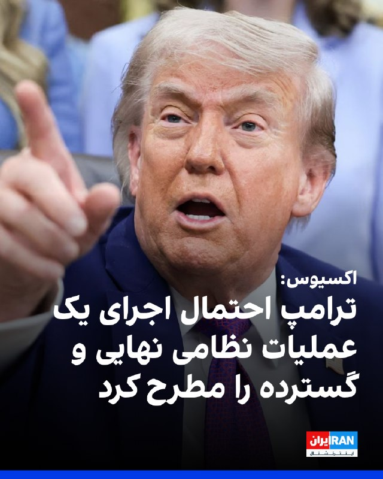

اکسیوس به نقل از یک منبع نزدیک به ترامپ نوشت که رییس‌جمهوری آمریکا در روزهای اخیر به‌طور فزاینده‌ای کلافه شده و احتمال انجام یک عملیات نظامی نهایی و گسترده را مطرح کرده است؛ عملیاتی که پس از آن بتواند اعلام پیروزی کرده و به جنگ پایان دهد.
@VahidOOnLine

📡 @VahidOnline

## VahidOnline — post 75627

  

سخنگوی هیئت مذاکره‌کننده ایران با آمریکا روز جمعه گفت که موضوع پرونده هسته‌ای ایران در این مرحله مورد مذاکره نیست و از اختلاف نظر عمیق با آمریکا خبر داد.

اسماعیل بقائی گفت: «اختلاف‌نظرها بین ایران و آمریکا آن‌قدر عمیق و زیاد است که نمی‌شود گفت با چندبار رفت‌وآمد یا مذاکرات ظرف چند هفته ما باید حتماً به نتیجه برسیم.»

او گزارش‌ها درباره قریب‌الوقوع بودن توافق با آمریکا را رد کرد و اعلام کرد: «نمی‌توانیم بگوییم ضرورتاً به جایی رسیده‌ایم که توافق نزدیک است.»

بقائی بار دیگر موضع جمهوری اسلامی درباره برنامه هسته‌ای و اورانیوم غنی‌شده را تکرار کرد و گفت مواضع ایران قبلاً اعلام شده است.
@VahidHeadline

📡 @VahidOnline

## VahidOnline — post 75626

  

تصویری از عاصم منیر، فرمانده ارتش پاکستان که امروز جمعه یکم خرداد۱۴۰۵ وارد تهران شد و مورد استقبال اسکندر مومنی وزیر کشور قرار گرفت. خبرگزاری آسوشیتدپرس پاکستان نیز به نقل از منابع امنیتی اعلام کرده‌اند که عاصم منیر در طول این سفر رسمی، درباره «مذاکرات جاری ایران و آمریکا و صلح و ثبات منطقه‌ و منافع دوجانبه دیگر» با مقام‌های ایران گفت‌و‌گو خواهد کرد.
@VahidHeadline

📡 @VahidOnline

## VahidOnline — post 75625

  

«فاکس نیوز»: تولسی گابارد از پست خود به عنوان مدیر اطلاعات ملی آمریکا استعفا کرد.
AlArabiya_Fa
پست ترامپ، ترجمه ماشین:
متأسفانه تولسی گبرد، پس از آنکه عملکردی بسیار خوب داشت، روز ۳۰ ژوئن دولت را ترک خواهد کرد. همسر فوق‌العاده او، آبراهام، به‌تازگی به نوعی نادر از سرطان استخوان مبتلا شده و او، به‌درستی، می‌خواهد در کنار همسرش باشد و در حالی که این نبرد دشوار را با هم پشت سر می‌گذارند، به بازگشت او به سلامتی کمک کند. تردیدی ندارم که او به‌زودی بهتر از همیشه خواهد شد.

تولسی کار فوق‌العاده‌ای انجام داده و دلمان برای او تنگ خواهد شد. معاون اصلی و بسیار محترم او در دفتر مدیر اطلاعات ملی، آرون لوکاس، به‌عنوان سرپرست مدیر اطلاعات ملی خدمت خواهد کرد.

رئیس‌جمهور دونالد جی. ترامپ
realDonaldTrump
متن استعفانامه، ترجمه ماشین:

آقای رئیس‌جمهور عزیز،

از اعتمادی که به من کردید و از فرصتی که برای رهبری دفتر مدیر اطلاعات ملی در یک سال و نیم گذشته در اختیارم گذاشتید، عمیقاً سپاسگزارم.

متأسفانه باید استعفای خود را، با اثرگذاری از ۳۰ ژوئن ۲۰۲۶، تقدیم کنم. همسرم، آبراهام، به‌تازگی به نوعی بسیار نادر از سرطان استخوان مبتلا شده است. او در هفته‌ها و ماه‌های پیش رو با چالش‌های بزرگی روبه‌رو خواهد بود. در این مقطع، باید از خدمت عمومی کناره‌گیری کنم تا در کنارش باشم و در این نبرد به‌طور کامل از او حمایت کنم.

آبراهام در تمام یازده سال زندگی مشترکمان تکیه‌گاه من بوده است؛ از مأموریتم در شرق آفریقا در یک عملیات مشترک نیروهای ویژه، تا چندین کارزار سیاسی، و اکنون نیز در دوران خدمتم در این جایگاه، استوار کنارم ایستاده است. قدرت و عشق او مرا در هر چالشی سرپا نگه داشته است. وجدانم اجازه نمی‌دهد از او بخواهم در حالی که من همچنان در این سمت دشوار و وقت‌گیر هستم، این مبارزه را به‌تنهایی پشت سر بگذارد.

هرچند ما در دفتر مدیر اطلاعات ملی پیشرفت‌های چشمگیری داشته‌ایم — از جمله پیشبرد شفافیتی بی‌سابقه و بازگرداندن یکپارچگی و درستکاری به جامعه اطلاعاتی — اما اذعان دارم که هنوز کارهای مهمی برای انجام دادن باقی مانده است. من کاملاً متعهد هستم که در هفته‌های پیش رو انتقالی روان و کامل را تضمین کنم تا شما و تیم‌تان هیچ اختلالی در رهبری یا روند کار تجربه نکنید.

از درک شما در این مقطع عمیقاً شخصی و دشوار برای خانواده‌مان سپاسگزارم. تا همیشه از شما و مردم آمریکا به‌خاطر افتخار بزرگی که خدمت به کشورمان در مقام مدیر اطلاعات ملی برایم داشت، سپاسگزار خواهم بود.

خبر یک ماه و نیم پیش:
ترامپ قصد داشت گابارد را اخراج کند

به گزارش وب‌سایت آکسیوس، دونالد ترامپ تا آستانه اخراج تولسی گابارد، مدیر اطلاعات ملی آمریکا، پیش رفته بود، اما مداخله لحظه آخری راجر استون، مشاور قدیمی و نزدیک او، مانع از این اتفاق شد.
دلیل خشم ترامپ به شهادت اخیر گابارد در کنگره بازمی‌گردد؛ جایی که او برخلاف انتظار، از جنگ با ایران حمایت تمام‌عیار نکرد.
طبق گفته منابع آگاه، ترامپ از اینکه گابارد در اظهاراتش اعلام کرده بود برنامه هسته‌ای ایران پیش از آغاز جنگ «منهدم» شده بود (موضعی که توجیهات ترامپ برای حمله را تضعیف می‌کرد)، به شدت ناراضی بود.
همچنین استعفای اعتراضی جو کنت، دستیار گابارد که جنگ را غیرضروری خوانده بود، بر آتش خشم ترامپ افزود.
در حالی که ترامپ در حال نظرسنجی از مشاورانش برای جایگزینی گابارد بود و وفاداری او را زیر سؤال می‌برد، راجر استون در تماسی تلفنی از او دفاع کرد. یک منبع نزدیک به آکسیوس گفت: «راجر معامله را جوش داد و تولسی را نجات داد.»
استون نیز بعدا در شبکه اجتماعی ایکس تایید کرد: «خوشبختانه به موقع اقدام کردم.» با این میانجی‌گری، گبرد فعلا در سمت خود ابقا شده است.
@VahidOOnLine

📡 @VahidOnline

## VahidOnline — post 75624

  

پست ترامپ درباره شرکت نکردن در مراسم ازدواج پسرش

ترجمه ماشین:
با اینکه بسیار دوست داشتم کنار پسرم، دان جونیور، و جدیدترین عضو خانواده ترامپ، همسر آینده‌اش بتینا باشم، شرایط مربوط به دولت و عشق من به ایالات متحده آمریکا اجازه چنین کاری را به من نمی‌دهد.

احساس می‌کنم مهم است که در این دوره مهم زمانی، در واشینگتن دی‌سی و در کاخ سفید بمانم.
به دان و بتینا تبریک می‌گویم!

رئیس‌جمهور دونالد جی. ترامپ
realDonaldTrump
دیروز:
ترامپ با اشاره به مشغله‌های شدید خود گفت: «به پسرم گفتم الآن زمان‌بندی خوبی برای من نیست؛ موضوعی به نام ایران و مسائل دیگر را در دست دارم. این از آن مواردی است که اگر در عروسی شرکت کنم، توسط رسانه‌های اخبار جعلی سلاخی می‌شوم و اگر شرکت نکنم هم باز من را می‌کشند!»
@VahidOOnLine
رسانه‌های امریکایی نوشته‌اند که دونالد ترامپ جونیور، ۴۸ ساله، قرار است در پایان هفته جاری با بتینا اندرسون، مدل و چهره اجتماعی ۳۹ ساله در یک جزیره خصوصی در باهاما ازدواج کند.
بر اساس گزارش‌ها، این زوج در ابتدا به برگزاری مراسم عروسی در کاخ سفید فکر کرده بودند، اما بعداً تصمیم گرفتند مراسم کوچک‌تری برگزار کنند. دلیل این تغییر، نگرانی از واکنش عمومی به برگزاری یک مراسم پرزرق‌وبرق در زمانی خوانده شده که امریکا با تنش‌های مربوط به ایران روبه‌رو است.
afintl

📡 @VahidOnline

## kianmeli1 — post 87556

🔴تولسی گابارد مدیرکا اطلاعات ملی آمریکا استعفا داد.

ترامپ: دلیل استعفای گابارد بیماری همسرش به سرطان استخوان بوده است.

-رویترز: بر خلاف گفته ترامپ، کاخ سفید برای استعفا به گابارد فشار آورد و مجبور به اینکار کرد.
https://t.me/kianmeli1

## kianmeli1 — post 87555

  

🔴ترامپ در مراسم ازدواج پسرش شرکت نکرد ٫ آیا امشب حمله میکنند؟

پست ترامپ:
با اینکه بسیار دوست داشتم کنار پسرم، دان جونیور، و جدیدترین عضو خانواده ترامپ، همسر آینده‌اش بتینا باشم، شرایط مربوط به دولت و عشق من به ایالات متحده آمریکا اجازه چنین کاری را به من نمی‌دهد.
احساس می‌کنم مهم است که در این دوره مهم زمانی، در واشینگتن دی‌سی و در کاخ سفید بمانم.
به دان و بتینا تبریک می‌گویم!
رئیس‌جمهور دونالد جی. ترامپ
https://t.me/kianmeli1

## IranIntlTV — post 338476

  <a href="https://t.me/IranintlTV/338476" target="_blank">📎 Download file</a>

🎧نسخه صوتی حرف آخر با پوریا زراعتی - عملیات موساد برای حذف فیزیکی مجتبی
@iranintlTV

## IranIntlTV — post 338475

  

اکسیوس به نقل از یک منبع نزدیک به ترامپ نوشت که رییس‌جمهوری آمریکا در روزهای اخیر به‌طور فزاینده‌ای کلافه شده و احتمال انجام یک عملیات نظامی نهایی و گسترده را مطرح کرده است؛ عملیاتی که پس از آن بتواند اعلام پیروزی کرده و به جنگ پایان دهد.

اکسیوس همچنین به نقل از یک منبع امنیتی پاکستان اعلام کرد که عاصم منیر، فرمانده ارتش پاکستان، جمعه در چارچوب تلاش‌ها برای دستیابی به توافقی میان جمهوری اسلامی و آمریکا وارد تهران شد؛ توافقی که بر اساس آن دو طرف جنگ را متوقف کرده و مذاکراتی گسترده‌تر را آغاز کنند.
https://iranintl.com/202605221158

## IranIntlTV — post 338474

  <a href="telegram/content/IranIntlTV_338474_1779476458.mp4" target="_blank">🎬 Download video</a>

۲۴ با فرداد فرحزاد، جمعه یک خرداد
@iranintltv

## IranIntlTV — post 338473

  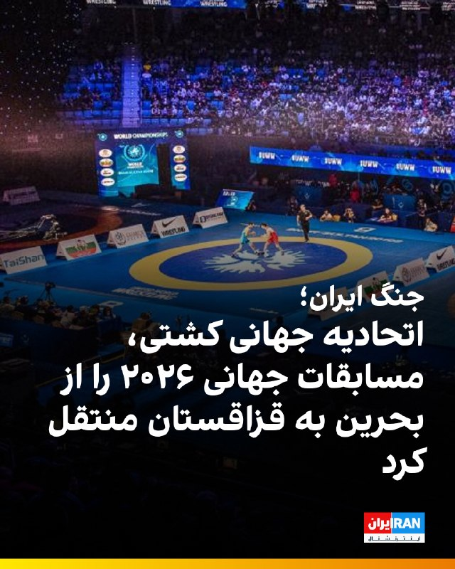

🔻اتحادیه جهانی کشتی اعلام کرد به دلیل «وضعیت ژئوپلیتیک کنونی، به‌ویژه تداوم ابهام‌ها و تاثیر آن بر سفرهای بین‌المللی» تصمیم گرفته است میزبانی مسابقات جهانی ۲۰۲۶ را از منامه بحرین به شهر آستانه قزاقستان منتقل کند.

🔹میزبانی مسابقات جهانی ۲۰۲۶، سال گذشته در نشست زاگرب به بحرین واگذار شده بود.

🔹مسابقات جهانی کشتی امسال از ۲ تا ۱۰ آبان ۱۴۰۵ برگزار می‌شود. آستانه در سال ۲۰۱۹ هم میزبان این رقابت‌ها بود.

🔹جنگ ایران از نهم اسفند ۱۴۰۴ تاکنون، باعث لغو بسیاری از مسابقات بین‌المللی ورزشی در منطقه شده است.

@iranintltvsport

## IranIntlTV — post 338471

هم‌زمان با ادامه کارزار جاویدنامان بیمارستان الغدیر، جزییات تازه‌ای از هویت و چگونگی کشته‌ شدن شماری از جان‌باختگان اعتراضات ۱۸ و ۱۹ دی‌ماه به دست ایران‌اینترنشنال رسیده است.
در این ویدیو نحوه قتل حکومتی ستاره رفیعی و حمیدرضا حق‌پرست و انتقال پیکر آن‌ها به بیمارستان را می‌‌‌شنوید.
فرنوش فرجی، عضو تحریریه ایران‌اینترنشنال گزارش می‌دهد.

## IranIntlTV — post 338470

  

راجر ویکر، رییس کمیته نیروهای مسلح سنای آمریکا در شبکه ایکس نوشت: «باید کاری را که آغاز کرده‌ایم، به پایان برسانیم. آمریکا نباید به‌دنبال توافق با جمهوری اسلامی باشد و در عوض باید عملیات نظامی را از سر بگیرد.»
او افزود: «به دونالد ترامپ توصیه اشتباهی می‌شود تا توافقی را دنبال کند که ارزش نوشته شدن روی کاغذ را هم ندارد.»

ویکر ادامه داد: «فرمانده کل قوا باید به نیروهای مسلح حرفه‌ای آمریکا اجازه دهد نابودی توان نظامی متعارف تهران را تکمیل کرده و تنگه هرمز را بازگشایی کنند.»
https://iranintl.com/202605226738

## IranIntlTV — post 338469

  <a href="telegram/content/IranIntlTV_338469_1779476460.mp4" target="_blank">🎬 Download video</a>

آیا توافق بین تهران و واشینگتن با شرایط فعلی امکان‌پذیر است؟
@iranintltv

## IranIntlTV — post 338467

  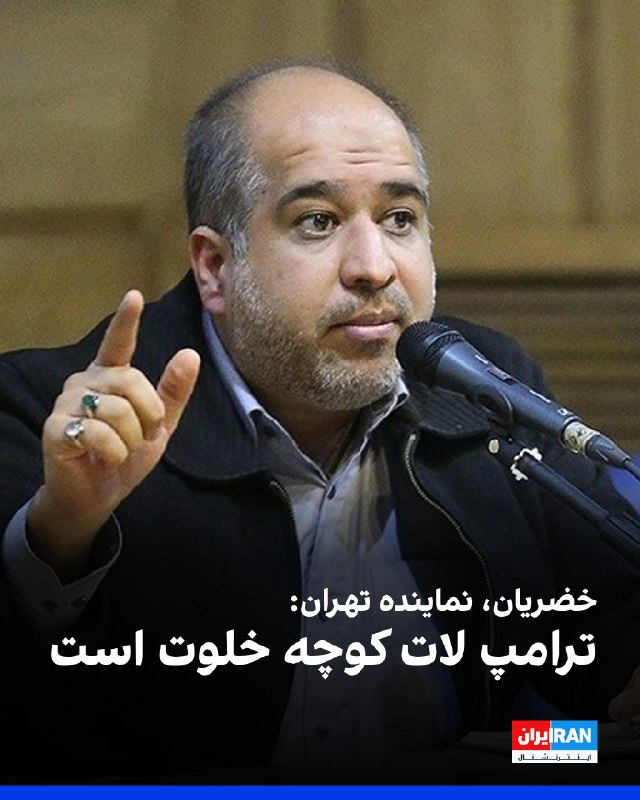

علی خضریان، نماینده تهران در مجلس گفت: «ترامپ بارها می‌گوید جمهوری اسلامی برای رسیدن به توافق زمان ندارد. در این اظهارات رییس جمهور آمریکا فرامتن و اعترافی وجود دارد که اتفاقا زمان علیه آمریکاست. برای همین این لات کوچه خلوت فضای مجازی داد می‌زند که بگوید ایران است که زمان ندارد.»

او ادامه داد: «در سه حوزه کلیدی مدیریت تنگه هرمز، حمایت از جبهه مقاومت وعدم خروج مواد هسته‌ای از خاک کشور به هیچ عنوان مصالحه نخواهد کرد.»

او افزود: «فکر نمی‌کنم درباره متنی بتوانیم صحبت کنیم که روی آن به توافق نزدیک شده باشیم.»
https://iranintl.com/202605220298

## IranIntlTV — post 338466

  

عبدالله حاجی‌صادقی، نماینده مجتبی خامنه‌ای در سپاه پاسداران گفت: «استکبار باید بداند که خلیج فارس و تنگه هرمز تحت کنترل کامل و هوشیارانه نیروی دریایی ماست. اگر دشمن نخواهد این واقعیت را بپذیرد و دست به ماجراجویی بزند، ما نه فقط در منطقه، بلکه فرای منطقه را هم برای آن‌ها ناامن و تنگ خواهیم کرد.»

او افزود: «اگر دشمن مرتکب کوچک‌ترین خطای محاسباتی شود، روزهایی به مراتب سخت‌تر از گذشته را تجربه خواهد کرد. سپاه پاسداران و نیروی دریایی مقتدر، پاسخی به آن‌ها خواهند داد که از نظر وسعت و شدت، فراتر از عملیات‌های ظفرمند وعده صادق خواهد بود.»
https://iranintl.com/202605223982

## IranIntlTV — post 338465

بحران انسانی در تنگه هرمز؛ هزاران دریانورد میان جنگ و بلاتکلیفی گرفتار شده‌اند

ادامه اقدامات تنش‌آفرین جمهوری اسلامی در تنگه هرمز، به نگرانی‌ها درباره تشدید بحران انسانی برای هزاران دریانورد گرفتار در خلیج فارس دامن زده است.

خبرگزاری رویترز جمعه اول خرداد گزارش داد بیش از ۲۰ هزار ملوان در حدود دو هزار کشتی در آب‌های خلیج فارس سرگردان مانده‌اند؛ بسیاری از آن‌ها امکان ترک شناورهای خود را ندارند و با کمبود غذا، آب آشامیدنی و عدم اطمینان نسبت به آینده دست و پنجه نرم می‌کنند.

دریانوردانی که در هفته‌های اخیر با رویترز مصاحبه کرده‌اند، از چالش‌ها و اضطراب مداوم خود در اوضاع جنگی منطقه سخن گفته‌اند.

سلمان صدیقی، ملوان هندی که در یکی از کشتی‌های گرفتار حضور دارد، در تماسی تلفنی به رویترز گفت: «تنها کاری که اینجا انجام می‌دهیم، این است که برای گذراندن شب برنامه‌ریزی کنیم و دعا کنیم در جریان حملات هدف قرار نگیریم.»

تنگه هرمز گذرگاه باریکی میان ایران و عمان است که حدود یک‌پنجم نفت خام و گاز طبیعی مایع جهان از آن عبور می‌کند.

از زمان آغاز مناقشه کنونی در ۹ اسفند ۱۴۰۴، اختلال در تردد شناورها در این آبراه موجب برهم خوردن جریان انرژی جهانی و افزایش قیمت نفت شده است.

انزوای دریانوردان در منطقه جنگی
در حالی که بحران در خلیج فارس ادامه دارد، خبرنگاران رویترز به‌تازگی با یک قایق امدادرسانی به سوی کشتی‌های پهلوگرفته در سواحل عربستان سعودی رفتند.

در این زمان، ملوانان یک نفتکش با تجمع کنار نرده‌های شناور، برای خبرنگاران دست تکان دادند. رویترز این رویداد را «لحظه‌ای نادر از تماس آن‌ها با جهان خارج» توصیف کرد.

بر اساس این گزارش، دریانوردان گرفتار در خلیج فارس نزدیک به سه ماه است در شرایطی منزوی و پراضطراب به سر می‌برند. آن‌ها در فضایی محدود، میان کابین‌های کوچک، سالن‌های غذاخوری مشترک و عرشه‌های داغ کشتی‌ها روزگار می‌گذرانند و تنها با شمار اندکی از همکاران خود در تماس هستند.

محمد اراشدی، هماهنگ‌کننده شبکه جهان عرب و ایران در فدراسیون بین‌المللی کارکنان حمل‌ونقل (ITF)، هشدار داد وضعیت جنگی منطقه آسیب‌پذیری دریانوردان را به‌طور چشمگیری افزایش داده است.

به گفته او، بسیاری از ملوانان با مشکلاتی همچون تاخیر در پرداخت دستمزد، مخالفت با بازگرداندن آن‌ها به کشورهایشان، کمبود آذوقه و نگرانی از حملات موشکی و پهپادی مواجه‌اند.

اراشدی افزود برخی از دریانوردان در تماس‌های تلفنی با او گریه کرده‌اند.

گرفتار میان حقوق‌های معوقه و هراس جنگ
موهیت کوهلی، کاپیتان یک کشتی باری که پس از آغاز جنگ در خلیج فارس گرفتار شده بود، گفت در ابتدا حتی تصور بسته ‌شدن تنگه هرمز هم برای او امکان‌پذیر نبود.

کشتی تحت فرمان او که متعلق به شرکتی آلمانی بود، توانست در منطقه‌ای امن در نزدیکی بندر دمام عربستان سعودی لنگر بیندازد، اما تنها چند روز پس از آغاز درگیری‌ها، خدمه کشتی شاهد عبور موشک‌ها و پهپادهایی بودند که حکومت ایران به سوی کشورهای حاشیه خلیج فارس شلیک می‌کرد.

کوهلی در گفت‌وگو با رویترز پس از بازگشت به هند، با اشاره به فضای حاکم بر کشتی گفت: «خدمه‌ای که همیشه پرجنب‌وجوش و پرسر‌وصدا بودند، ناگهان ساکت شدند. زمان غذا خوردن کوتاه‌تر شد و همه با احتیاط بیشتری صحبت می‌کردند.»

او افزود مالکان کشتی برای اعزام نیروهای جایگزین با خدمه همکاری کردند.

با این حال، مقام فدراسیون بین‌المللی کارکنان حمل‌ونقل خاطرنشان کرد تمامی دریانوردان گرفتار در تنگه هرمز وضعیت مشابهی ندارند و بسیاری از آن‌ها با چالش‌ها و فشارهای به‌مراتب شدیدتری روبه‌رو هستند.

اراشدی گفت در برخی پرونده‌های در دست بررسی، حقوق ناچیز ۱۰۰ تا ۲۰۰ دلاری ملوانان از سال گذشته پرداخت نشده و برخی مالکان کشتی نیز از فراهم کردن امکان بازگشت آن‌ها به کشورشان خودداری می‌کنند یا این کار را مشروط به صرف‌نظر کردن ملوانان از مطالبات معوقه‌شان دانسته‌اند.

تلاش برای تسهیل خروج ملوانان از برزخ
رویترز در ادامه نوشت کشورهای حاشیه خلیج فارس اقداماتی را برای کمک‌رسانی به خدمه کشتی‌های گرفتار آغاز کرده‌اند؛ از جمله تسهیل روند تامین تدارکات و جابه‌جایی نیروها.

سلیمان المزروعی، رییس سازمان بنادر عربستان سعودی، گفت مهم‌ترین مساله برای دریانوردان گرفتار این است که بدانند ساحلی امن «به روی آن‌ها باز است».

به گفته او، سازمان بنادر عربستان سعودی تاکنون به صدها کشتی در تامین مواد غذایی، آب آشامیدنی، سوخت و دارو کمک کرده و امکان انتقال بیش از ۵۰۰ ملوان را فراهم آورده است.
 
🔗متن کامل گزارش را اینجا بخوانید
@iranintltv

## IranIntlTV — post 338464

  <a href="telegram/content/IranIntlTV_338464_1779476463.mp4" target="_blank">🎬 Download video</a>

دو شهروند در پیام‌هایی که با هوش مصنوعی خوانده شده، به ایران اینترنشنال گفتند که قیمت یک پرس قرمه‌سبزی در رستوران‌ها به حدود ۸۰۰ هزار تومان و یک عدد پیتزای دو نفره به بالای دو میلیون تومان رسیده است.

## IranIntlTV — post 338463

  <a href="telegram/content/IranIntlTV_338463_1779476465.mp4" target="_blank">🎬 Download video</a>

دو شهروند در پیام‌هایی که با هوش مصنوعی خوانده شده، به ایران اینترنشنال گفتند که قیمت یک پرس قرمه‌سبزی در رستوران‌ها به حدود ۸۰۰ هزار تومان و یک عدد پیتزای دو نفره به بالای دو میلیون تومان رسیده است.

## IranIntlTV — post 338462

  

اسماعیل بقائی، سخنگوی وزارت خارجه جمهوری اسلامی گفت: «در مورد اورانیوم غنی‌شده با درجه بالا، مواضع‌مان را خیلی روشن بیان کرده‌ایم؛ در این مرحله اگر بخواهیم در این مباحث گفت‌وگو کنیم، قاعدتا به نتیجه نمی‌رسیم.»

او افزود: «ما قبلا این مسیر را رفتیم و اختلاف‌نظرها آن‌قدر زیاد بود که نتوانستیم به نتیجه برسیم و طرف مقابل به‌خاطر خواسته‌های نامعقولش میز مذاکرات را از بین برد و حمله کرد.»
https://iranintl.com/202605226137

## IranIntlTV — post 338461

  

اسماعیل بقائی، سخنگوی وزارت خارجه جمهوری اسلامی گفت: «اختلاف‌نظر ما با آمریکا آن‌قدر عمیق و زیاد است که نمی‌شود گفت با چندبار رفت‌وآمد یا مذاکرات ظرف چند هفته ما باید حتما به نتیجه برسیم.»

او افزود: «نمی‌توانیم بگوییم ضرورتا به جایی رسیده‌ایم که توافق نزدیک است. تمرکز مذاکرات بر خاتمه جنگ است.»

او در واکنش به سفر عاصم منیر به تهران گفت: «این رفت‌وآمدها باوجود اینکه پرترافیک‌تر شده، تداوم همان روند دیپلماتیک است.»

بقائی ادامه داد: «یک هیئتی از قطر درحال مذاکره با وزیر خارجه کشورمان هستند اما میانجی مذاکرات همچنان طرف پاکستانی است.»
https://iranintl.com/202605224547

## IranIntlTV — post 338460

  

فاکس‌نیوز گزارش داد که تولسی گبرد، مدیر اطلاعات ملی آمریکا از سمت خود استعفا داده است.
او پیش‌تر گفته بود گفت که اهداف تعیین‌شده از سوی ترامپ درباره جنگ با جمهوری اسلامی، با اهداف اسرائیل متفاوت است.

گبرد همچنین گفته بود که حکومت ایران برقرار به نظر می‌رسد، اما در نتیجه عملیات نظامی آمریکا به‌طور گسترده تضعیف شده است.
https://iranintl.com/202605228014

## IranIntlTV — post 338459

  <a href="telegram/content/IranIntlTV_338459_1779476468.mp4" target="_blank">🎬 Download video</a>

در پی کارزار مردمی ایران‌اینترنشنال برای شناسایی جاویدنامان بیمارستان الغدیر تهران، شاهدان با ارسال پیام‌هایی می‌گویند کادر درمان این بیمارستان در ۱۸ و ۱۹ دی ۱۴۰۴، با وجود فشار شدید ماموران و ممانعت آنها، معترضان را رها نکردند و برای بهبود آنها تلاش کردند.
فرنوش فرجی، عضو تحریریه ایران‌اینترنشنال گزارش می‌دهد.

## IranIntlTV — post 338458

  

علیرضا سلیمی، عضو هیات رییسه مجلس گفت: «یکی از دستاوردهای جنگ اخیر، مدیریت جمهوری اسلامی بر تنگه هرمز است که هرگز قابل مذاکره و معامله نیست و رژیم حقوقی جدیدی بر این تنگه حاکم خواهد شد که قواعد آن را تنها ما تعریف و اعمال می‌کنیم.»

او افزود: «شرایط عبور و مرور همچنین نرخ عوارض بر تنگه هرمز را جمهوری اسلامی مشخص می‌کند و با توییت نمی‌توانند اوضاع تنگه را تغییر دهند.»
https://iranintl.com/202605225037

## IranIntlTV — post 338457

  <a href="https://t.me/IranintlTV/338457" target="_blank">📎 Download file</a>

🎧نسخه صوتی اخبار شبانگاهی | جمعه یک خرداد
@iranintlTV

## IranIntlTV — post 338456

  

بر اساس گزارش‌های رسیده به ایران‌اینترنشنال، محمدرضا منصوری، جوان ۲۴ ساله و پدر یک نوزاد ۲۰ روزه بود که با تیراندازی نیروهای حکومتی در جریان اعتراضات شهر رشت جان خود را از دست داد. او به دلیل جراحات ناشی از شلیک گلوله، حدود یک ماه بستری و تحت درمان بود.

بر اساس گزارش‌ها، محمدرضا ۱۸ دی‌ماه در منطقه یخسازی رشت هدف شلیک نیروهای حکومتی قرار گرفت و بر اثر اصابت گلوله به نخاع و کتف به شدت زخمی شد.

او ۱۳ بهمن‌ماه بر اثر شدت جراحات وارده در جریان اعتراضات جان باخت.

به گفته منابع محلی، محمدرضا تنها فرزند خانواده بود و پیش از حضور در فراخوان، گفته بود: «برای آینده دخترم در اعتراض شرکت می‌کنم.»
https://iranintl.com/202605222447

## Shin_Persian — post 6152

  

Rapid Response 47 ✓ @RapidResponse47
Fri, 22 May 2026 17:13:05 UTC

𝕏 · @shin_persian

## Shin_Persian — post 6151

  <a href="telegram/content/Shin_Persian_6151_1779476471.mp4" target="_blank">🎬 Download video</a>

Iran International English ✓ @IranIntl_En Fri, 22 May 2026 15:37:34 UTC The Pentagon on Friday released a video allegedly showing unidentified anomalous phenomena (UAP) near Iran, saying the footage was likely captured by an infrared sensor aboard a US military…

## Shin_Persian — post 6150

Iran International English ✓ @IranIntl_En
Fri, 22 May 2026 15:37:34 UTC

The Pentagon on Friday released a video allegedly showing unidentified anomalous phenomena (UAP) near Iran, saying the footage was likely captured by an infrared sensor aboard a US military platform operating in the CENTCOM area in 2022, while cautioning that the material lacks a substantiated chain of custody.

The All-domain Anomaly Resolution Office (AARO) said the 20-second clip, titled “4 UAP Formation Iran 26 Aug 2022 over water [CALLSIGN],” was uploaded to a classified network in June 2024 and surfaced as part of a review of potentially UAP-related records requested by eight members of the US House of Representatives.

فارسی

پنتاگون روز جمعه ویدئویی را منتشر کرد که مدعی است «پدیده‌های ناهنجار ناشناخته» (UAP) را در نزدیکی ایران نشان می‌دهد. پنتاگون اعلام کرد این فیلم احتمالاً توسط یک حسگر فروسرخ در یک پلتفرم نظامی ایالات متحده که در سال ۲۰۲۲ در منطقه سنتکام (فرماندهی مرکزی ایالات متحده) فعالیت می‌کرده، ضبط شده است؛ در عین حال هشدار داد که این محتوا فاقد سلسله‌مراتب نظارتی و استنادی تأیید شده است.

دفتر حل‌وفصل ناهنجاری‌های تمام‌محیطی (AARO) اعلام کرد این کلیپ ۲۰ ثانیه‌ای با عنوان «تشکیل ۴ UAP ایران ۲۶ اوت ۲۰۲۲ بر فراز آب [شناسه رادیویی]»، در ژوئن ۲۰۲۴ در یک شبکه طبقه‌بندی شده بارگذاری شده و در جریان بازبینی پرونده‌های احتمالی مرتبط با UAP که توسط هشت عضو مجلس نمایندگان ایالات متحده درخواست شده بود، ظاهر شده است.

𝕏 · @shin_persian

## ManotoTV — post 105748

  <a href="telegram/content/ManotoTV_105748_1779476473.mp4" target="_blank">🎬 Download video</a>

«دلم براتون تنگ میشه اما امید دارم برگردید»

## ManotoTV — post 105747

  <a href="telegram/content/ManotoTV_105747_1779476474.mp4" target="_blank">🎬 Download video</a>

رییس اورژانس پیش‌بیمارستانی و مدیریت حوادث دانشگاه علوم پزشکی البرز اعلام کرد بر اثر تصادف زنجیره‌ای در آزادراه کرج قزوین، سه نفر جان باختند و چهار نفر دیگر مجروح شدند.
به گزارش رسانه‌های داخلی، در این سانحه دو مرد و یک زن کشته شدند و سه مرد و یک زن دیگر نیز مجروح شدند.
مصدومان توسط نیروهای اورژانس به بیمارستان امام جعفر صادق نظرآباد منتقل شدند.

## FarsiVOA — post 218380

🔺کناره‌‌گیری مدیر اطلاعات ملی آمریکا؛ تقدیر پرزیدنت ترامپ از عملکرد تولسی گابارد

◾️دونالد ترامپ، رئیس جمهوری آمریکا، روز جمعه ۱ خرداد با انتشار پیامی در شبکه اجتماعی تروت سوشال اعلام کرد که تولسی گابارد به دلیل بیماری همسرش و به منظور کمک به او در روند بهبودی، از سمت خود کناره‌گیری می‌کند.

⬇️ بیشتر بخوانید:

https://ir.voanews.com/a/president-trump-white-house-meeting-iran/8152838.html

## FarsiVOA — post 218379

واکنش‌ها به مصائب کسب‌و‌کارها در ایران در سایه خفقان دیجیتال؛ سرکوب اقلیت‌ها ادامه دارد

## FarsiVOA — post 218378

🔺تداوم بلاتکلیفی یک شهروند بهائی در زندان مشهد؛ سرکوب اقلیت‌های مذهبی توسط رژیم در ایران ادامه دارد

◾️گزارش‌های رسیده به صدای آمریکا حاکی از آن است که وفا کاشفی، شهروند بهائی ساکن مشهد، با گذشت یک‌ ماه از بازداشتش، کماکان در زندان وکیل‌آباد این شهر در وضعیت بلاتکلیف به‌سر می‌برد.

⬇️ بیشتر بخوانید:

https://ir.voanews.com/a/vafa-kashefi-iran-bahaaie-religious-repression-prison/8152834.html

## FarsiVOA — post 218377

علی جوانمردی: گزینەهای آمریکا در مقابل ایران، دیپلماسی توام با فشار روزافزون

## FarsiVOA — post 218376

تحریم‌های تازه اتحادیه اروپا علیه جمهوری اسلامی همزمان با افزایش نگرانی‌ها از شوک نفتی

## FarsiVOA — post 218375

🔺تشدید کارزار جمهوری اسلامی برای آزار و سرکوب اقلیت‌های دینی در ایران

▪️جمهوری اسلامی در تشدید کارزار آزار و سرکوب اقلیت‌های دینی ایران، با درخواست‌های مکرر یک زن باردار بهائی برای آزادی از زندان و مراجعه به پزشک و انجام آزمایش‌های ضروری بارداری، مخالفت کرده است. همزمان رسانه‌های حقوق بشری از بلاتکلیفی یک زوج بهائی در زندان شیراز و محکومیت یک زن نوکیش مسیحی به بیش از ۹ سال زندان خبر داده‌اند.

⬇️ بیشتر بخوانید:

https://ir.voanews.com/a/iran-bahaaie-prison-minority-religous-execution/8152804.html/?nocach=1

## FarsiVOA — post 218374

ویدویی از پرفورمنس یک هنرمند ایرانی در خیابان در شبکه‌های اجتماعی مورد توجه قرار گرفته است.

او در این اجرا، هم‌زمان با فروش و رنده کردن پیاز، از رهگذران می‌خواهد «بر وضعیتی که در آن زندگی می‌کنیم، اشک بریزند.»

@FarsiVOA

## DW_Farsi — post 125025

  

🔶 تعویق مسابقات قهرمانی کشتی جهان ۲۰۲۶ در بحرین

اتحادیه جهانی کشتی (UWW) با صدور بیانیه‌ای اعلام کرد که در هماهنگی نزدیک با کمیته المپیک بحرین و فدراسیون کشتی این کشور، مسابقات قهرمانی جهان ۲۰۲۶ را که در ابتدا قرار بود از ۲۴ اکتبر تا ۱ نوامبر در بحرین برگزار شود به زمانی دیگر موکول می‌شود.

بنا بر این بیانیه، تصمیم تعویط جام جهانی کشتی "پس از بررسی دقیق و مسئولانه شرایط ژئوپلیتیک کنونی منطقه، به ویژه بلاتکلیفی‌های جاری پیرامون مناقشات در حال وقوع در حوزه خلیج [فارس] و تأثیرات گسترده‌تر آن بر ثبات منطقه و سفرهای بین‌المللی اتخاذ شده است".

در ادامه بیانیه آمده است: «ورزش کشتی همواره فراتر از یک رقابت صرف بوده است؛ کشتی پلی میان ملت‌ها، فرهنگ‌ها و مردم است. در روزگاری که جهان با بلاتکلیفی و تفرقه روبروست، به ما یادآوری می‌شود که ورزش همچنان زبان مشترک صلح، احترام و اتحاد است. با همین رویکرد و روحیه است که اتحادیه جهانی کشتی، کمیته المپیک بحرین و فدراسیون کشتی بحرین این بیانیه مشترک را صادر می‌کنند.»
@dw_farsi

## DW_Farsi — post 125024

🎥 ۲۷ خواهر و برادر ناتنی؛ جست‌وجو برای پدر بیولوژیکی

در اروپا، همزمان با افزایش اهدای اسپرم، بحث بر سر حق فرزندان برای شناخت هویت بیولوژیکی‌شان جدی‌تر شده؛ آیا کودکانی که از طریق اهدای اسپرم متولد می‌شوند، باید حق شناخت پدر بیولوژیکی‌شان را داشته باشند؟ لئونتین از سوئد، ۲۷ خواهر و برادر ناتنی پیدا کرد، اما هنوز یک سؤال بی‌پاسخ مانده؛ پدر واقعی‌اش کیست؟
@dw_farsi

## DW_Farsi — post 125023

🔶 اختلاف ترامپ و نتانیاهو درباره ایران؛ جنگ یا دیپلماسی؟

🔻 گزارشی از مراد رحمتی

مقام‌های اسرائیلی می‌گویند دونالد ترامپ، رئیس جمهور آمریکا به نتانیاهو اطمینان داده هرگونه توافق احتمالی با تهران شامل خروج ذخایر اورانیوم غنی‌شده ایران خواهد بود؛ موضوعی که اسرائیل آن را خط قرمز امنیتی خود می‌داند.

در مقابل، نتانیاهو بارها تاکید کرده است که پایان جنگ تنها زمانی معنا خواهد داشت که علاوه بر توقف برنامه هسته‌ای، حمایت جمهوری اسلامی از نیروهای نیابتی منطقه‌ای و توان موشک‌های بالستیک ایران نیز از میان برود.

اکنون این پرسش مطرح است که در نهایت آیا دیپلماسی دست بالا را خواهد داشت یا تقابل نظامی ادامه پیدا می‌کند؟ و اگر آمریکا بدون توجه به اولویت‌های اسرائیل با جمهوری اسلامی به توافق برسد، آیا اسرائیل آن را می‌پذیرد یا دوباره به اقدام نظامی مستقیم روی خواهد آورد؟ این‌ها محور گفت‌وگوی دویچه وله با دو کارشناس است.
@dw_farsi

## DW_Farsi — post 125022

  

🔶 تعلیق فروش ۱۴ میلیارد دلاری سلاح آمریکا به تایوان به دلیل جنگ ایران

سرپرست نیروی دریایی ایالات متحده روز پنجشنبه، ۲۲ مه، اعلام کرد که فروش تسلیحات به تایوان به حالت "تعلیق" درآمده است تا اطمینان حاصل شود ارتش آمریکا مهمات کافی برای عملیات‌های خود در قبال ایران را در اختیار دارد.

هنگ کائو، سرپرست نیروی دریایی آمریکا، در یک جلسه استماع در کنگره و در پاسخ به سؤالی درباره خرید تسلیحاتی معطل‌مانده و ۱۴ میلیارد دلاری تایوان گفت: «در حال حاضر ما یک وقفه (تعلیق) ایجاد کرده‌ایم تا مطمئن شویم مهمات مورد نیاز برای عملیات "خشم حماسی" (Epic Fury) را در اختیار داریم، که البته مقدار زیادی هم داریم.»

او افزود: «اما ما فقط می‌خواهیم اطمینان حاصل کنیم که همه‌چیز را در اختیار داریم؛ پس از آن، هر زمان که دولت صلاح بداند، فروش نظامی به کشورهای خارجی از سر گرفته خواهد شد.»

وزارت امور خارجه و پنتاگون (وزارت دفاع آمریکا) بلافاصله به درخواست‌ها برای اظهار نظر درباره سخنان کائو پاسخ ندادند.
@-dw_farsi

## DW_Farsi — post 125021

  

🔶 مارک روته حمایت ناتو از عملیات نظامی در تنگه هرمز را محتمل دانست

یوهان واده‌فول، وزیر امور خارجه آلمان، در تازه‌ترین اظهارنظر خود، محتاطانه در مورد مأموریت احتمالی ناتو در آزادسازی تنگه هرمز سخن گفت.

او اعلام کرد که آلمان همیشه آماده است تا امنیت تردد آزاد در آنجا را تضمین کند و تحت رهبری بریتانیا و فرانسه در حال آماده‌سازی برای این عملیات‌ است.

این سیاستمدار حزب دموکرات مسیحی که در جریان نشست وزرای امور خارجه ناتو در شهر بندری هلسینگبوری سوئد سخن می‌گفت، در عین حال افزود: «اما من هیچ مأموریت فوری ناتو به معنای کلاسیک آن را در تنگه هرمز پیش‌بینی نمی‌کنم.»

روته نیز در ادامه سخنان خود گفت که تلاش‌هایی در جریان است تا متحدان اروپایی بتوانند در مرحله بعدی، بیشترین کمک ممکن را ارائه دهند.

به گفته دیپلمات‌ها، در این مسیر مشارکت دادن ناتو نیز می‌تواند منطقی باشد؛ به‌ویژه از این جهت که دونالد ترامپ، رئیس‌جمهور آمریکا، اخیراً چندین بار ارزش افزوده و فایده ناتو را برای کشورش زیر سؤال برده است.
@dw_farsi

## DW_Farsi — post 125020

  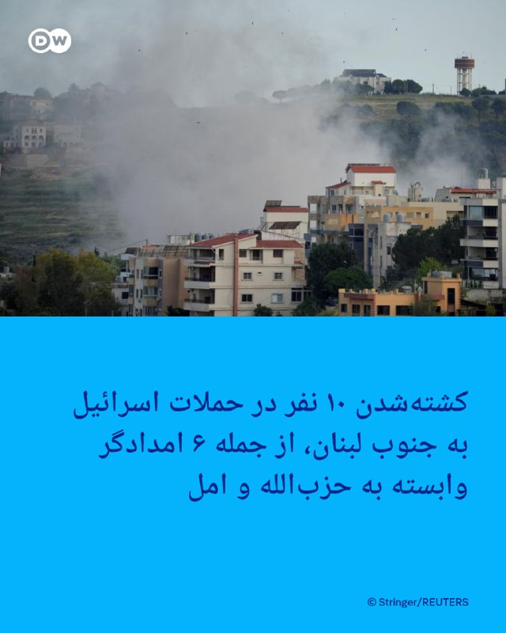

🔶 " کشته‌شدن ۱۰ نفر در حملات اسرائیل به جنوب لبنان، از جمله ۶ امدادگر وابسته به حزب‌الله و امل"

حملات متقابل میان اسرائیل و حزب‌الله در لبنان با وجود برقراری آتش‌بس همچنان ادامه دارد.

بنا بر اعلام مقامات رسمی، در پی حملات هوایی اسرائیل به جنوب لبنان از شب گذشته تاکنون، دست‌کم ده نفر کشته شده‌اند.

وزارت بهداشت در بیروت گزارش داد که در میان کشته‌شدگان، شش امدادگر (پزشکیار) و یک کودک وجود دارند. همچنین تعداد دیگری از شهروندان و امدادگران در این حملات زخمی شده‌اند. ارتش اسرائیل هنوز واکنشی به این حملات نشان نداده است.

مراکز درمانی و امدادی هدف‌قرارگرفته،متعلق به حزب‌الله و جنبش متحد آن، "امل" هستند. اسرائیل بارها مراکز بهداشتی و تیم‌های پزشکی را در لبنان هدف قرار داده و حزب‌اللهِ تحت حمایت ایران را متهم می‌کند که از این مراکز به عنوان پوششی برای پنهان کردن سلاح‌ها و جنگجویان خود استفاده می‌کند.

از آنجا که حزب‌الله به‌ویژه در جنوب لبنان مانند "دولتی در دولت" عمل می‌کند، شاخه غیرنظامی آن مسئولیت تأمین خدمات پزشکی و درمانی را در این مناطق بر عهده دارد.
@dw_farsi

## DW_Farsi — post 125019

  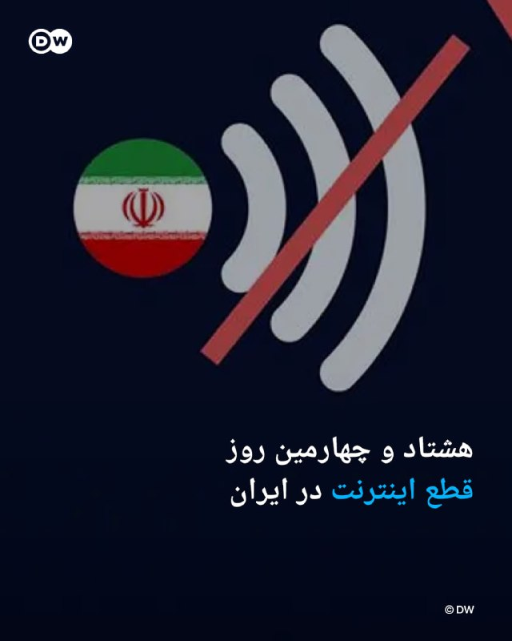

🔶 هشتاد و چهارمین روز قطع اینترنت در ایران

نت‌بلاکس اعلام کرده است که بلک‌اوت (قطع کامل) اینترنت در ایران وارد هشتاد و چهارمین روز خود شده و شبکه‌های بین‌المللی برای بیش از ۱۹۹۲ ساعت به طور گسترده قطع شده‌اند.

این سازمان غیردولتی و بین‌المللی که بر امنیت سایبری و حکمرانی اینترنت نظارت می‌کند، افزوده است که با گذشت هر ساعت، شکاف‌های اجتماعی و اقتصادی عمیق‌تر می‌شوند؛ چرا که هرگونه ارتباط با جهان خارج، اکنون در انحصار موقعیت اجتماعی، میزان همسویی با مواضع رسمی حکومت و برخورداری از امتیازات ویژه قرار گرفته است.

قطعی کنونی اینترنت در ایران بی‌سابقه‌ترین خاموشی ارتباطات دیجیتال یک کشور با جهان خارج است.
@dw_farsi

## DW_Farsi — post 125018

🔶 بخشی از پلکان برج ایفل در حراجی ۴۵۰ هزار یورو فروخته شد

خبرگزاری رویترز گزارش داد یک کلکسیونر فرانسوی روز پنج‌شنبه ۲۱ مه بخش ۱۴ پله‌ای از پلکان مارپیچ اصلی برج ایفل را در حراجی "آرکیوریال" در پاریس به قیمت ۴۵۰ هزار و ۱۶۰ یورو خریدهاست.

این قطعه نزدیک به ۳ متر ارتفاع و حدود ۱/۴ تن وزن دارد و بسیار بالاتر از برآورد اولیه ۱۲۰ تا ۱۵۰ هزار یورویی فروخته شده است.
@dw_farsi

## Persian_Trend_Official — post 14684

  <a href="telegram/content/Persian_Trend_Official_14684_1779476477.webm" target="_blank">🎬 Download video</a>

https://youtube.com/live/D0LvFYIUbgw?feature=share

## Persian_Trend_Official — post 14683

تا دقایقی دیگه لایو امشب آغاز میشه

## Persian_Trend_Official — post 14682

سخنگوی وزارت خارجه: 💢مباحث هسته‌ای در این مرحله قرار نیست صحبت شود. 💢خاتمه جنگ در همه جبهه به شمول لبنان خودش ظرایف خاصی دارد. همین طور محاصره دریایی ایران موضوع مهمی است که مورد بحث است. 💢درباره هسته‌ای تکلیف روشن است. ما عضو ان پی تی هستیم و حق داریم…

## Persian_Trend_Official — post 14681

🔴سخنگوی وزارت خارجه: 💢نمی‌توانیم بگوییم ضرورتا به جایی رسیده‌ایم که توافق نزدیک است. تمرکز مذاکرات بر خاتمه جنگ است. 🫆:Tony 📌 @persian_trend_official پرشین ترند | متفاوت‌ترین کانال نظامی

## Persian_Trend_Official — post 14680

🔴سخنگوی وزارت خارجه: 💢نمی‌توانیم بگوییم ضرورتا به جایی رسیده‌ایم که توافق نزدیک است. تمرکز مذاکرات بر خاتمه جنگ است. 🫆:Tony 📌 @persian_trend_official پرشین ترند | متفاوت‌ترین کانال نظامی

## Persian_Trend_Official — post 14679

🔴سخنگوی وزارت خارجه:

💢نمی‌توانیم بگوییم ضرورتا به جایی رسیده‌ایم که توافق نزدیک است.

تمرکز مذاکرات بر خاتمه جنگ است.

🫆:Tony

📌 @persian_trend_official
پرشین ترند | متفاوت‌ترین کانال نظامی

## Persian_Trend_Official — post 14678

  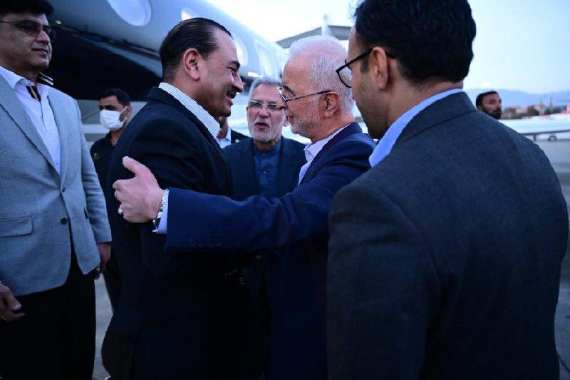

استقبال رسمی سردار اسکندر مؤمنی وزیرکشور از فرمانده ارتش پاکستان فیلد مارشال عاصم منیر.

👩‍💻:PhantomDirective

🆔@persian_trend_official
پرشین ترند | متفاوت‌ترین کانال نظامی

## RadioFarda — post 157461

  

🔸سخنگوی هیئت مذاکره‌کننده ایران با آمریکا روز جمعه گفت که موضوع پرونده هسته‌ای ایران در این مرحله مورد مذاکره نیست و از اختلاف نظر عمیق با آمریکا خبر داد.

🔸اسماعیل بقائی گفت: «اختلاف‌نظرها بین ایران و آمریکا آن‌قدر عمیق و زیاد است که نمی‌شود گفت با چندبار رفت‌وآمد یا مذاکرات ظرف چند هفته ما باید حتماً به نتیجه برسیم.»

🔸او گزارش‌ها درباره قریب‌الوقوع بودن توافق با آمریکا را رد کرد و اعلام کرد: «نمی‌توانیم بگوییم ضرورتاً به جایی رسیده‌ایم که توافق نزدیک است.»

🔸بقائی بار دیگر موضع جمهوری اسلامی درباره برنامه هسته‌ای و اورانیوم غنی‌شده را تکرار کرد و گفت مواضع ایران قبلاً اعلام شده است.

🔸این در حالی است که ساعتی قبل، مارکو روبیو، وزیر خارجه آمریکا اعلام کرد که موضوع آینده غنی‌سازی اورانیوم در ایران باید در دستور کار مذاکرات باشد.

🔸دونالد ترامپ، رئیس‌جمهور ایالات متحده، نیز بارها تأکید کرده که ایران نباید به سلاح هسته‌ای دست یابد.

@RadioFarda

## RadioFarda — post 157460

🔸چهارمین برنامه «موزیک تک» با محوریت «صداهای جنوب» در موزه هنرهای معاصر تهران برگزار شد.

🔸در بخشی از این برنامه، گروهی از زنان نیز قطعه‌ای را اجرا کردند که با استقبال حاضران روبه‌رو شد.

🔸زنان در جمهوری اسلامی طی چهار دهه گذشته اجازه تک‌خوانی در برابر مخاطبان مرد را نداشته‌اند و فعالیت خوانندگان زن همواره با محدودیت‌های گسترده روبه‌رو بوده است.

@RadioFarda

## RadioFarda — post 157459

  <a href="https://t.me/radiofarda/157459" target="_blank">📎 Download file</a>

📻بشنوید: ایستگاه ۱۹ با رادیوفردا، اول خرداد ۱۴۰۵

@RadioFarda

## IranianMinds — post 20567

🔴 اکسیوس نقل از مقام آمریکایی: مذاکرات بسیار دست و پا گیر است و پیش نویس ها هر روز بدون پیشرفت زیادی به این سو و آن سو می روند.

@IranianMinds

## IranianMinds — post 20566

  

@Daeijoonbot
@Daeijoonbot
@Daeijoonbot
کانفیگ رایگان میده به کل ایران👆

## IranianMinds — post 20565

🔴 کانال ۱۲ اسرائیل:

تفاهمات بین اسرائیل و آمریکا بر این اساس است که اورانیوم غنی‌شده یا امکان غنی‌سازی در اختیار ایران باقی نماند!

@IranianMinds

## IranianMinds — post 20564

  

پست ترامپ:

با اینکه بسیار دوست داشتم کنار پسرم دان جونیور و جدید‌ترین عضو خانواده ترامپ، همسر آینده‌اش بتینا باشم، شرایط مربوط به دولت و عشق من به ایالات متحده آمریکا، اجازه چنین کاری را به من نمی‌دهد.
احساس می‌کنم مهم است که در این دوره مهم زمانی، در واشینگتن دی‌سی و در کاخ سفید بمانم. به دان و بتینا تبریک می‌گویم!
رئیس‌جمهور دونالد جی، ترامپ

@IranianMinds

## IranianMinds — post 20563

عزیزان اخبار رو از چنل مردمی و‌ خوب فایتر رادار هم میتونید دنبال کنید سریع براتون پوشش میدن و موضوعش کاملا شبیه چنل خودمونه جوین باشید حتما:

https://t.me/+9C1ENi5qn6hhZjk0

https://t.me/+9C1ENi5qn6hhZjk0

## BBCPersian — post 281808

🔻سخنگوی وزارت خارجه ایران حضور هیئتی از قطر را در تهران تایید کرد

اسماعیل بقایی،‌ سخنگوی وزارت خارجه ایران تایید کرد که یک هیئت از قطر روز جمعه در تهران بودند و با عباس عراقچی وزیر خارجه ایران گفت‌وگو کردند.

او بدون ارائه جزئیات گفت که کشورهای مختلفی طی روزهای اخیر با وزیر خارجه گفتوگو کردند اما تاکید کرد که میانجی اصلی میان ایران و آمریکا همان کشور پاکستان است.

پیشتر رویترز به نقل از یک منبع آگاه گزارش داد که هیئتی از قطر در هماهنگی با آمریکا وارد تهران شده است.

قطر و امارات و عربستان سعودی سه کشوری بودند که آقای ترامپ روز دوشنبه گفت که به درخواست آنها فعلا حمله مجدد به ایران را متوقف کرده است.

https://bbc.in/4v3pH4G
@BBCPersian

## BBCPersian — post 281807

  

🔻دونالد ترامپ،‌ رئیس جمهور آمریکا می‌گوید که برخلاف میلش،‌ در مراسم عروسی دونالد ترامپ جونیور، پسر بزرگش شرکت نمی‌کند، چون باید در واشنگتن و کاخ سفید بماند.

رسانه‌های آمریکایی پیشتر گزارش داده بودند که قرار است در تعطیلات آخر هفته، مراسم عروسی پسر بزرگ آقای ترامپ با بتینا اندرسون در جزیره‌ای در باهاما برگزار شود.

آقای ترامپ در پستی در تروث سوشال،‌ شبکه اجتماعی خودش نوشت: «در حالیکه خیلی دوست داشتم با پسرم دان جونیور و بتینا،‌ جدیدترین عضو خانواده ترامپ و همسر آینده‌اش باشم،‌ شرایط کارهای مربوط به دولت و عشق من به ایالات متحده به من اجازه این‌کار را نمی‌دهد.»

او در ادامه افزود: «حس می‌کنم مهم است که در این برهه زمانی مهم در واشنگتن دی‌سی،‌ در کاخ سفید بمانم.»

آقای ترامپ،‌ دیروز پنجشنبه هم در یک مصاحبه گفته بود که سعی دارد در مراسم عروسی پسرش شرکت کند اما زمان این مراسم برای او مناسبت نیست چون درگیر مسائلی از جمله ایران است.

📸 EPA

https://bbc.in/4v3pH4G
@BBCPersian

## BBCPersian — post 281806

🔻همزمان با تشدید تلاش‌های دیپلماتیک؛ ترامپ باردیگر گفت که ایران مشتاق رسیدن به توافق است

دونالد ترامپ، رئیس‌جمهور آمریکا روز جمعه در کاخ سفید باردیگر گفت که کاری کرده است که «ایران مشتاق رسیدن به توافق است.»

آقای ترامپ گفت: «می‌بینید ما با ایران چه کرده‌ایم؟ ایران مشتاق رسیدن به توافق است. خواهیم دید چه می‌شود. اما ما به آنها ضربه سختی زدیم و چاره دیگری هم نداشتیم چون ایران نباید سلاح هسته‌ای داشته باشد. آنها نمی‌توانند آن را داشته باشند.»

این اظهارات آقای ترامپ در حالی مطرح شده است که به نظر می‌رسد تحرکات دیپلماتیک برای کمک به رفع اختلافات ایران و آمریکا و حصول نوعی توافق صلح شتاب بیشتری گرفته است. فیلد مارشال عاصم منیر،‌ فرمانده ارتش پاکستان، شامگاه جمعه وارد تهران شد.

محسن نقوی، وزیر کشور پاکستان هم در تهران با عباس عراقچی، وزیر خارجه ایران برای دومین بار طی دو روز گذشته دیدار کرد.

رویترز هم می‌گوید که هیئتی از قطر به تهران سفر کردند.

https://bbc.in/4v3pH4G
@BBCPersian

## BBCPersian — post 281805

  <a href="https://t.me/bbcpersian/281805" target="_blank">📎 Download file</a>

پادکست برنامه جام جهان‌نما جمعه ۱ خرداد ۱۴۰۵
این برنامه رادیویی را می‌توانید هر شب ساعت ۲۰ به وقت ایران، روی موج متوسط ۷۰۲ کیلوهرتز و موج کوتاه ۹۴۶۵ کیلوهرتز بشنوید.

تکرار برنامه را هم می‌توانید ساعت ۲۱:۳۰ روی موج متوسط ۷۰۲ کیلوهرتز و موج کوتاه ۵۳۹۵ کیلوهرتز گوش کنید.
@BBCPersian

## BBCPersian — post 281804

🔻حزب اصلی مخالف ترکیه می‌گوید حکم دادگاه برکناری رهبرانش را به چالش می‌کشد

🖌پل کربی, سردبیر بخش دیجیتال اروپا. بی‌بی‌سی

اوزگور اوزال،‌ رهبر حزب اصلی مخالف در ترکیه قول داد که با حکم دادگاهی که او و دیگر رهبران حزب جمهوری‌خواه خلق را برکنار کرده است،‌ مبارزه کند. حکمی که دیروز صادر شد،‌ تازه‌ترین اقدام حقوقی است که می‌تواند به تحکیم پایه‌های قدرت رجب طیب اردوغان،‌ رئیس‌جمهور کمک کند.

https://bbc.in/3PCHRLq
@BBCPersian

## BBCPersian — post 281803

🔻اتحادیه اروپا اعلام کرد زمینه تحریم ایران بر سر انسداد تنگه هرمز را فراهم کرد

اتحادیه اروپا می‌گوید چارچوب مقررات اعمال تحریم‌های خود را به‌گونه‌ای اصلاح کرده است که افرادی را هدف قرار دهد که به گفته این اتحادیه، به ایران در «تهدید آزادی کشتیرانی در خاورمیانه» کمک کرده‌اند.

این محدودیت‌ها در ابتدا برای مقابله با حمایت تهران از تهاجم گسترده روسیه به اوکراین وضع شده بود اما با تغییراتی که شورای اتحادیه اروپا اعمال کرده، قابل تسری به موضوع تنگه هرمز است.

شورای اروپا اعلام کرد: «اتحادیه اروپا اکنون قادر خواهد بود در واکنش به اقدامات ایران در تضعیف آزادی کشتیرانی در تنگه هرمز، تدابیر محدودکننده بیشتری اعمال کند.» این تدابیر شامل ممنوعیت سفر و توقیف دارایی افراد خواهد بود.

تنگه هرمز عملاً از زمان آغاز جنگ آمریکا و اسرائیل علیه ایران بسته شده است.

https://bbc.in/4v3pH4G
@BBCPersian

## BBCPersian — post 281802

  

🔻وزارت دفاع آمریکا روز جمعه دومین مجموعه از اسناد محرمانه سابق درباره مشاهده اشیای ناشناس پرنده را منتشر کرد؛ اسنادی که شامل گزارش‌هایی درباره مشاهده «گوی‌های سبز، بشقاپ پرنده‌ها و گوی‌های آتشین ناشناخته» می‌شود.

اولین مجموعه از این اسناد به دستور دونالد ترامپ در ۸ مه (۱۹ فروردین) منتشر شده بود. او جدیدترین رئیس‌جمهور آمریکاست که گزارش‌های دولتی مربوط به اشیای پرنده ناشناس را علنی می‌کند؛ روندی که از اواخر دهه ۱۹۷۰ آغاز شده است.

پیت هگست، وزیر دفاع آمریکا، گفت که این اسناد، تصاویر و ویدئوها که عنوان رسمی‌شان «پدیده‌های ناشناس غیرعادی» است، سال‌ها موضوع گمانه‌زنی و بحث بوده است.

او در بیانیه‌ای گفت: «وقت آن رسیده که مردم آمریکا خودشان این موارد را ببینند.»
یکی از ۲۲۲ پرونده‌ای که روز جمعه منتشر شد، شامل ۱۱۶ صفحه سند درباره مجموعه‌ای از گزارش‌های مشاهدات و تحقیقات انجام‌شده در یک مرکز فوق‌محرمانه در «ساندیا» واقع در ایالت نیومکزیکو بین سال‌های ۱۹۴۸ تا ۱۹۵۰ است.

📸 U.S. Department

@BBCPersian

## BBCPersian — post 281801

  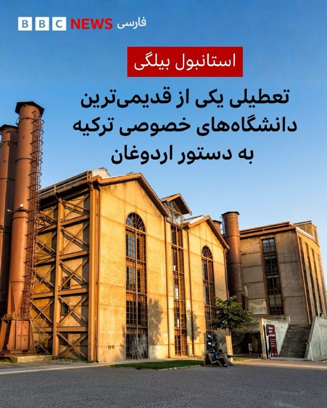

🔻یکی از قدیمی‌ترین دانشگاه‌های خصوصی ترکیه با حکم رجب طیب اردوغان، رئیس‌جمهور این کشور، تعطیل شد.

دانشگاه «استانبول بیلگی» که به داشتن گرایش‌های سیاسی لیبرال شناخته می‌شود، در هشت ماه گذشته در اداره دولت بوده است.

شرکت «جان هولدینگ»، مالک دانشگاه، به اتهام پول‌شویی و فرار مالیاتی تحت تحقیق قرار داشت.

این شرکت همچنین مالک شبکه‌های عمده تلویزیونی و چندین مدرسه در ترکیه است.

حالا سرنوشت بیش از ۲۰ هزار دانشجوی دانشگاه بیلگی همچنان نامشخص است.
دانشجویان می‌گویند که محوطه دانشگاه همچنان باز است و امروز (جمعه) تجمع اعتراضی برگزار می‌کنند.

شرح عکس: یک نیروگاه قدیمی استانبول که به یک مرکز فرهنگی تبدیل شده و اکنون بخشی از محوطه دانشگاه بیلگی است.

📸 Getty

@BBCPersian

## Dirty_Kids — post 389968

  <a href="telegram/content/Dirty_Kids_389968_1779476482.mp4" target="_blank">🎬 Download video</a>

کاری به تحریک آمیز بودن رقص این فلسطین‌به‌کون‌های سپاهی ندارم

اینا میان به وطن‌پرستا میگن شما دنبال رقصیدنید

@Dirty_Kids 👻

## Dirty_Kids — post 389967

‏برو کیرم دهن another life شد.
این زندگی چی‌ بود که باز بخواد بعدیش باشه

@Dirty_Kids 👻

## Dirty_Kids — post 389966

  

طرفو با یه 206 عهد بوق، عرق یکو نیمی و چیپس بردن باغ ویلا بعد ب بقیه داره میگه ارزون 😂😂

@Dirty_Kids 👻

## Dirty_Kids — post 389965

  

تنها فیلدمارشال کهکشان راه شیری با استقبال اسکندر مومنی وزیر کشور ایران وارد تهران شد.

@Dirty_Kids 👻

## Dirty_Kids — post 389964

  <a href="telegram/content/Dirty_Kids_389964_1779476483.mp4" target="_blank">🎬 Download video</a>

این روزا در کافه‌های مملکت چه میگذرد:

@Dirty_Kids 👻

## Dirty_Kids — post 389963

  <a href="telegram/content/Dirty_Kids_389963_1779476484.mp4" target="_blank">🎬 Download video</a>

آنلاین‌شاپا دارن برای جام‌جهانی آماده میشن

یکی بهشون بگه رئال تو جام‌جهانی نیست

@Dirty_Kids 👻

## Dirty_Kids — post 389962

خیلی رفتار‌هایی که در جامعه می‌بینید عادی سازی نیست فرار از واقعیته دوستان

@Dirty_Kids 👻

## Hranews — post 113100

  

گزارشی از آخرین وضعیت بهار صحرائیان، وکیل دادگستری در زندان عادل آباد شیراز

❗️
❗️
❗️
❗️
❗️ – بهار صحرائیان، وکیل دادگستری محبوس در زندان عادل آباد شیراز، کماکان به‌صورت بلاتکلیف در این زندان در بازداشت موقت به‌سر می‌برد و از ملاقات با خانواده محروم است.

به گزارش خبرگزاری هرانا، ارگان خبری مجموعه فعالان حقوق بشر در ایران، بهار صحرائیان همچنان به‌صورت بلاتکلیف قضایی در زندان عادل آباد شیراز نگهداری می‌شود.

یک منبع مطلع و نزدیک به خانواده این وکیل دادگستری ضمن تایید این خبر به هرانا گفت: با وجود پیگیری خانواده وی برای تعیین قرار وثیقه و آزادی موقت، مسئولین قضایی با این امر مخالفت کرده‌اند. همچنین خانم صحرائیان از زمان بازداشت تاکنون از ملاقات با خانواده محروم مانده است.

ادامه مطلب

#بهار_صحرائیان

↘️
@hranews_bot تماس ✉️ -  @Hranews  کانال هرانا 🆑

## Hranews — post 113099

  

طی روزهای اخیر اعتراض صنفی شماری از کارگران شهرداری زنجان نسبت به وضعیت معیشتی و مطالبات شغلی، منجر به بروز تنش میان کارگران معترض و محمدکاظم مجتهدی عضو شورای شهر زنجان و نایب رئیس شورا این شهر شده است. رویداد ۲۴ با انتشار گزارشی و بر اساس روایت کارگران اعلام کرد، در پی وقوع این تجمع اعتراضی محمدکاظم مجتهدی هنگام خروج از محل تجمع در پاسخ به مطالبات کارگران گفته است: «می‌روید کنار یا نه؟ با ماشین دولت می‌زنم، دیه هم می‌دهم.»

مهدی محمدیان، #کارگر آسیب دیده در خصوص جزئیات این حادثه گفت: آقای مجتهدی "ماشین را روشن کرد و همان‌طور که حرکت کرد به من زد. من زمین خوردم و تا نصف بدن ماشین روی من آمد. او میگفت می‌زنم، خون‌بهایت را می‌دهم." در مقابل، محمدکاظم مجتهدی این روایت را رد کرده و مدعی شده کارگر معترض «خود را به زمین انداخته» و ماجرا با فضاسازی مخالفان شورا همراه شده است.

چندی پیش در این راستا خبرگزاری ایلنا با انتشار خبری اعلام کرد، ده‌ها نفر از کارگران شهرداری زنجان که به تصمیم شورای شهر و شهرداری مبنی بر حذف اضافه کارها و عدم افزایش حقوق کارکنان شهرداری طبق وعده‌های قبلی شکایت داشتند، در مقابل دفتر شهرداری این شهر تجمع مسالمت‌آمیزی داشتند. این تجمع با برخورد نادرست یکی از اعضای شورای شهر مواجه شده بود. همچنین علی اصغر نجاری، دبیر اجرایی خانه کارگر استان زنجان نیز در این خصوص اظهار کرده که در پی وقوع این رویداد «پای کارگر مذکور به شدت آسیب دیده است».

↘️
@hranews_bot تماس ✉️ - @Hranews کانال هرانا 🆑

## Hranews — post 113098

  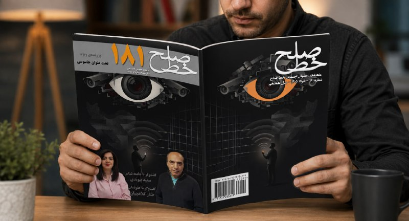

صدوهشتادویکمین شماره‌ از ماهنامه‌ی خط صلح منتشر شد 
📡
📡
📡
📡
📡– صدوهشتادویکمین شماره از #ماهنامه_خط_صلح به کوشش مدافعان حقوق بشر و جمعی از کنشگران مدنی منتشر شد. قانون «تشدید مجازات #جاسوسی و همکاری با رژیم صهیونیستی و کشورهای متخاصم علیه امنیت و منافع ملی» در…

## Hranews — post 113097

  <a href="https://t.me/hranews/113097" target="_blank">📎 Download file</a>

صدوهشتادویکمین شماره‌ از ماهنامه‌ی خط صلح منتشر شد 
📡
📡
📡
📡
📡– صدوهشتادویکمین شماره از #ماهنامه_خط_صلح به کوشش مدافعان حقوق بشر و جمعی از کنشگران مدنی منتشر شد. قانون «تشدید مجازات #جاسوسی و همکاری با رژیم صهیونیستی و کشورهای متخاصم علیه امنیت و منافع ملی» در…

## Hranews — post 113096

صدوهشتادویکمین شماره‌ از ماهنامه‌ی خط صلح منتشر شد

📡
📡
📡
📡
📡– صدوهشتادویکمین شماره از #ماهنامه_خط_صلح به کوشش مدافعان حقوق بشر و جمعی از کنشگران مدنی منتشر شد.

قانون «تشدید مجازات #جاسوسی و همکاری با رژیم صهیونیستی و کشورهای متخاصم علیه امنیت و منافع ملی» در مهرماه ۱۴۰۴ نهایی و ابلاغ شد. قانونی که پس از جنگ ۱۲روزه در سال ۱۴۰۴ و در پی تشدید تنش‌های منطقه‌ای، منازعات امنیتی و افزایش #اعتراضات_مردمی تدوین شد. این تصویب، مفهوم جاسوسی در ایران را از درک و تعریف پیشین، به مفهومی سیال و موسّع در حوزه‌ی سیاسی و امنیتی بدل کرد. قانونی که با استناد به آن، شهروندان بسیاری در خطر مجازات‌های سنگین از جمله #مجازات_غیرانسانی اعدام قرار گرفته‌اند و تعدادی نیز اعدام شده‌اند.

بر مبنای این قانون، نه‌فقط انتقال #اطلاعات_محرمانه، بلکه برخی همکاری‌های رسانه‌ای، فعالیت‌ها در شبکه‌های اجتماعی، استفاده از ابزارهای ارتباطی و اینترنت ماهواره‌ای مانند #استارلینک، و تعامل با نهادها و دولت‌هایی که شعام (شورای عالی امنیت ملی) آن‌ها را متخاصم تشخیص می‌دهد نیز می‌توانند ذیل #جرائم_امنیتی و جاسوسی تفسیر شوند.

ماهنامه‌ی خط صلح در این شماره، در پرونده‌ی ویژه‌ای با عنوان «تحت عنوان جاسوسی»، به بحث و بررسی ابعاد مختلف این قانون می‌پردازد.

خط صلح در این راستا به سراغ «#طناز_کلاهچیان»، وکیل دادگستری، رفت تا درباره‌ی ابعاد حقوقی و سیاسی این قانون با او به گفتگو بنشیند. خانم کلاهچیان نیز ضمن پاسخ به پرسش‌های این ماهنامه، به خط صلح گفت: «مسئله این‌جاست که جمهوری اسلامی می‌گوید که من می‌دانم تعریف جرم جاسوسی چیست. می‌دانم هیچ‌کدام‌تان جاسوس نیستید. می‌دانم که این جرم محقق نشده است. ولی برای بقای خودم و ایجاد ترس، وحشت و جلوگیری از اختلال در نظمی که برای خودم چیده‌ام، از این قانون استفاده می‌کنم. دلیل تصویب این قانون با این سرعت همین بود».

ماهنامه‌ی خط صلح هم‌چنین در گفتگویی دیگر به سراغ «#سعید_پیوندی»، جامعه‌شناس، رفت تا به بررسی ابعاد جامعه‌شناختی این قانون، تأثیر آن بر آزادی‌های مدنی، اعتماد اجتماعی، خودسانسوری و امنیتی‌سازی جامعه بپردازد. این استاد دانشگاه نیز با ذکر این نکته که «ما با دستگاه معیوبی سروکار داریم که در دوران جنگ، تبدیل به هیولایی می‌شود و به ابزاری در دست دولت برای سرکوب و محدود کردن جامعه بدل می‌شود»، گفت: «حکومتی هم که در برقراری امنیت ملی شکست خورده، می‌خواهد شکست خود را با انتقام گرفتن از شهروندان، محدود کردن آنان و اعمال نظارت فراگیر امنیتی بر آن‌ها جبران کند».

این شماره هم‌چنین همراه است با مطالب و اظهارنظراتی از: مجید شیعه‌علی، موسی برزین، سینا یوسفی، مینا جوانی، اِلدار خیاوی، مصطفی داننده، جمشید عزیزی، سارا قریشی، مریم عابدی، ایمان سلیمانی، علی کلائی، امیر آقایی، شبنم معینی‌پور، نفیسه مطلق، مرتضی هامونیان، پردیس پارسا، هرمینه هورداد و جمعی دیگر از فعالان حقوق بشر.

لینک دانلود مستقیم فایل پی.دی.اف ماهنامه‌ی خط صلح

وبسایت خط صلح

در این شماره می‌خوانید:
🔸طناز کلاهچیان: در قانون جدید تشدید جاسوسی، هر شهروندی می‌تواند متهم به جاسوسی شود/ علی کلائی
🔸سعید پیوندی: قانون تشدید مجازات جاسوسی، دشمنی میان جامعه و حکومت را بیش‌تر می‌کند/ نفیسه شرف‌الدینی
🔸مقایسه‌ی قانون جدید تشدید مجازات جاسوسی با قوانین قبلی/ سینا یوسفی
🔸بررسی ابهام و گسترش جرم جاسوسی در حقوق کیفری ایران/ موسی برزین
🔸از جرم «جاسوسی» تا جرم‌انگاری «قصد همکاری»/ مریم عابدی
🔸بررسی تطبیقی تعارضات قانون جدید تشدید مجازات جاسوسی با حقوق اساسی مردم/ ایمان سلیمانی
🔸توسعه امنیتی‌سازی کنشگری در قانون جدید تشدید مجازات جاسوسی/ سارا قریشی
🔸مقایسه‌ی تطبیقی جاسوس و جاسوسی در حقوق ایران و سایر کشورها/ اِلدار خیاوی
🔸همکاری رسانه‌ای با خارج؛ مرز اطلاع‌رسانی و جاسوسی کجاست؟/ مصطفی داننده
🔸امنیتی‌سازی جامعه با اتهام جاسوسی/ هرمینه هورداد
🔸قانون جدید تشدید مجازات جاسوسی و مرز مبهم
تراکنش‌های مالی/ شبنم معینی‌پور
🔸سرکوب و اعدام با اتهام نابخشودنیِِ جاسوسی/ مرتضی هامونیان
🔸اعدام به نام امنیت؛ تشدید برخورد با اتهام جاسوسی در ایران/ نفیسه مطلق
🔸امنیت ملی با اعدام و سرکوب؟/ مجید شیعه‌علی
🔸نمایشِ جنگ و تولید ملت: مطالعه‌ای بر مدیریت دیداری قدرت در خیابان/ مینا جوانی
🔸تجربه‌ی زیسته‌ی ایرانیان در دوران جنگ/ پردیس پارسا
🔸از فیلتر تلگرام تا «اینترنت پرو»/ امیر آقایی
🔸«کبوتر صلح»، «جنگ» و «بازمانده»؛ سه شعر کوتاه از جمشید عزیزی

↘️
@hranews_bot تماس ✉️ - @Hranews کانال هرانا 🆑

## manototv — post 105748

  <a href="telegram/content/manototv_105748_1779476486.mp4" target="_blank">🎬 Download video</a>

«دلم براتون تنگ میشه اما امید دارم برگردید»

## manototv — post 105747

  <a href="telegram/content/manototv_105747_1779476488.mp4" target="_blank">🎬 Download video</a>

رییس اورژانس پیش‌بیمارستانی و مدیریت حوادث دانشگاه علوم پزشکی البرز اعلام کرد بر اثر تصادف زنجیره‌ای در آزادراه کرج قزوین، سه نفر جان باختند و چهار نفر دیگر مجروح شدند.
به گزارش رسانه‌های داخلی، در این سانحه دو مرد و یک زن کشته شدند و سه مرد و یک زن دیگر نیز مجروح شدند.
مصدومان توسط نیروهای اورژانس به بیمارستان امام جعفر صادق نظرآباد منتقل شدند.

## alonews — post 121860

  <a href="telegram/content/alonews_121860_1779476488.webm" target="_blank">🎬 Download video</a>

👈یک منبع رسمی ایرانی به الجزیره: توقف جنگ در تمام جبهه‌ها، پیش‌شرط اساسی برای هرگونه مذاکره آتی است.

🔴هنوز توافق نهایی حاصل نشده و تلاش‌ها برای کاهش فاصله بین تهران و واشنگتن ادامه دارد.

🔴فضای مثبت همراه با تلاش‌های دیپلماتیک مهم است، اما برای یک توافق واقعی کافی نیست.

✅ @AloNews خبر جنگ

## alonews — post 121859

  <a href="telegram/content/alonews_121859_1779476488.webm" target="_blank">🎬 Download video</a>

👈نورالدین الدغیر خبرنگار الجزیره در تهران: به نظر می‌رسد فضای مذاکرات ایران و آمریکا تا این لحظه مثبت است و پیشرفت ملموسی در حل برخی اختلافات از طریق میانجیگر پاکستانی حاصل شده است.

🔴آمدن فرمانده ارتش پاکستان به تهران ممکن است دو هدف داشته باشد:

🔴۱. حل اختلافات باقی‌مانده

🔴۲. احتمال اعلام چیزی پس از نهایی شدن آن وجود دارد

✅ @AloNews خبر جنگ

## alonews — post 121858

  <a href="telegram/content/alonews_121858_1779476488.webm" target="_blank">🎬 Download video</a>

🔴فوری / آکسیوس به نقل از یک منبع نزدیک به ترامپ: رئیس جمهور آمریکا طی چند روز گذشته به طور فزاینده‌ای احساس ناامیدی کرده است.

🔴رئیس جمهور احتمال آغاز یک عملیات نظامی بزرگ دیگر، اعلام پیروزی و پایان دادن به جنگ را مطرح کرد.

✅ @AloNews خبر جنگ

## alonews — post 121857

  <a href="telegram/content/alonews_121857_1779476489.webm" target="_blank">🎬 Download video</a>

👈ایسنا: تلاش میانجی‌ها برای نزدیک‌ کردن متون دو طرف کماکان ادامه دارد

✅ @AloNews خبر جنگ

## alonews — post 121856

  <a href="telegram/content/alonews_121856_1779476489.webm" target="_blank">🎬 Download video</a>

👈 اکسیوس: یک مقام آمریکایی، مذاکرات را «طاقت‌فرسا» توصیف کرد. 
🔴این مقام آمریکایی گفت که پیش‌نویس‌ها «هر روز در حال رفت و برگشت هستند» بدون آنکه پیشرفت چشمگیری حاصل شود. 
✅ @AloNews خبر جنگ

## alonews — post 121855

  <a href="telegram/content/alonews_121855_1779476489.webm" target="_blank">🎬 Download video</a>

👈 هاآرتص: یک واحد مخفی در وزارت آموزش اسرائیل وجود داشته که معلمان منتقد دولت را زیر نظر می‌گرفته است.

🔴 این واحد: پست‌های شبکه‌های اجتماعی معلمان را بررسی می‌کرده

🔴فعالیتشان در اعتراضات را ثبت می‌کرده

🔴برایشان پرونده محرمانه می‌ساخته

✅ @AloNews خبر جنگ

## alonews — post 121854

  <a href="telegram/content/alonews_121854_1779476489.webm" target="_blank">🎬 Download video</a>

👈 اکسیوس: یک مقام آمریکایی، مذاکرات را «طاقت‌فرسا» توصیف کرد.

🔴این مقام آمریکایی گفت که پیش‌نویس‌ها «هر روز در حال رفت و برگشت هستند» بدون آنکه پیشرفت چشمگیری حاصل شود.

✅ @AloNews خبر جنگ

## alonews — post 121853

  <a href="telegram/content/alonews_121853_1779476489.webm" target="_blank">🎬 Download video</a>

👈دونالد ترامپ» اعلام کرد «آرون لوکاس» به عنوان مدیر موقت اطلاعات ملی منصوب خواهد شد.

✅ @AloNews خبر جنگ

## alonews — post 121852

  <a href="telegram/content/alonews_121852_1779476489.webm" target="_blank">🎬 Download video</a>

👈یک حادثه امنیتی در پایگاه نیروی هوایی پنساکولا در ایالت فلوریدای آمریکا رخ داد.

✅ @AloNews خبر جنگ

## alonews — post 121851

  <a href="telegram/content/alonews_121851_1779476489.webm" target="_blank">🎬 Download video</a>

👈آخرین قیمت نفت ۱۰۲.۳۰ دلار

✅ @AloNews خبر جنگ

## alonews — post 121850

  <a href="telegram/content/alonews_121850_1779476490.webm" target="_blank">🎬 Download video</a>

👈گفته رویترز، تولسی گابارد توسط کاخ سفید مجبور به کناره‌گیری شد

✅ @AloNews خبر جنگ

## alonews — post 121849

  <a href="telegram/content/alonews_121849_1779476490.webm" target="_blank">🎬 Download video</a>

👈ترامپ سفر خود به باشگاه گلف ملی ترامپ بدمینستر را لغو کرده و در عوض در طول آخر هفته در کاخ سفید خواهد ماند

✅ @AloNews خبر جنگ

## alonews — post 121848

  <a href="telegram/content/alonews_121848_1779476490.webm" target="_blank">🎬 Download video</a>

👈 ترامپ در تروث سوشال: متأسفانه، تولسی گبرد پس از انجام کاری عالی، در تاریخ ۳۰ ژوئن دولت را ترک خواهد کرد.

🔴همسر فوق‌العاده او، ابراهام گبرد، اخیراً به نوع نادری از سرطان استخوان مبتلا شده و او به‌درستی می‌خواهد کنار همسرش باشد و به بازگشت او به سلامتی کمک کند؛ زیرا اکنون هر دو در حال گذر از یک نبرد سخت هستند.

🔴من هیچ شکی ندارم که او به‌زودی بهتر از همیشه خواهد شد. تولسی کار فوق‌العاده‌ای انجام داده و دلمان برایش تنگ خواهد شد.

🔴معاون اصلی و مورد احترام او در سمت معاون مدیر اطلاعات ملی، آرون لوکاس، به‌عنوان سرپرست مدیر اطلاعات ملی فعالیت خواهد کرد.

✅ @AloNews خبر جنگ

## alonews — post 121847

  <a href="telegram/content/alonews_121847_1779476490.webm" target="_blank">🎬 Download video</a>

👈کانال ۱۲ رژیم اسرائیل به نقل از مقامات اسرائیل : تفاهمات بین اسرائیل و آمریکا بر این اساس است که اورانیوم غنی‌شده یا امکان غنی‌سازی در اختیار ایران باقی نماند.

🔴طی روز گذشته، پیشرفت‌هایی در مذاکرات بین آمریکا و ایران حاصل شد. در اسرائیل نگرانی‌هایی در مورد به تعویق افتادن مذاکرات در مورد برنامه هسته‌ای ایران و خروج اورانیوم غنی‌شده از ایران وجود دارد.

✅ @AloNews خبر جنگ

## alonews — post 121846

  <a href="telegram/content/alonews_121846_1779476490.webm" target="_blank">🎬 Download video</a>

👈سخنگوی هیئت مذاکره کننده ایرانی:
یک هیئتی از قطر درحال مذاکره وزیر خارجه کشورمان هستند اما میانجی مذاکرات همچنان طرف پاکستانی است

🔴 سخنگوی وزارت خارجه: ‌اختلاف‌نظرها بین ایران و آمریکا آن‌قدر عمیق و زیاد است که نمی‌شود گفت با چندبار رفت‌وآمد یا مذاکرات ظرف چند هفته ما باید حتماً به نتیجه برسیم

✅ @AloNews خبر جنگ

## alonews — post 121845

  <a href="telegram/content/alonews_121845_1779476490.mp4" target="_blank">🎬 Download video</a>

👈فیلم دوربین مدار بسته لحظه‌ای را ثبت کرد که حملات هوایی اسرائیل امروز زودتر جویّا در جنوب لبنان را هدف قرار داد

✅ @AloNews خبر جنگ

## alonews — post 121844

  <a href="telegram/content/alonews_121844_1779476492.webm" target="_blank">🎬 Download video</a>

👈سخنگوی وزارت خارجه: مباحث هسته‌ای در این مرحله قرار نیست صحبت شود

✅ @AloNews خبر جنگ

## alonews — post 121843

  <a href="telegram/content/alonews_121843_1779476492.webm" target="_blank">🎬 Download video</a>

👈 سخنگوی وزارت خارجه: نمی‌توانیم بگوییم ضرورتا به جایی رسیده‌ایم که توافق نزدیک است.

🔴 تمرکز مذاکرات بر خاتمه جنگ است.

🔴یک هیئتی از قطر درحال مذاکره وزیر خارجه کشورمان هستند اما میانجی مذاکرات همچنان طرف پاکستانی است

🔴رفت و آمدها به تهران تداوم همان روند دیپلماتیک است

✅ @AloNews خبر جنگ

## alonews — post 121842

  <a href="telegram/content/alonews_121842_1779476492.webm" target="_blank">🎬 Download video</a>

👈ترامپ: با اینکه خیلی میخواهم در کنار پسرم برای مراسم عروسی باشم اما حس میکنم که مهم است در واشنگتن و کاخ سفید در طی زمان مهم پیش رو در روز شنبه و یکشنبه بمانم.

✅ @AloNews خبر جنگ

## alonews — post 121841

  <a href="telegram/content/alonews_121841_1779476492.webm" target="_blank">🎬 Download video</a>

👈سخنگوی وزارت خارجه : هنوز به توافق نزدیک نشدیم و اختلاف‌ها باقیه

✅ @AloNews خبر جنگ

---
📅 بروزرسانی: 1405/03/01 20:04
---

## VahidOOnLine — post 241559

  

خبرگزاری ایسنا اعلام کرد که عاصم منیر، رییس ستاد کل ارتش پاکستان، عصر جمعه وارد تهران شده است.
پیش‌تر برخی رسانه‌ها از سفر او به تهران، برای تلاش در خصوص نزدیک کردن خواسته‌ها و انتظارات مقام‌های جمهوری اسلامی و ایالات متحده، برای رسیدن به توافق خبر داده بودند.
‌🏁 🇬🇧 IranintlTV

🤖 @VahidOOnLine

## VahidOOnLine — post 241558

  

♦️ محسن پاک‌نژاد، وزیر نفت جمهوری اسلامی، روز جمعه اول خرداد هشدار داد که با توجه به آسیب‌های وارد شده به مخازن سوخت و زیرساخت‌های انرژی در دوران جنگ، لازم است که مردم در مصرف بهینه سوخت همراهی کنند.

پاک‌نژاد گفت: «بخش عمده‌ای از آنچه در جنگ روزه از دست داده بودیم را به‌سرعت به مدار بازگرداندیم اما با این وجود به همراهی مردم در مصرف بهینه سوخت نیاز داریم.»

پاک‌نژاد تاکید کرد که تلاش‌ها برای بازسازی سایر واحدهای آسیب‌دیده ادامه دارد.
‌🇸🇦 Indypersian

🤖 @VahidOOnLine

## VahidOOnLine — post 241557

بندر خَصَب، راه فرار جمهوری اسلامی از محاصره دریایی؟
فرناز داوری- در میانه آتش‌بس شکننده و محاصره دریایی در تنگه هرمز، بندر خَصَب در عمان به یکی از مسیرهای حیاتی برای رساندن کالا به ایران تبدیل شده است. بندری که با قایق‌های «شوتی»، ماهیگیران و گردشگران شناخته می‌شد، حالا گذرگاهی پرهزینه اما مهم برای دور زدن محاصره بنادر جنوبی ایران شده است.
تا پیش از آغاز جنگ آمریکا و اسرائیل علیه جمهوری اسلامی، بخشی از رفت‌وآمدهای دریایی میان خصب و سواحل جنوبی ایران، به قایق‌های تندرو اختصاص داشت. قایق‌هایی که در ادبیات محلی به «شوتی» معروف‌ هستند و سال‌ها در مسیرهای غیررسمی میان عمان و جنوب ایران، رفت‌وآمد کرده‌اند.
این قایق‌ها معمولا به صورت گروهی حرکت می‌کردند و در زمانی کوتاه خود را از آب‌های عمان به قشم یا دیگر نقاط ساحلی ایران می‌رساندند.
این مسیر پیش از این بیشتر برای دادوستدهای غیررسمی و قاچاق خرد شناخته می‌شد. سیگار ایرانی، مشروبات الکلی و حشیش، از ایران به عمان منتقل می‌شد و در مسیر بازگشت، کالاهای مصرفی، لوازم خانگی و اجناس لوکس، از عمان به ایران می‌رسید.
حضور قایق‌های ماهیگیری ایرانی نیز در اطراف خصب همیشه بخشی از تصویر معمول این منطقه بود.

ادامه گزارش را در اینجا بخوانید:
iranintl
‌🏁 🇬🇧 IranintlTV

🤖 @VahidOOnLine

## VahidOOnLine — post 241556

  

دونالد ترامپ در کاخ سفید درباره مذاکرات با جمهوری اسلامی گفت: «خواهیم دید چه خواهد شد. ما ضربه سختی به ‌آنها زدیم. چاره‌ای نداشتیم. ایران نمی‌تواند سلاح هسته‌ای داشته باشد.»

ترامپ ادامه داد: «آمریکا با جمهوری اسلامی همان رفتاری را انجام می‌دهد که با ونزوئلا انجام داده است.»

ترامپ تاکید کرد جمهوری اسلامی بی‌صبرانه به دنبال رسیدن به توافق است.
‌🏁 🇬🇧 IranintlTV

🤖 @VahidOOnLine

## VahidOOnLine — post 241555

رجزخوانی نظام؛ مغازه کوچک وحشت‌فروشی
حسین ذوقی-جمهوری اسلامی در حالی که تقریبا در آستانه شکست در همه زمینه‌های داخلی و خارجی قرار دارد، تاکتیکش را بر یک سنت فقهی استوار کرده است: رجزخوانی.
سخنان تند مداحان در تجمعات شبانه، سخنان تلویزیونی مسئولان میان‌رده تا گفته‌های رسمی مسئولین بلندپایه در مذاکرات، رسانه‌های اجتماعی و در نهایت، پیام‌های مکتوب رهبر نادیده نظام، بر همین سنت استوار شده است.
ماجرای «آتیش زدم به مالم» را حتما شنیده‌اید: بزازی در بازار، در کسادی وضعیتش و وقتی که اجناسش روی دستش مانده بود و راهی برای فروش نداشت، شاگردش را با یک حلب نفت به میانه بازار می‌فرستد تا فریاد بزند که: «اوستایم عقلش را از دست داده، می‌خواهد همه جا را به آتش بکشد!»
مردم هم که ترسیده‌اند به طمع جنس مفت، سمت دکان بزاز هجوم می‌برند. اوستای بزاز پارچه‌هایش را میان دکان می‌اندازد و رجز می‌خواند که «آتش می‌زنم ...»
خلاصه که انبار بزاز خالی می‌شود و جنس‌هایش را با قیمت بالاتر می‌فروشد!
حالا جمهوری اسلامی هم انگار می‌خواهد با تهدید و رجزخوانی به آتش زدن دنیا، ایده‌هایش را به منطقه و جهان بفروشد.
مداحان از منبر، منتقدان داخلی را به مرگ تهدید می‌کنند. محمود نبویان، نایب‌رییس کمیسیون امنیت ملی مجلس شورای اسلامی، پادشاهان کشورهای عربی را تهدید می‌کند که «هیچ یک از کاخ‌هایشان سالم نخواهد ماند».
عباس عراقچی، وزیر امور خارجه جمهوری اسلامی، در شبکه‌های اجتماعی از «پاسخ طولانی و دردناک» سخن می‌گوید.
اسماعیل بقایی، سخنگوی وزارت امور خارجه، حتی در نشست‌های دیپلماتیک، با لحنی رجزآلود حرف می‌زند.
غلامحسین محسنی اژه‌ای، رییس قوه قضاییه، از «تحمیل ناپذیری» می‌گوید؛ و حسین کنعانی‌مقدم، فرمانده پیشین سپاه پاسداران، اعتراف می‌کند که «رجزخوانی یکی از روش‌های مقابله با دشمن است».
لایه‌ها‌ی متفاوت نظام به یک زبان مشترک رسیده‌اند. این روش تصادفی نیست، شیوه جدید حکمرانی در جمهوری اسلامی است.

ادامه این تحلیل را اینجا بخوانید:
‌🏁 🇬🇧 IranintlTV

🤖 @VahidOOnLine

## VahidOOnLine — post 241554

  <a href="telegram/content/VahidOOnLine_241554_1779467682.mp4" target="_blank">🎬 Download video</a>

⭕️«بنما آفتاب را بی‌ابر»؛ روایتی از عشق و تحصیل ممنوعه بهائیان در ایران

📌گزارش ایندیپندنت فارسی از نخستین نمایش خصوصی فیلم در نیویورک

♦️فیلم «بنما آفتاب را بی‌ابر» (Cast Aside the Clouds)، ساخته مری دارلینگ، کارگردان و تهیه‌کننده کانادایی، در ظاهر بر رابطه عاطفی دو جوان تمرکز دارد، اما در لایه‌های زیرین به موضوعاتی مانند هویت دینی، محرومیت از تحصیل، فشارهای اجتماعی و حق زیستن بر اساس باور شخصی می‌پردازد؛ یک داستان عاشقانه در خیابان‌های تهران که آرام‌آرام به روایتی درباره تبعیض، ایمان، حق آموزش و آزادی انتخاب تبدیل می‌شود.

ایندیپندنت فارسی در نخستین نمایش خصوصی این فیلم در نیویورک حضور داشت و پس از آن، در گفتگوی خبری با حضور عوامل فیلم شرکت کرد. فضای این گفتگو به‌ویژه به‌دلیل حضور بازیگر نقش پدر لیلا، (آنتونی عزیزی) که بهائی هستند، و بیان تجربه های شخصی از حال‌ و روز خانواده ایشان در اوائل انقلاب تجاربی ملموس را به واقعیت دشواری زندگی بهائیان در ایران پیوند می‌زد.

بیشتر بخوانید...
‌🇸🇦 Indypersian

🤖 @VahidOOnLine

## VahidOOnLine — post 241553

  <a href="telegram/content/VahidOOnLine_241553_1779467683.mp4" target="_blank">🎬 Download video</a>

یک شهروند در پیامی به ایران اینترنشنال با اشاره به پوشش چادر خود می‌گوید که نه در تجمعات حکومتی شرکت می‌کند و نه از نظام جمهوری اسلامی حمایت می‌کند. پیام او با هوش مصنوعی خوانده شده است.
‌🏁 🇬🇧 IranintlTV

🤖 @VahidOOnLine

## VahidOOnLine — post 241552

  

♦️ خبرگزاری العربیه به نقل از منابع خود اعلام کرد که عاصم منیر، فرمانده کل ارتش پاکستان عصر جمعه، اول خرداد وارد تهران شده است. پیش از این خبرگزاری فرانسه و العربیه از حرکت منیر به سمت تهران خبر داده بودند.

بر اساس گزارش‌ها، این سفر که همزمان با حضور وزیر کشور پاکستان در ایران انجام شده، در راستای کاهش شکاف‌ها میان تهران و واشنگتن است. مارکو روبیو، وزیر امور خارجه ایالات متحده نیز با اشاره به این سفر، اعلام کرد که گام‌های مثبتی در راستای دستیابی به توافق انجام شده با این‌وجود تاکید کرد که نمی‌خواهد «بیش از حد» مثبت‌اندیش باشد و باید دید که تلاش‌ها به چه شکل پیش می‌رود.
‌🇸🇦 Indypersian

🤖 @VahidOOnLine

## VahidOOnLine — post 241551

♦️روز پنجشنبه ۳۱ اردیبهشت در مراسمی در موزه هنرهای معاصر تهران، محسن شریفیان به همراه گروهی از نوازندگان، با اجرای ساز شوفار، بخشی از روایت موسیقی معاصر جنوب ایران را به نمایش گذاشتند؛ اجرایی متفاوت که با تلفیق عناصر آیینی و موسیقایی، توجه مخاطبان را به خود جلب کرد.

 در روایتی از موسیقی معاصر جنوب ایران، صدای ساز «شوفار» به‌عنوان یکی از کهن‌ترین ابزارهای صوتی، در موزه هنرهای معاصر تهران طنین‌انداز شد؛ سازی ساخته‌شده از شاخ قوچ که ریشه‌ای آیینی و مذهبی دارد.
شوفار در سنت یهودیان نواخته می‌شود و بیش از همه در مراسم‌های مهمی مانند «روش هشانا» (سال نو یهودی) و «یوم کیپور» (روز آمرزش) کاربرد دارد؛ صدایی نمادین که برای بیداری، تأمل و بازگشت به درون نواخته می‌شود.
‌🇸🇦 Indypersian

🤖 @VahidOOnLine

## VahidOOnLine — post 241550

  

♦️وزارت امور خارجه فرانسه روز جمعه اول خرداد، اعلام کرد که این کشور پیش‌نویس قطعنامه‌ای را در شورای امنیت سازمان ملل برای تشکیل یک هیئت بین‌المللی با هدف احیای کشتیرانی آزاد در تنگه هرمز آماده کرده است. این اقدام در حالی صورت می‌گیرد که واشنگتن برای به رای گذاشتن متن پیشنهادی خود با دشواری روبرو است.

کنترل این آبراه حیاتی، مانع اصلی در مذاکرات پایان دادن به جنگ سه‌ماهه میان تهران و واشنگتن است. در حال حاضر، قطعنامه پیشنهادی آمریکا و بحرین که خواستار توقف حملات و مین‌گذاری جمهوری اسلامی در تنگه است، به دلیل احتمال وتوی چین و روسیه بیش از دو هفته به تعویق افتاده است. پکن و مسکو پیش از این در ماه آوریل، متن مشابهی را به دلیل موضع‌گیری علیه تهران وتو کرده بودند.
‌🇸🇦 Indypersian

🤖 @VahidOOnLine

## VahidOOnLine — post 241549

  

مقام‌های اتحادیه اروپا جمعه اعلام کردند اروپایی‌ها باید انتظار داشته باشند قیمت نفت و گاز دست‌کم تا پایان سال ۲۰۲۷ بالاتر از سطح پیش از جنگ باقی بماند و قیمت سایر کالاها نیز روندی افزایشی داشته باشد.

کمیسر اقتصادی اتحادیه اروپا، گفت افزایش قیمت انرژی عامل اصلی رشد تورم است؛ به‌طوری‌که نرخ تورم برای امسال ۳.۱ درصد و برای سال ۲۰۲۷ حدود ۲.۴ درصد پیش‌بینی می‌شود. این رقم به‌مراتب بالاتر از پیش‌بینی قبلی ۱.۹ درصدی برای سالجاری میلادی است.
‌🏁 🇬🇧 IranintlTV

🤖 @VahidOOnLine

## VahidOOnLine — post 241546

  

وزارت خارجه فرانسه اعلام کرد این کشور پیش‌نویس قطعنامه‌ای را برای شورای امنیت سازمان ملل تهیه کرده که هدف آن تشکیل یک ماموریت بین‌المللی جهت بازگرداندن رفت‌وآمد کشتی‌ها در تنگه هرمز است و در صورت فراهم بودن شرایط، ممکن است آن را ارائه کند.

قطعنامه پیشنهادی آمریکا و بحرین درباره تنگه هرمز بیش از دو هفته است که در حال بررسی است، اما رای‌گیری درباره آن بارها به تعویق افتاده؛ زیرا چین و روسیه اعلام کرده‌اند ممکن است آن را وتو کنند.
‌🏁 🇬🇧 IranintlTV

🤖 @VahidOOnLine

## VahidOOnLine — post 241545

  

رسول فلاحتی، امام جمعه رشت گفت: «کشورهای عربی منطقه به درگیری دوباره آمریکا با جمهوری اسلامی علاقه‌مندند و پادشاهان این کشورها به فکر ملت خود نیستند.»

او افزود: «اگر موشک هایمان را علیه دشمنان به کار بگیریم، روزگارشان سیاه خواهد شد؛ همانگونه که اسرائیل را شخم زدیم.»

او ادامه داد: «آمریکا سوخت خود را از عربستان و امارات تامین می کند و اگر این زیرساخت ها آسیب ببیند، آمریکا دچار مشکل می شود.»
‌🏁 🇬🇧 IranintlTV

🤖 @VahidOOnLine

## VahidOOnLine — post 241544

  

دادستانی بریتانیا اعلام کرد مردی به دلیل مجموعه‌ای از تهدیدهای یهودستیزانه علیه اعضای جامعه یهودیان در شمال لندن، به پنج‌سال زندان محکوم شده است.

پیش‌تر بریتانیا سطح تهدید تروریسم در این کشور را از «قابل توجه» به «شدید» افزایش داده است.

کی‌یر استارمر، نخست‌وزیر بریتانیا، گفته است که یهودیان این کشور در ترس زندگی می‌کنند و وعده داد اقدامات برای حفاظت از آنان تقویت شود.
‌🏁 🇬🇧 IranintlTV

🤖 @VahidOOnLine

## VahidOOnLine — post 241543

  

اتحادیه اروپا اعلام کرد کشورهای عضو این اتحادیه جمعه روند اعمال تحریم علیه مقام‌های جمهوری اسلامی و دیگر افراد مرتبط با بستن تنگه هرمز را آغاز کردند.

شورای اتحادیه اروپا افزود که این اتحادیه از این پس می‌تواند در واکنش به اقداماتی که آزادی کشتیرانی در تنگه هرمز را مختل می‌کند، تحریم‌ها و محدودیت‌های بیشتری علیه جمهوری اسلامی اعمال کند.
‌🏁 🇬🇧 IranintlTV

🤖 @VahidOOnLine

## VahidOOnLine — post 241542

  

♦️ اتحادیه اروپا روز جمعه اول خرداد، اعلام کرد که کشورهای عضو این اتحادیه در حال حرکت به سمت اعمال تحریم علیه مقامات جمهوری اسلامی و سایر افرادی هستند که مسئول مسدود کردن تنگه هرمز شناخته می‌شوند.

دولت‌های اروپایی با «مغایر با قوانین بین‌المللی» دانستن این اقدام، گامی فنی برای گسترش دامنه رژیم تحریم‌های موجود علیه جمهوری اسلامی برداشته‌اند تا افراد بیشتری هدف قرار گیرند. شورای اروپا در این باره اعلام کرد: «اتحادیه اروپا اکنون قادر خواهد بود اقدامات تنبیهی بیشتری را در پاسخ به اقدامات ایران که آزادی کشتیرانی در تنگه هرمز را مخدوش می‌کند، اعمال کند.»

بسته شدن تنگه هرمز که به طور معمول یک‌پنجم تولید نفت جهان از آن عبور می‌کند، به همراه جنگ جاری، شوک شدیدی به اقتصاد جهانی وارد کرده و قیمت انرژی را به شدت افزایش داده است. تحریم‌های جدید که شامل ممنوعیت سفر و مسدود کردن دارایی‌ها خواهد بود، فراتر از تحریم‌های پیشین اتحادیه اروپا در زمینه‌های حقوق بشر و حمایت نظامی ایران از روسیه و گروه‌های منطقه‌ای است. هنوز نام افراد یا نهادهای هدف در این بسته تحریمی اعلام نشده است.
‌🇸🇦 Indypersian

🤖 @VahidOOnLine

## VahidOOnLine — post 241541

  <a href="telegram/content/VahidOOnLine_241541_1779467689.mp4" target="_blank">🎬 Download video</a>

اجمین مسیحی، جوان ۲۷ ساله ارمنی، شامگاه ۱۸ دی ۱۴۰۴ در میدان هفت‌حوض تهران هدف شلیک مستقیم گلوله جنگی قرار گرفت و کشته شد. پیکر او در بیمارستان الغدیر رها شد که در پی کارزار ایران‌اینترنشنال برای شناسایی جاویدنامان این بیمارستان، اطلاعات و تصاویری از او به دست ما رسیده است.
‌🏁 🇬🇧 IranintlTV

🤖 @VahidOOnLine

## VahidOOnLine — post 241540

  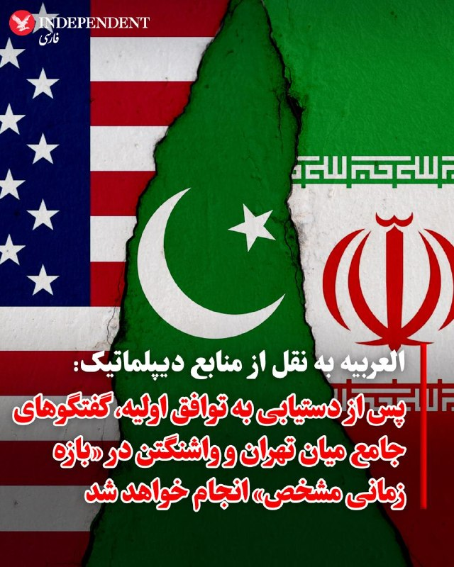

♦️.منابع عالی‌رتبه دیپلماتیک در گفتگو با شبکه العربیه اعلام کردند در صورت دستیابی به توافق میان واشنگتن و تهران، گفتگوهای جامع و همه‌جانبه میان دو کشور در آینده و در یک بازه زمانی مشخص و تعیین‌شده برگزار می‌شود.

به گفته این منابع، سند توافق احتمالی که ممکن است میان دو طرف حاصل شود، یک متن یک‌صفحه‌ای خواهد بود که احتمالا «اعلامیه اسلام‌آباد» نام می‌گیرد و زمینه را برای مذاکرات تفصیلی بعدی فراهم می‌کند.

همزمان با اعلام این خبر از سوی العربیه، خبرگزاری فرانسه نیز به نقل از منابع خود تایید کرد که عاصم منیر، فرمانده کل ارتش پاکستان برای پیشبرد این گفتگوها به تهران سفر کرده است.
‌🇸🇦 Indypersian

🤖 @VahidOOnLine

## VahidOOnLine — post 241539

  <a href="telegram/content/VahidOOnLine_241539_1779467692.mp4" target="_blank">🎬 Download video</a>

♦️مراسم رژه نیروهای امنیتی حج برای سال ۱۴۰۵ (۱۴۴۷ هجری قمری) برگزار شد؛ رویدادی که با حضور مقامات ارشد عربستان از جمله وزیر کشور و رئیس کمیته عالی حج همراه بود.
در این مراسم تاکید شد که نیروهای امنیتی از سطح بالایی از آمادگی برخوردارند و در قالب یک منظومه امنیتی یکپارچه، ماموریت حفظ امنیت و سلامت زائران و تسهیل انجام مناسک حج را بر عهده دارند.
بر اساس برنامه‌ریزی‌ها، زائران روز سه‌شنبه آینده در عرفات وقوف خواهند داشت و آغاز عید قربان نیز روز چهارشنبه پیش‌بینی شده است.
‌🇸🇦 Indypersian

🤖 @VahidOOnLine

## VahidOOnLine — post 241538

  <a href="telegram/content/VahidOOnLine_241538_1779467693.mp4" target="_blank">🎬 Download video</a>

یک شهروند در پیامی به ایران اینترنشنال می‌پرسد که جوانان ایران چه گناهی کردند که باید تاوان «نسل ۵۷» در انقلاب را بدهند. پیام او با هوش مصنوعی خوانده شده است.
‌🏁 🇬🇧 IranintlTV

🤖 @VahidOOnLine

## WithYashar — post 11963

العربی الجدید به نقل از منبعی در وزارت خارجه پاکستان: واشنگتن و تهران انعطاف کافی در پرونده‌های اصلی از خود نشان نمی‌دهند
@withyashar

## WithYashar — post 11962

ایسنا: عاصم منیر وارد تهران شد
@withyashar

## WithYashar — post 11961

  <a href="telegram/content/WithYashar_11961_1779467694.mp4" target="_blank">🎬 Download video</a>

کوین وارش رسماً به عنوان رئیس فدرال رزرو سوگند یاد کرد.
@withyashar

## WithYashar — post 11960

  <a href="telegram/content/WithYashar_11960_1779467696.mp4" target="_blank">🎬 Download video</a>

ترامپ درباره ایران:

«ایران داره جون میده برای توافق.
ما حسابی زدیمشون؛ چاره‌ای هم نداشتیم، چون ایران نباید سلاح هسته‌ای داشته باشه.»
@withyashar

## WithYashar — post 11959

## mwarmonitor — post 9486

  

✈️بله تایید میشود @mwarmonitor

## mwarmonitor — post 9485

  

✈️یک جت شخصی اسرائیلی از نوع Hawker 800 که توسط شرکت Arrow Aviation اداره می‌شود (شماره ثبت: 4X-CNZ)، دیروز از فرودگاه بن گوریون در تل‌آویو به سمت دبی پرواز کرد، حدود ۴۰ دقیقه روی زمین ماند و سپس دوباره به سمت اسرائیل پرواز کرد.

@mwarmonitor

## mwarmonitor — post 9484

  

🔰یک ملوان نیروی دریایی آمریکا در ناو USS Comstock (LSD 45) یک کشتی تجاری را در حالی مشاهده می‌کند که در حال اجرای محاصره آمریکا علیه ایران است، ۲۱ مه. نیروهای آمریکایی از زمان آغاز این محاصره، ۹۷ کشتی تجاری را تغییر مسیر داده و ۴ کشتی را از کار انداخته‌اند.

@mwarmonitor

## mwarmonitor — post 9483

  

🔹تنگه هرمز خالی است، به‌جز قایق‌های تندرو سپاه پاسداران که از ایران به سمت تنگه در حال عبور هستند.

🔸این نشان می‌دهد ایران درباره تعداد کشتی‌هایی که امروز عبور کرده‌اند آمارسازی می‌کند. ۴ شناور بزرگ در حال عبور از مسیر «عوارض ایران» قابل مشاهده هستند. این عدد بسیار کمتر از ۳۰+ مورد اعلام‌شده است.

@mwarmonitor

## mwarmonitor — post 9482

🔴مارشال ارتش پاکستان برای نهایی کردن توافق میان آمریکا و ایران راهی تهران می‌شود

📝نویسنده: باراک راوید AXIOS

🔰یک منبع امنیتی پاکستانی به اکسیوس (Axios) گفت که ژنرال عاصم منیر، عالی‌رتبه‌ترین فرمانده نظامی پاکستان، روز جمعه در تلاش برای دستیابی به توافقی که بر اساس آن آمریکا و ایران با پایان دادن به جنگ و آغاز مذاکرات برای یک توافق گسترده‌تر موافقت کنند، به تهران سفر می‌کند.

🔸چرا این موضوع اهمیت دارد؟
ژنرال منیر از زمان آغاز جنگ، میانجی اصلی میان آمریکا و ایران بوده است. این واقعیت که او پس از چند روز گفت‌وگو در سطوح پایین‌تر راهی تهران می‌شود، می‌تواند نشان‌دهنده تلاش نهایی پاکستان برای دستیابی به یک توافق باشد.

🔹پشت صحنه خبر
میانجی‌ها در تلاش هستند تا یک «نامه‌ اعلام آمادگی» (Letter of Intent) را نهایی کنند؛ این سند شامل توافقی برای پایان دادن به جنگ و اصول پایه‌ای برای ۳۰ روز مذاکرات بیشتر درباره یک توافق گسترده‌تر است که برنامه هسته‌ای ایران را نیز در بر می‌گیرد.
کشورهای میانجی: کشورهای پاکستان، قطر، عربستان سعودی، مصر و ترکیه همگی در این میانجی‌گری مشارکت داشته‌اند.

🔸ابهام در موضع ایران: هنوز مشخص نیست که آیا ایران تمایلی به امضای چنین سندی دارد یا خیر، به‌ویژه در شرایطی که به نظر می‌رسد برخی در تهران بر این باورند که برگ برنده و اهرم فشار در دست آن‌هاست.

🔹اظهار نظر مقامات
«پیشرفت‌های اندکی حاصل شده است. نمی‌خواهم بزرگ‌نمایی کنم، اما تحرکات کوچکی صورت گرفته که این خوب است.»
— مارکو روبیو، وزیر امور خارجه آمریکا (روز جمعه)
وی در ادامه افزود که خواسته بنیادین این است که «ایران هرگز نباید به سلاح هسته‌ای دست یابد. این امر مطلقاً ممکن نیست.»
روبیو همچنین اشاره کرد که هرگونه توافقی باید به موضوع ذخایر اورانیوم با غنای بالای ایران و سیاست غنی‌سازی این کشور در آینده بپردازد. وی در پایان به این نکته اشاره کرد که پس از تاکید مجدد ایران در روز پنج‌شنبه بر قصد خود برای ایجاد سیستمی جهت دریافت عوارض در تنگه هرمز، به ایران اجازه داده نخواهد شد تا در این آبراه «ایستگاه‌های دریافت عوارض» ایجاد کند.

@mwarmonitor

## mwarmonitor — post 9481

📰 وال‌استریت ژورنال بر اساس داده‌ها: صادرات نفت ایران که از طریق دریا حمل می‌شود، به‌دلیل محاصره به سطحی نزدیک به صفر کاهش یافته است.

@mwarmonitor

## mwarmonitor — post 9480

  

🔸امروز با وزیر خارجه ترکیه، Hakan Fidan، دیدار کردم تا درباره ضرورت راهبردی ادامه‌دارِ پایبندی همه متحدان به تعهدات دفاعی خود و همچنین برنامه‌های مربوط به نشست آینده ناتو در ترکیه گفتگو کنیم. همچنین درباره بازگشایی تنگه هرمز و تلاش برای دستیابی به ثبات بیشتر منطقه‌ای صحبت کردیم.

@mwarmonitor

## FoxNewsTwitter — post 342116

  <a href="telegram/content/FoxNewsTwitter_342116_1779467700.mp4" target="_blank">🎬 Download video</a>

Fox News (Twitter/X)

BREAKING: "Our mandate at the Fed is to promote price stability and maximum employment."

"When we pursue those aims with wisdom and clarity, independence and resolve, inflation can be lower, growth stronger, real-take home pay higher, and America, can be more prosperous. And no less important, America's place in the world more secure."

"These duties are now mine, Mr. President, because of the trust you have placed in me."

## FoxNewsTwitter — post 342115

  <a href="telegram/content/FoxNewsTwitter_342115_1779467702.mp4" target="_blank">🎬 Download video</a>

Fox News (Twitter/X)

JUST IN: President Trump shares a lighthearted moment during the swearing-in ceremony of Fed Chairman Kevin Warsh, joking that he would rather be a Supreme Court justice than lead the Fed.

“I'm not sure. I think I'd rather be a justice between you and I. It might be easier. You're going to find out. You'll be saying, well, that's a very easy job."

## FoxNewsTwitter — post 342114

  <a href="telegram/content/FoxNewsTwitter_342114_1779467703.mp4" target="_blank">🎬 Download video</a>

Fox News (Twitter/X)

BREAKING: Kevin Warsh is sworn in by Supreme Court Justice Clarence Thomas as the new chairman of the Federal Reserve.

## FoxNewsTwitter — post 342113

  <a href="telegram/content/FoxNewsTwitter_342113_1779467705.mp4" target="_blank">🎬 Download video</a>

Fox News (Twitter/X)

NEW: President Trump jokes “they must like you!” after the stock market jumped 600 points on the day Kevin Warsh was sworn in as Fed chair.

“Stock market’s up 600 points. That means they like you. If they didn’t like you...” Trump said while making a downward hand motion.

“I think it can only go up. I think with you, it’s only going to go up.”

## FoxNewsTwitter — post 342112

  <a href="telegram/content/FoxNewsTwitter_342112_1779467706.mp4" target="_blank">🎬 Download video</a>

Fox News (Twitter/X)

BREAKING: President Trump tears into the Federal Reserve for "losing its way" over the last few years as he prepares to swear in Kevin Warsh as the new chair.

"Unfortunately, in the eyes of many, the Fed lost its way in recent years. It became distracted by concerns far removed from its core mission and mandate, drifting into matters such as climate policy and DEI initiatives."

"With the Fed straying from its mandate, while the last administration blew out the deficit. Americans suffered the worst inflation that we had in history."

## FoxNewsTwitter — post 342111

  <a href="telegram/content/FoxNewsTwitter_342111_1779467708.mp4" target="_blank">🎬 Download video</a>

Fox News (Twitter/X)

HAPPENING NOW: President Trump says "no one in America" is better prepared to lead the Federal Reserve than new chair Kevin Warsh.

"The Federal Reserve is a pillar of the world financial system, and the most important central bank anywhere in the world."

"Honestly, I really mean this... I want Kevin to be totally independent. I want him to be independent and just do a great job."

## FoxNewsTwitter — post 342110

  <a href="telegram/content/FoxNewsTwitter_342110_1779467709.mp4" target="_blank">🎬 Download video</a>

Fox News (Twitter/X)

BREAKING: New Federal Reserve Chair Kevin Warsh gets a roaring applause from the White House crowd as President Trump introduces him at his swearing in ceremony:

"I expect he will go down as one of the truly great chairmen of the Federal Reserve that we've ever had. I really believe that."

## FoxNewsTwitter — post 342109

  <a href="telegram/content/FoxNewsTwitter_342109_1779467711.mp4" target="_blank">🎬 Download video</a>

Fox News (Twitter/X)

NOW: The White House crowd bursts out laughing after President Trump cracks a joke during Kevin Warsh's swearing-in ceremony as the new Federal Reserve Chairman.

"Oh, I thought that was for me. I was very unhappy. I looked around and I saw they were all looking at you. I was not happy about that."

## FoxNewsTwitter — post 342108

  

Fox News (Twitter/X)

WATCH LIVE: President Trump swears in Kevin Warsh as new Fed chair https://twitter.com/i/broadcasts/1rxmqoBMWAnxy

## FoxNewsTwitter — post 342107

Fox News (Twitter/X)

A growing number of politicians are being accused of antisemitism.

Democrat Graham Platner faced backlash over his Nazi-linked tattoo and is now coming under fire for resurfaced Reddit posts, while fellow Democrat Maureen Galindo said that she wants to lock up “American Zionists” in an ICE detention facility.

@BillMelugin_ reports on the hatred creeping into politics as examples of it grow more and more egregious. | @HARRISFAULKNER @FaulknerFocus

## FoxNewsTwitter — post 342106

Fox News (Twitter/X)

RT @TreyYingst: UPDATE: A Qatari negotiation team is in Tehran on Friday and Saturday to support the U.S. to reach a final deal that would end the war and address outstanding issues with Iran, an official with knowledge of the visit told Fox News.

## FoxNewsTwitter — post 342105

Fox News (Twitter/X)

A new batch of UFO files have just been released to the public.

The Department of War publishing a second wave of documents tied to PURSUE, a program releasing records connected to unidentified aerial incidents observed during military missions.

This latest batch adds another wave of unexplained reports and operational blurbs as public interest surrounding government UFO disclosures continues to grow.

## FoxNewsTwitter — post 342104

  

Fox News (Twitter/X)

Hooters says it’s going family-friendly.

CEO Neil Kiefer says the restaurant chain wants to return to its roots as a “beach-themed” neighborhood spot that families, couples, and regulars feel comfortable walking into, he told People magazine.

Kiefer blamed years of private equity ownership for pushing the brand “further and further away” from what it originally stood for — including uniforms he says became overly sexualized.

Now, after buying the brand back out of bankruptcy, the original owners say they’re trying to “re-Hooterize” Hooters.

“There’s nothing wrong with a pair of shorts if fitted properly... But I think in a dining place, there is something wrong [if] they’re in a thong-type uniform.”

📸: Hooters

## FoxNewsTwitter — post 342103

  <a href="telegram/content/FoxNewsTwitter_342103_1779467714.mp4" target="_blank">🎬 Download video</a>

Fox News (Twitter/X)

This Memorial Day weekend is expected to set a travel record despite more expensive tickets for Americans who plan to fly.

AAA projects around 3.7 million Americans will fly this weekend, as travelers are seemingly undeterred by higher ticket prices from increased jet fuel costs.

@Grady_Trimble spoke to travelers who are noticing those higher prices but are accepting the cost to still make their trips.

## FoxNewsTwitter — post 342102

  

Fox News (Twitter/X)

Spotify is trying something concert fans have been begging for for years: keeping tickets out of scammers’ hands and getting them directly to real fans.

The streaming giant just launched a new program called “Reserved,” giving an artist’s most engaged listeners access to two reserved seats at select shows before tickets disappear into resale sites.

For fans used to watching prices skyrocket seconds after a tour goes live, Spotify says this is designed to reward the people actually streaming the music, not bots flipping tickets for profit.

## FoxNewsTwitter — post 342101

  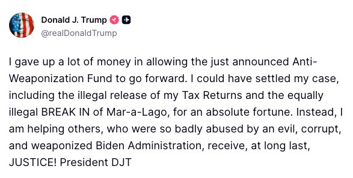

Fox News (Twitter/X)

“I could have settled my case... for an absolute fortune.”

President Trump says he turned down a massive payout tied to the release of his tax returns and the FBI's raid of Mar-a-Lago in order to secure the 'Anti-Weaponization Fund.'

The $1.776 billion fund is supposed to compensate individuals who were unfairly targeted by past administrations.

## FoxNewsTwitter — post 342100

  <a href="telegram/content/FoxNewsTwitter_342100_1779467716.mp4" target="_blank">🎬 Download video</a>

Fox News (Twitter/X)

A suspected drunk driver was arrested after crashing their Corvette head-on into a tour bus carrying 48 passengers along California’s scenic 17 Mile Drive in Monterey County.

The driver suffered major injuries, one bus passenger was treated for minor injuries, as investigators say the crash happened after the Corvette crossed the center line at a high rate of speed.

## FoxNewsTwitter — post 342099

  

Fox News (Twitter/X)

NYC's 9/11 Memorial & Museum is announcing free admission to all veterans ahead of Memorial Day weekend.

Museum officials say the expanded policy is meant to honor the post-9/11 generation of Americans who answered the call to serve after the attacks.

“For countless Americans, September 11, 2001, was a call to serve,” Chief Advancement and Communications Officer Josh Cherwin tells Fox Digital, pointing to the students, first responders, and young Americans whose lives were shaped by that day.

The change takes effect ahead of Memorial Day, expanding the museum’s existing free admission policy for active-duty military members.

## FoxNewsTwitter — post 342098

  <a href="telegram/content/FoxNewsTwitter_342098_1779467718.mp4" target="_blank">🎬 Download video</a>

Fox News (Twitter/X)

BREAKING: Secretary Marco Rubio says NATO allies are beginning to think through a worst-case scenario if Iran refuses to open the Strait of Hormuz:

"We all would love to see an agreement with Iran in which the Straits are open and they abandon their nuclear ambitions and so forth... We also have to have a plan B."

"We have to start thinking about what do we do if, a few weeks from now, Iran decides 'We don't care, we're going to keep the Straits closed. We're going to sink any ship that doesn't listen to us or doesn't pay us.' Then someone's going to have to do something about it."

## FoxNewsTwitter — post 342097

  <a href="telegram/content/FoxNewsTwitter_342097_1779467720.mp4" target="_blank">🎬 Download video</a>

Fox News (Twitter/X)

NEW: Secretary of State Rubio outlines the major tech agreement signed with Sweden during today's key NATO meeting.

"[This] further adds to our cooperation on biomedicine, biotechnology, all of these innovatives, and we're building on a foundation of years and years, actually decades of cooperation between our two countries."

"We have already sort of a preexisting relationship when it comes to collaborating on innovation and in technology... What we signed today... I just think it's going to give further impetus to what we've already done in the past together."

## pm_afshaa — post 91215

🔴ترامپ: ما به ایران ضربات شدیدی وارد کردیم و گزینه دیگری نداشتیم

💧 Rainbet.com the #1 Non-KYC Crypto Casino & Sportsbook @rainbetcom

😁 @Pm_Afshaa

## pm_afshaa — post 91214

🔴ترامپ: ایران به شدت خواهان توافقه
همان کاری را که در ونزوئلا انجام دادیم، در ایران انجام می دهیم

💧 Rainbet.com the #1 Non-KYC Crypto Casino & Sportsbook @rainbetcom

😁 @Pm_Afshaa

## pm_afshaa — post 91213

🔴ترامپ : ما یه مقدار بدهی داریم که باید حلش کنیم و راهش رشد اقتصادیه قراره با رشد خیلی سریع از این بدهی خارج بشیم

💧 Rainbet.com the #1 Non-KYC Crypto Casino & Sportsbook @rainbetcom

😁 @Pm_Afshaa

## pm_afshaa — post 91212

وال استریت ژورنال: صادرات نفت ایران از طریق دریا به دلیل محاصره به سطح صفر کاهش یافته

💧 Rainbet.com the #1 Non-KYC Crypto Casino & Sportsbook @rainbetcom

😁 @Pm_Afshaa

## pm_afshaa — post 91211

🔴2000 ساعت از قطع اینترنت مردم ایران توسط جمهوری اسلامی گذشت

💧 Rainbet.com the #1 Non-KYC Crypto Casino & Sportsbook @rainbetcom

😁 @Pm_Afshaa

## pm_afshaa — post 91210

  <a href="telegram/content/pm_afshaa_91210_1779467721.webm" target="_blank">🎬 Download video</a>

🔴حسینی همدانی، امام جمعه کرج:
هرکسی که در تجمعات شبانه شرکت نمیکنه، باید در محضر خدا پاسخگو باشه.

💧 Rainbet.com the #1 Non-KYC Crypto Casino & Sportsbook @rainbetcom

😁 @Pm_Afshaa

## pm_afshaa — post 91209

🔴نورمن، خبرنگار وال استریت ژورنال : یه منبع میگه هر چیزی درباره پیش‌نویس توافقی که داره می‌چرخه، دروغه و صحت نداره

💧 Rainbet.com the #1 Non-KYC Crypto Casino & Sportsbook @rainbetcom

😁 @Pm_Afshaa

## pm_afshaa — post 91208

  <a href="telegram/content/pm_afshaa_91208_1779467722.webm" target="_blank">🎬 Download video</a>

🔴العربیه: عاصم ملک، رئیس سازمان اطلاعات پاکستان هم عازم تهران شد.

💧 Rainbet.com the #1 Non-KYC Crypto Casino & Sportsbook @rainbetcom

😁 @Pm_Afshaa

## pm_afshaa — post 91207

🔴پوتین: اوکراین یک خوابگاه دانشجویی را هدف قرار داد و 15 نفر مفقود شده‌اند، شش نفر کشته و 39 نفر دیگر زخمی شدن

💧 Rainbet.com the #1 Non-KYC Crypto Casino & Sportsbook @rainbetcom

😁 @Pm_Afshaa

## pm_afshaa — post 91206

🔴اختلال گسترده Gps در تنگه هرمز ، عربستان ، اسرائیل ، اردن ، سوریه ، عراق ، ایران

💧 Rainbet.com the #1 Non-KYC Crypto Casino & Sportsbook @rainbetcom

😁 @Pm_Afshaa

## pm_afshaa — post 91204

🔴مارک لوین:زمان نابودی رژیم ایران فرا رسیده است. بیایید کار را تمام کنیم، بگذارید کار را به انجام برسانیم

💧 Rainbet.com the #1 Non-KYC Crypto Casino & Sportsbook @rainbetcom

😁 @Pm_Afshaa

## pm_afshaa — post 91203

🔴آکسیوس:نتانیاهو بزرگ ترین عامل برای عدم توافق بین دو کشور است

💧 Rainbet.com the #1 Non-KYC Crypto Casino & Sportsbook @rainbetcom

😁 @Pm_Afshaa

## pm_afshaa — post 91202

  <a href="telegram/content/pm_afshaa_91202_1779467722.webm" target="_blank">🎬 Download video</a>

🔴اکسیوس: واسطه‌ها در تلاش برای نهایی‌سازی یک تفاهم‌نامه هستن که شامل توافق برای پایان جنگ و اصولی برای 30 روز مذاکره بر سر یک توافق گسترده‌تره که به برنامه هسته‌ای ایران نیز بپردازه.

پاکستان، قطر، عربستان، مصر و ترکیه همگی در میانجیگری مشارکت داشتن.

💧 Rainbet.com the #1 Non-KYC Crypto Casino & Sportsbook @rainbetcom

😁 @Pm_Afshaa

## pm_afshaa — post 91201

  <a href="telegram/content/pm_afshaa_91201_1779467723.webm" target="_blank">🎬 Download video</a>

🔴روبیو، وزیر خارجه آمریکا: عاصم‌ منیر برای میانجی گری راهی تهرانه و ما در بالاترین رده‌های سیاسی با او در ارتباط هستیم.

💧 Rainbet.com the #1 Non-KYC Crypto Casino & Sportsbook @rainbetcom

😁 @Pm_Afshaa

## pm_afshaa — post 91200

🔴بلومبرگ:حمله به نیروگاه هسته‌ای امارات متحده عربی، نگرانی‌ها در مورد انتقام‌جویی ایران و افزایش نقش گروه‌های نیابتی آن در عراق را افزایش داد

💧 Rainbet.com the #1 Non-KYC Crypto Casino & Sportsbook @rainbetcom

😁 @Pm_Afshaa

## pm_afshaa — post 91198

  <a href="telegram/content/pm_afshaa_91198_1779467723.webm" target="_blank">🎬 Download video</a>

🔴مارکو روبیو، وزیر خارجه آمریکا:
باید تنگه هرمز کامل باز و آزاد باشه و ایران به طور کامل قید برنامه هسته‌ای رو بزنه!

💧 Rainbet.com the #1 Non-KYC Crypto Casino & Sportsbook @rainbetcom

😁 @Pm_Afshaa

## pm_afshaa — post 91197

یه هیئت قطری و ‌پاکستانی دارن میان تهران بله رو از عروس خانوم بگیرن

## DEJradio — post 4849

  <a href="telegram/content/DEJradio_4849_1779467724.mp4" target="_blank">🎬 Download video</a>

🚨
🔸 پرتوی دیگر، به میزبانی کیهان لندن؛
آدینه ساعت ۱۹:۳۰ به‌وقت ایران

#پرتوی_دیگر
@DEJradio

## DEJradio — post 4848

⭕️ آمریکا سفیر اخراجی جمهوری اسلامی در لبنان و ۸ فرد مرتبط با حزب‌الله را تحریم کرد

وزارت خزانه‌داری آمریکا ۹ تن از جمله محمدرضا شیبانی رئوف، سفیر معرفی‌شدۀ جمهوری اسلامی در لبنان را تحریم کرد.
واشینگتن می‌گوید این افراد در روند صلح لبنان مانع‌تراشی کرده و از خلع سلاح حزب‌الله جلوگیری کرده‌اند.
آمریکا همچنین اعلام کرد برخی افراد تحریم‌شده، از مقام‌های لبنانی همسو با حزب‌الله در پارلمان، ارتش و نهادهای امنیتی‌اند.
اسکات بسنت، وزیر خزانه‌داری آمریکا، گفت حزب‌الله یک سازمان تروریستی است و باید کاملاً خلع سلاح شود.
اعتبارنامۀ سفیر معرفی‌شدۀ جمهوری اسلامی، پیش‌تر در لبنان رد شده بود و او ناچار به بازگشت به تهران شد.

#تحریم
@DEJradio

## DEJradio — post 4847

⭕️ آمریکا فروش تسلیحات به تایوان را به دلیل جنگ با جمهوری اسلامی کاهش داد

رویترز به نقل از یک مقام ارشد آمریکایی گزارش داد واشینگتن برای تأمین مهمات مورد نیاز جنگ علیه جمهوری اسلامی، به‌طور موقت در روند فروش تسلیحات به تایوان وقفه ایجاد کرده است.
هانگ کائو، سرپرست وزارت نیروی دریایی آمریکا گفت ایالات متحده می‌خواهد مطمئن شود مهمات کافی برای عملیات علیه جمهوری اسلامی، در اختیار دارد.
او تأکید کرد فروش‌ تجهیزات نظامی به کشورهای خارجی، تا هر زمان که دولت آمریکا لازم بداند ادامه می‌یابد.

#جنگ
@DEJradio

## DEJradio — post 4846

🌐 
🚨 قطعی سراسری اینترنت در ایران وارد هشتادوچهارمین روز شد

نت‌بلاکس اعلام کرد قطعی گستردۀ اینترنت در ایران وارد هشتادوچهارمین روز شده و شبکه‌های بین‌المللی عملا بیش از ۱۹۹۲ ساعت از دسترس عموم مردم خارج شده‌اند.
این نهاد جهانی پایش اینترنت هشدار داد که با ادامۀ خاموشی دیجیتال، شکاف‌های اقتصادی و اجتماعی در ایران عمیق‌تر شده و ارتباط با جهان خارج به دسترسی‌های محدود و گزینشی وابسته است.
بنا بر گزارش‌ها فروشگاه‌های آنلاین داخلی با سقوط درحدود هشتاد درصدی در فروش مواجه‌اند.
ناظران می‌گویند این مسئله بیشترین فشار را بر کسب‌وکارهای کوچک وارد کرده است.
جمهوری اسلامی دسترسی محدود به اینترنت جهانی را تنها برای برخی نهادها، سازمان‌ها و هواداران حکومت فراهم کرده است.

#اینترنت
@DEJradio

## DEJradio — post 4845

⭕️ یک مقام دولتی گفت دوازده درصد از آب کشور در شبکۀ فرسوده هدر می‌رود

هاشم امینی، مدیرعامل شرکت مهندسی آب و فاضلاب ایران، اعلام کرد ۱۲ درصد از آب ایران به علت فرسودگی شبکۀ انتقال و توزیع در کشور هدر می‌رود. به گفتۀ این مقام دولتی، بودجۀ کافی برای کاهش این تلفات وجود ندارد.
هاشم امینی به خبرگزاری ایرنا گفت کاهش تنها یک درصد از هدررفت آب، سالانه حدود ۲۱ همت اعتبار نیاز دارد. به گفتۀ او این رقم با افزایش تورم همچنان بالاتر می‌رود.
امینی افزود در هر شهر و روستا باید سالانه حدود ۱۰ درصد از شبکه‌های فرسوده بازسازی شود، اما محدودیت منابع مالی مانع تحقق این هدف است.
بر اساس آمار رسمی، مصرف آب شرب ایران درحدود ۹ میلیارد متر مکعب در سال است.
این در حالی است که تنها نیمی از خانوارهای شهری به شبکۀ فاضلاب متصل‌اند. از سویی تنها یک‌پنجم از فاضلاب تولیدی تصفیه و بازیافت می‌شود.
طبق ارزیابی‌های بین‌المللی، ایران از نظر تنش آبی در رتبۀ سیزدهم دنیا قرار دارد.

#آب #ایران
@DEJradio

## DEJradio — post 4844

⭕️ ارتش اسرائیل: پنج عضو حزب‌الله در جنوب لبنان کشته شدند

ارتش اسرائیل اعلام کرد پنج عضو حزب‌الله لبنان را پس از ورود به یک مرکز فرماندهی متعلق به این گروه در جنوب لبنان هدف گرفته است.
شبه‌نظامیان حزب‌الله در سیاهۀ تروریستی اتحادیۀ اروپا و ایالات متحده قرار دارند.
بر پایۀ بیانیۀ ارتش اسرائیل، این افراد روز پنج‌شنبه در مناطق جنوبی لبنان شناسایی و در پی حملۀ هوایی کشته شدند. این مناطق تحت کنترل شبه‌نظامیان حزب‌الله قرار دارد.
ارتش اسرائیل همچنین اعلام کرد در ساعت گذشته، انبارهای تسلیحاتی حزب‌الله و دیگر زیرساخت‌های تروریستی را هدف گرفته است. در پی این حملات و چندین عضو دیگر حزب‌الله حذف شدند.
صبح آدینه اول خرداد نیز ارتش اسرائیل خبر داد دو فرد مسلح مشکوک را پیش از نزدیک شدن به مرز این کشور با لبنان هدف قرار داده است.

#اسرائیل #حزب‌الله
@DEJradio

## mamlekate — post 103568

  <a href="telegram/content/mamlekate_103568_1779467725.mp4" target="_blank">🎬 Download video</a>

رسماً جاکش خونه باز کردن

norbayuv
@mamlekate

## mamlekate — post 103567

📞 الو کاشان همه ورودی اماکن دیدنی از این سگ‌های حجاب بان بستن. گیر و گیربازاریه.
اعصاب همه رو خورد کردن.

@mamlekate

## mamlekate — post 103566

📝 نماینده مجلس: با تصمیم نهادهای بالادستی، فعلاً نیاز به باز کردن اینترنت وجود ندارد

نایب‌رئیس کمیسیون فرهنگی مجلس شورای اسلامی می‌گوید بر اساس تصمیم «نهادهای بالادستی، فعلاً نیازی به باز کردن اینترنت وجود ندارد» و مدعی شد دلیل آن «خطرات امنیتی و تهدید شخصیت‌ها و کشور» است.

@mamlekate

## mamlekate — post 103565

📝 گزارش وال‌استریت جورنال از «کمک» بابک زنجانی به انتقال میلیون‌ها دلار پول برای ایران

وال‌استریت جورنال از استفاده گسترده حکومت ایران از صرافی دیجیتال بایننس و با کمک شبکۀ مالی بابک زنجانی خبر داد. این روزنامه می‌گوید این تراکنش‌ها تا همین اواخر ادامه داشته است.

@mamlekate

## VahidOnline — post 75621

🔴بنیاد عبدالرحمن برومند تا کنون ۶۵۵ مورد اعدام را در سال ۲۰۲۶ ثبت کرده است، که ۳۴ مورد که از آغاز ماه می تاکنون اجرا شده است.. آمار واقعی احتمالاً بسیار بیشتر از این رقم است. جمهوری اسلامی در حالی این اعدام‌ها را پشت درهای بسته اجرا می‌کند که ۸۳ روزه است که اینترنت کشور قطع شده است. حاکمیت با قطع ارتباط جامعه از ۹ اسفند ۱۴۰۴ صدای زندانیان، خانواده‌ها و شاهدان عینی را به شدت سرکوب کرده و نظارت مستقل بر وضعیت حقوق بشر را به‌طور خاص دشوار ساخته است.

🔸از آنجا که دستگاه قضایی همواره تنها بخش کوچکی از احکام مرگ خود را به‌طور رسمی اعلام می‌کند، قطع اینترنت داده‌های فعلی را به شدت محدود به منابع دولتی ایران کرده است. بنابراین کاهش در آمارهای ثبت‌شده، تنها نشان‌دهنده خفقان اطلاعاتی است، نه کاهش کشتار.
#نه_به_اعدام
@IranRights

## VahidOnline — post 75620

  

دختر حسین ناصری: MNaseri23595

📡 @VahidOnline

## VahidOnline — post 75619

  

به گزارش رسانه‌های دولتی پاکستان، فیلد مارشال عاصم منیر،‌ فرمانده ارتش این کشور راهی تهران شده است.

خبرگزاری اسوشیتد پرس پاکستان به نقل از منابع امنیتی گزارش داده است که فیلد مارشال عاصم منیر در طول این سفر رسمی، درباره «مذاکرات جاری ایران و آمریکا و صلح و ثبات منطقه‌ و منافع دوجانبه دیگر» با مقام‌های ایران گفت‌و‌گو خواهد کرد.

فرمانده ارتش پاکستان چهل روز پیش هم در تهران بود و با محمدباقر قالیباف و اعضای تیم مذاکره‌ ایران و آمریکا دیدار و گفت‌وگو کرده بود.

این در حالی است که وزیر کشور پاکستان هم برای دومین بار طی هفته اخیر به تهران رفته و در حال گفت‌وگو با مقامات ایرانی است.
@VahidHeadline

📡 @VahidOnline

## VahidOnline — post 75614

  <a href="telegram/content/VahidOnline_75614_1779467728.mp4" target="_blank">🎬 Download video</a>

مارکو روبیو، وزیر خارجه آمریکا، در حاشیه نشست ناتو درباره مذاکرات جاری با جمهوری اسلامی گفت که واشینگتن در انتظار نتایج گفت‌وگوهای در حال انجام است؛ گفت‌وگوهایی که به گفته او نشانه‌هایی از پیشرفت داشته‌اند.
او افزود: «ما در انتظار نتایج این گفت‌وگوها هستیم که نشانه‌هایی از پیشرفت دارد. نمی‌خواهم در این باره اغراق کنم؛ تحرک محدودی صورت گرفته و این مثبت است، اما اصول اساسی تغییری نکرده است.»
وزیر خارجه آمریکا تاکید کرد که حکومت ایران هرگز نباید به سلاح هسته‌ای دست یابد و گفت: «برای تحقق این هدف، باید به مسئله غنی‌سازی و نیز موضوع اورانیوم با غنای بالا رسیدگی کنیم و افزون بر آن، موضوع تنگه هرمز را نیز مد نظر قرار دهیم.»
@VahidOOnLine
مارکو روبیو، وزیر خارجه آمریکا، جمعه یکم خرداد در حاشیه نشست ناتو گفت جمهوری اسلامی در پی ایجاد نظامی اختصاصی برای اخذ عوارض در یک آبراه بین‌المللی است و تلاش می‌کند عمان را نیز به پیوستن به این سازوکار متقاعد کند. روبیو تاکید کرد که این اقدام «غیرقابل قبول» است.
او افزود: «هیچ کشوری در جهان نباید چنین چیزی را بپذیرد. من کشوری را نمی‌شناسم که جز ایران از آن حمایت کند.»
روبیو با اشاره به تحرکات دیپلماتیک در سازمان ملل متحد گفت قطعنامه‌ای با پیشنهاد بحرین در شورای امنیت مطرح شده که آمریکا در آن نقش فعالی داشته و به گفته او، بیشترین تعداد هم‌پیشنهاددهنده را در تاریخ شورای امنیت دارد. او هشدار داد چند کشور در حال بررسی وتوی این قطعنامه هستند و افزود: «این مایه تاسف خواهد بود.»
وزیر خارجه آمریکا تاکید کرد واشینگتن برای دستیابی به اجماع جهانی جهت جلوگیری از اجرای چنین طرحی تلاش می‌کند و گفت: «باید دید آیا سازمان ملل همچنان کارآمد است یا نه. ما می‌کوشیم از این مسیر به نتیجه برسیم.»
او تصریح کرد اگر اخذ عوارض در تنگه هرمز اجرایی شود، ممکن است در دیگر آبراه‌های مهم جهان نیز تکرار شود و افزود: «این قابل قبول نیست و نمی‌تواند رخ دهد.»
روبیو با اشاره به اهمیت تنگه هرمز گفت این آبراه برای کشورهای حاضر در نشست و نیز برای دیگر کشورها، به‌ویژه در منطقه هند-آرام، حیاتی است.
او در پایان با ابراز امیدواری نسبت به نتایج نشست ناتو گفت این دیدار زمینه را برای نشست رهبران در حدود شش هفته آینده فراهم خواهد کرد و افزود که تا آن زمان کارهای زیادی پیش رو است.
@VahidOOnLine
مارکو روبیو، وزیر خارجه آمریکا، پس از نشست ناتو در سوئد درباره مذاکرات با تهران گفت: «همه ما دوست داریم توافقی با ایران شکل بگیرد که در آن تنگه‌ها باز باشند و ایران از جاه‌طلبی‌های هسته‌ای خود دست بردارد.»
او افزود: «این چیزی است که همه ما امیدواریم و همچنان برایش تلاش خواهیم کرد و همین حالا هم که با شما صحبت می‌کنم، کار و مذاکرات در این زمینه ادامه دارد.»
وزیر خارجه آمریکا با اشاره به این که باید یک «برنامه جایگزین» هم وجود داشته باشد، گفت که برنامه جایگزین در صورتی باید عملی شود که حکومت ایران از باز کردن تنگه‌ هرمز خودداری کند.
او گفت: «پس باید از الان درباره‌اش فکر کنیم. من امروز این موضوع را مطرح کردم. واکنش‌های تاییدآمیز زیادی دیدم. اما هنوز چیزی برای اعلام رسمی درباره اقدام مشخصی که در حال انجام باشد نداریم.»
وزیر خارجه آمریکا درباره برنامه جایگزین در صورت امتناع جمهوری اسلامی از بازگشایی تنگه هرمز افزود: «نمی‌دانم لزوما این می‌تواند ماموریت ناتو باشد یا نه، اما قطعا کشور‌های عضو ناتو می‌توانند در آن مشارکت کنند.»
@VahidOOnLine

📡 @VahidOnline

## VahidOnline — post 75611

اطلاعیه منوتو درباره پایان پخش برنامه‌ها
@VahidOOnLine

📡 @VahidOnline

## VahidOnline — post 75607

  <a href="telegram/content/VahidOnline_75607_1779467728.mp4" target="_blank">🎬 Download video</a>

فیلم مستند «تمرین‌هایی برای یک انقلاب»، ساخته پگاه آهنگرانی جایزه «چشم طلایی» هفتاد و نهمین جشنواره فیلم کن را از آن خود کرد.

 «لوئی دور» یا چشم طلایی، مهم‌ترین جایزه بخش مستند جشنواره فیلم کن است.
 پگاه آهنگرانی جایزه‌اش را به مردم ایران تقدیم کرد و گفت: «(مردم ایران) با وجود تمام سرکوب‌هایی که در طول این سال‌ها تحمل کرده‌اند، هرگز از تلاش برای حقوقشان، آزادی‌شان و آرزوهایشان دست نکشیده‌‌اند و مطمئنم که آنها هرگز تسلیم نخواهند شد. مطمئنم و یک آرزو دارم که می‌خواهم اینجا بگویم: این‌که روزی دختر کوچکم لی‌لی و همه بچه‌های ایران در آینده‌ای نزدیک در ایرانی آزاد و دموکراتیک زندگی کنند.»

به گفته خانم آهنگرانی او با استفاده از آرشیوهای شخصی، ویدئوهای خانگی، تصاویر اعتراضات خیابانی، روزنامه‌ها و صداهای ضبط‌ شده، بیش از ۴۰ سال از تاریخ ایران را بازخوانی ‌کرده است.
@VahidHeadline

📡 @VahidOnline

## VahidOnline — post 75606

  

کشورهای عرب حوزه خلیج فارس از جامعه جهانی خواستند که طرح جمهوری اسلامی برای مدیریت تنگه هرمز را رد کنند.

به گزارش بلومبرگ، در میانه مذاکرات دیپلماتیک سازمان بین‌المللی دریانوردی با ایران و عمان پیرامون بازگرداندن آزادی تردد و امنیت کامل کشتیرانی در این آبراه راهبردی، کشورهای عرب حوزه خلیج فارس طی نامه‌های به اعضای این نهاد زیرمجموعه سازمان ملل، نسبت به طرح جمهوری اسلامی موسوم به «نهاد مدیریت آبراه خلیج فارس» هشدار دادند.

پنج کشور عربستان، امارات، بحرین، کویت و قطر در نامه خود گفته‌اند که به رسمیت شناختن مسیر پیشنهادی جمهوری اسلامی می‌تواند یک «سابقه خطرناک» ایجاد کند.

سفیر ایران در فرانسه روز گذشته تأیید کرد که تهران با عمان درباره اعمال دائمی عوارض عبور در حال مذاکره است.
@VahidHeadline

📡 @VahidOnline

## VahidOnline — post 75605

  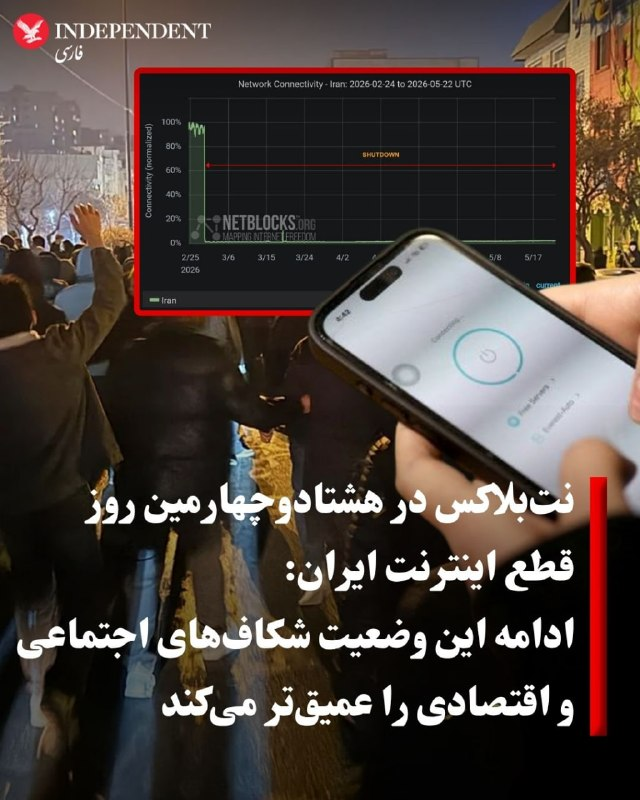

نهاد بین‌المللی ناظر بر وضعیت اینترنت، نت‌بلاکس، صبح جمعه اول خرداد اعلام کرد قطع گسترده اینترنت در ایران وارد هشتاد‌وچهارمین روز خود شده و بیش از هزار و ۹۹۲ ساعت است که دسترسی کاربران در ایران به شبکه‌های بین‌المللی همچنان قطع است.

این نهاد ناظر بر اینترنت نوشت با ادامه این وضعیت، شکاف‌های اجتماعی و اقتصادی عمیق‌تر می‌شود و هر ساعت از قطع اینترنت، ارتباط با جهان خارج را بیش از پیش به جایگاه، همراهی با حکومت و برخورداری از امتیاز وابسته می‌کند.
@VahidOOnLine

📡 @VahidOnline

## VahidOnline — post 75604

  

دیوان عالی کشور احکام اعدام محمدرضا مجیدی‌اصل و همسرش بیتا همتی، از بازداشت‌شدگان اعتراضات دی‌ماه ۱۴۰۴، را نقض کرد.

هرانا خبر داد که پرونده این دو متهم برای رسیدگی مجدد به شعبه هم‌عرض ارجاع شده است.

این دو پیش‌تر به همراه بهروز زمانی‌نژاد و کوروش زمانی‌نژاد با حکم صادرشده از سوی قاضی ایمان افشاری، رئیس شعبه ۲۶ دادگاه انقلاب تهران، از بابت اتهام «اقدام عملیاتی برای دولت متخاصم ایالات متحده و گروه‌های متخاصم» به اعدام محکوم شده بودند.
@VahidHeadline

📡 @VahidOnline

## kianmeli1 — post 87554

  

🔴به گزارش رویترز، به نقل از افراد آگاه، با هماهنگی ایالات متحده، یک هیئت قطری امروز صبح وارد تهران شد تا به تلاش‌ها برای دستیابی به توافق بین ایالات متحده و ایران کمک کند.

در گذشته، قطر نقش میانجی بین ایران و ایالات متحده را ایفا کرده است و تصور می‌شود که ارتباط آنها با تصمیم‌گیرندگان اصلی ایران ممکن است تلاش‌های مذاکرات را تسهیل کند.
این در حالی است که فیلد مارشال عاصم منیر، تصمیم‌گیرنده اصلی پاکستان، نیز برای تسهیل توافق به تهران سفر کرده است.
https://t.me/kianmeli1

## IranIntlTV — post 338455

  

خبرگزاری ایسنا اعلام کرد که عاصم منیر، رییس ستاد کل ارتش پاکستان، عصر جمعه وارد تهران شده است.
پیش‌تر برخی رسانه‌ها از سفر او به تهران، برای تلاش در خصوص نزدیک کردن خواسته‌ها و انتظارات مقام‌های جمهوری اسلامی و ایالات متحده، برای رسیدن به توافق خبر داده بودند.
https://iranintl.com/202605220892

## IranIntlTV — post 338454

بندر خَصَب، راه فرار جمهوری اسلامی از محاصره دریایی؟
فرناز داوری- در میانه آتش‌بس شکننده و محاصره دریایی در تنگه هرمز، بندر خَصَب در عمان به یکی از مسیرهای حیاتی برای رساندن کالا به ایران تبدیل شده است. بندری که با قایق‌های «شوتی»، ماهیگیران و گردشگران شناخته می‌شد، حالا گذرگاهی پرهزینه اما مهم برای دور زدن محاصره بنادر جنوبی ایران شده است.
تا پیش از آغاز جنگ آمریکا و اسرائیل علیه جمهوری اسلامی، بخشی از رفت‌وآمدهای دریایی میان خصب و سواحل جنوبی ایران، به قایق‌های تندرو اختصاص داشت. قایق‌هایی که در ادبیات محلی به «شوتی» معروف‌ هستند و سال‌ها در مسیرهای غیررسمی میان عمان و جنوب ایران، رفت‌وآمد کرده‌اند.
این قایق‌ها معمولا به صورت گروهی حرکت می‌کردند و در زمانی کوتاه خود را از آب‌های عمان به قشم یا دیگر نقاط ساحلی ایران می‌رساندند.
این مسیر پیش از این بیشتر برای دادوستدهای غیررسمی و قاچاق خرد شناخته می‌شد. سیگار ایرانی، مشروبات الکلی و حشیش، از ایران به عمان منتقل می‌شد و در مسیر بازگشت، کالاهای مصرفی، لوازم خانگی و اجناس لوکس، از عمان به ایران می‌رسید.
حضور قایق‌های ماهیگیری ایرانی نیز در اطراف خصب همیشه بخشی از تصویر معمول این منطقه بود.

ادامه گزارش را در اینجا بخوانید:
https://www.iranintl.com/202605220630

## IranIntlTV — post 338453

  <a href="telegram/content/IranIntlTV_338453_1779467731.mp4" target="_blank">🎬 Download video</a>

همه‌پرسی درباره جدایی آلبرتا از کانادا ۱۹ اکتبر برگزار می‌شود.

نخست‌وزیر کانادا هشدار داد هرگونه اقدام برای استقلال باید بر اساس قوانین فدرال انجام شود.

گزارش مهسا مرتضوی، خبرنگار ایران‌اینترنشنال
@iranintltv

## IranIntlTV — post 338452

  

دونالد ترامپ در کاخ سفید درباره مذاکرات با جمهوری اسلامی گفت: «خواهیم دید چه خواهد شد. ما ضربه سختی به ‌آنها زدیم. چاره‌ای نداشتیم. ایران نمی‌تواند سلاح هسته‌ای داشته باشد.»

ترامپ ادامه داد: «آمریکا با جمهوری اسلامی همان رفتاری را انجام می‌دهد که با ونزوئلا انجام داده است.»

ترامپ تاکید کرد جمهوری اسلامی بی‌صبرانه به دنبال رسیدن به توافق است.
https://iranintl.com/202605224243

## IranIntlTV — post 338451

رجزخوانی نظام؛ مغازه کوچک وحشت‌فروشی
حسین ذوقی-جمهوری اسلامی در حالی که تقریبا در آستانه شکست در همه زمینه‌های داخلی و خارجی قرار دارد، تاکتیکش را بر یک سنت فقهی استوار کرده است: رجزخوانی.
سخنان تند مداحان در تجمعات شبانه، سخنان تلویزیونی مسئولان میان‌رده تا گفته‌های رسمی مسئولین بلندپایه در مذاکرات، رسانه‌های اجتماعی و در نهایت، پیام‌های مکتوب رهبر نادیده نظام، بر همین سنت استوار شده است.
ماجرای «آتیش زدم به مالم» را حتما شنیده‌اید: بزازی در بازار، در کسادی وضعیتش و وقتی که اجناسش روی دستش مانده بود و راهی برای فروش نداشت، شاگردش را با یک حلب نفت به میانه بازار می‌فرستد تا فریاد بزند که: «اوستایم عقلش را از دست داده، می‌خواهد همه جا را به آتش بکشد!»
مردم هم که ترسیده‌اند به طمع جنس مفت، سمت دکان بزاز هجوم می‌برند. اوستای بزاز پارچه‌هایش را میان دکان می‌اندازد و رجز می‌خواند که «آتش می‌زنم ...»
خلاصه که انبار بزاز خالی می‌شود و جنس‌هایش را با قیمت بالاتر می‌فروشد!
حالا جمهوری اسلامی هم انگار می‌خواهد با تهدید و رجزخوانی به آتش زدن دنیا، ایده‌هایش را به منطقه و جهان بفروشد.
مداحان از منبر، منتقدان داخلی را به مرگ تهدید می‌کنند. محمود نبویان، نایب‌رییس کمیسیون امنیت ملی مجلس شورای اسلامی، پادشاهان کشورهای عربی را تهدید می‌کند که «هیچ یک از کاخ‌هایشان سالم نخواهد ماند».
عباس عراقچی، وزیر امور خارجه جمهوری اسلامی، در شبکه‌های اجتماعی از «پاسخ طولانی و دردناک» سخن می‌گوید.
اسماعیل بقایی، سخنگوی وزارت امور خارجه، حتی در نشست‌های دیپلماتیک، با لحنی رجزآلود حرف می‌زند.
غلامحسین محسنی اژه‌ای، رییس قوه قضاییه، از «تحمیل ناپذیری» می‌گوید؛ و حسین کنعانی‌مقدم، فرمانده پیشین سپاه پاسداران، اعتراف می‌کند که «رجزخوانی یکی از روش‌های مقابله با دشمن است».
لایه‌ها‌ی متفاوت نظام به یک زبان مشترک رسیده‌اند. این روش تصادفی نیست، شیوه جدید حکمرانی در جمهوری اسلامی است.

ادامه این تحلیل را اینجا بخوانید:
https://www.iranintl.com/202605219159

## IranIntlTV — post 338450

  <a href="telegram/content/IranIntlTV_338450_1779467733.mp4" target="_blank">🎬 Download video</a>

فیلم مستند «تمرین‌هایی برای یک انقلاب»، ساخته پگاه آهنگرانی، برنده جایزه «چشم طلایی» جشنواره کن شد. این فیلم با استفاده از آرشیوهای شخصی و تصاویر اعتراض‌ها، ۴ دهه از تحولات سیاسی و اجتماعی ایران را روایت می‌کند.

لی‌لی نیکفر، خبرنگار ایران‌اینترنشنال، گزارش می‌دهد
@iranintltv

## IranIntlTV — post 338449

  <a href="telegram/content/IranIntlTV_338449_1779467734.mp4" target="_blank">🎬 Download video</a>

جاویدنام عرفان بزرگی، جوان ۲۲ ساله اهل مرودشت، قهرمان مچ‌اندازی استان فارس بود. او ۱۲ دی‌ماه از ناحیه سر هدف گلوله نیروهای سرکوب جمهوری اسلامی قرار گرفت و به‌دلیل شدت جراحات، دو روز بعد در بیمارستان جان باخت.

گزارش فربد سروندی، عضو تحریریه ایران‌اینترنشنال
@iranintltv

## IranIntlTV — post 338448

  <a href="telegram/content/IranIntlTV_338448_1779467735.mp4" target="_blank">🎬 Download video</a>

همزمان با رایزنی‌های غیرمستقیم میان تهران و واشینگتن، فرمانده ارتش پاکستان وارد تهران شد.

به گفته جمهوری اسلامی، این سفر بخشی از تبادل پیام‌ها میان ایران و آمریکا با میانجی‌گری پاکستان است.

گزارش اردوان روزبه، خبرنگار ایران‌اینترنشنال
@iranintltv

## IranIntlTV — post 338447

  <a href="telegram/content/IranIntlTV_338447_1779467737.mp4" target="_blank">🎬 Download video</a>

🔻نهادهای حقوق بشری نسبت به وضعیت غلامرضا خانی‌ شکرآب، ورزشکار و زندانی سیاسی، که با اتهام «جاسوسی» بازداشت شده، هشدار داده‌اند.

🔹او به‌طور ناگهانی از بند امنیتی زندان اوین به سلول انفرادی در زندان قزل‌حصار منتقل شده است.

🔹تصاویری از این ورزشکار را سردار پاشایی، قهرمان پیشین کشتی جوانان جهان، در فضای مجازی منتشر کرده است.

@iranintltvsport

## IranIntlTV — post 338446

  <a href="telegram/content/IranIntlTV_338446_1779467738.mp4" target="_blank">🎬 Download video</a>

یک شهروند در پیامی به ایران اینترنشنال با اشاره به پوشش چادر خود می‌گوید که نه در تجمعات حکومتی شرکت می‌کند و نه از نظام جمهوری اسلامی حمایت می‌کند. پیام او با هوش مصنوعی خوانده شده است.

## IranIntlTV — post 338445

تحرکات تازه در مذاکرات تهران و واشینگتن با سفر فرمانده ارتش پاکستان و هیات قطری به ایران

هم‌زمان با ادامه رایزنی‌های دیپلماتیک در خصوص مذاکرات تهران و واشینگتن، گزارش‌ها از سفر عاصم منیر، فرمانده ارتش پاکستان، به ایران حکایت دارند. یک منبع آگاه نیز به رویترز گفت قطر در هماهنگی با ایالات متحده، یک تیم مذاکره‌کننده را به تهران اعزام کرده است.

ایرنا، خبرگزاری دولت جمهوری اسلامی، جمعه اول خرداد به نقل از یک منبع دیپلماتیک نوشت منیر قرار است در سفر به ایران با مقام‌های بلندپایه جمهوری اسلامی دیدار و گفت‌وگو کند.

شبکه سی‌بی‌اس نیوز نیز به نقل از منابع آگاه امنیتی، سفر فرمانده ارتش پاکستان به ایران را تایید کرد و نوشت بررسی مسائل مهم منطقه‌ای و بین‌المللی، از جمله مذاکرات تهران و واشینگتن، محور اصلی دیدارهای او با مقام‌های جمهوری اسلامی خواهد بود.

یک مقام ارشد پاکستانی به سی‌بی‌اس نیوز گفت دیدارهای اخیر محسن نقوی، وزیر کشور پاکستان، در تهران باعث شده مذاکرات «در مسیری مهم» پیش برود و در همین چارچوب، منیر برای ادامه این رایزنی‌ها راهی ایران شده است.

خبرگزاری رویترز نیز از سفر یک هیات مذاکره‌کننده قطری به تهران خبر داد و نوشت هدف از این سفر که با هماهنگی واشینگتن انجام گرفت، «کمک به تلاش‌ها برای دستیابی به توافقی برای خاتمه جنگ ایران» است.

بر اساس این گزارش، هیات قطری اول خرداد وارد شد.

قطر که پیش‌تر نقش پررنگی در میانجی‌گری‌های بین‌المللی از جمله در جنگ غزه داشت، در پی حملات موشکی و پهپادی اخیر جمهوری اسلامی به این کشور، از ایفای نقش واسطه در مذاکرات مربوط به جنگ ایران فاصله گرفته بود.

العربیه از سفر رییس سازمان اطلاعات پاکستان به تهران خبر داد
شبکه العربیه به نقل از منابع آگاه گزارش داد عاصم مالک، رییس سازمان اطلاعات پاکستان، هم راهی تهران شده است.

از زمان برقراری آتش‌بس موقت در ۱۹ فروردین، پاکستان کوشیده است زمینه دستیابی به توافقی را برای پایان جنگ آمریکا و اسرائیل با جمهوری اسلامی فراهم کند.

رویترز اول خرداد نوشت عباس عراقچی، وزیر امور خارجه جمهوری اسلامی، با وزیر کشور پاکستان در تهران دیدار کرد تا درباره پیشنهادهای مربوط به پایان جنگ گفت‌وگو کند.
این دومین دور گفت‌وگوهای نقوی با مقام‌های ایرانی در دو روز گذشته بود.

رویترز افزود اسلام‌آباد در تلاش است ارتباط میان تهران و واشینگتن را تسهیل کند تا چارچوبی برای پایان جنگ و حل اختلاف‌ها شکل بگیرد.

«نشانه‌های مثبت»
مارکو روبیو، وزیر خارجه آمریکا، ۳۱ اردیبهشت گفت در مذاکرات «نشانه‌های مثبتی» دیده می‌شود، اما هشدار داد اگر جمهوری اسلامی طرح دریافت عوارض از کشتی‌های عبوری از تنگه هرمز را اجرا کند، دستیابی به توافق ممکن نخواهد بود.

او گفت: «ما می‌خواهیم این مسیر باز و آزاد باشد. تنگه هرمز یک آبراه بین‌المللی است.»

یک منبع ارشد ایرانی نیز به رویترز گفت اختلاف‌ها میان دو طرف کاهش یافته، اما موضوع غنی‌سازی اورانیوم و تنگه هرمز همچنان از اصلی‌ترین موانع توافق هستند.

جنگ جاری شوک بزرگی به اقتصاد جهانی وارد کرده و افزایش قیمت نفت، نگرانی‌ها را درباره تورم تشدید کرده است.

پیش از آغاز جنگ، حدود یک‌پنجم صادرات جهانی نفت و گاز طبیعی مایع از تنگه هرمز عبور می‌کرد.

هم‌زمان ارزش دلار آمریکا به بالاترین سطح شش هفته گذشته نزدیک شده و قیمت نفت نیز در پی تردید بازارها نسبت به موفقیت مذاکرات، افزایش یافته است.

اورانیوم و تنگه هرمز
دونالد ترامپ، رییس‌جمهوری آمریکا، ۳۱ اردیبهشت گفت واشینگتن در نهایت ذخایر اورانیوم غنی‌شده ایران را در اختیار خواهد گرفت.

او اضافه کرد: «آن را به دست خواهیم آورد. به آن نیاز نداریم و احتمالا بعد از به دست آوردنش نابودش خواهیم کرد، اما اجازه نمی‌دهیم ایران آن را داشته باشد.»

دو منبع ارشد ایرانی پیش‌تر به رویترز گفته بودند مجتبی خامنه‌ای، رهبر سوم جمهوری اسلامی، دستور داده ذخایر اورانیوم غنی‌شده از ایران خارج نشود.

پیشنهاد تازه جمهوری اسلامی که این هفته به آمریکا ارائه شده، شامل درخواست‌هایی مانند کنترل تنگه هرمز، دریافت غرامت جنگ، لغو تحریم‌ها، آزادسازی دارایی‌های بلوکه‌شده و خروج نیروهای آمریکایی از منطقه است؛ درخواست‌هایی که ترامپ پیش‌تر آن‌ها را رد کرده بود.

هم‌زمان آژانس بین‌المللی انرژی اعلام کرد جنگ جاری «بدترین شوک انرژی جهان» را ایجاد کرده است.

این نهاد هشدار داد هم‌زمانی اوج تقاضای تابستانی و کمبود عرضه جدید از خاورمیانه، ممکن است بازار انرژی را در ماه‌های ژوییه و اوت وارد «منطقه قرمز» کند.
 
🔗وب‌سایت ایران‌اینترنشنال
@iranintltv

## IranIntlTV — post 338444

  <a href="telegram/content/IranIntlTV_338444_1779467739.mp4" target="_blank">🎬 Download video</a>

مارکو روبیو، وزیر خارجه آمریکا، در دومین روز نشست وزیران خارجه ناتو هشدار داد هرگونه اقدام جمهوری اسلامی برای ایجاد محدودیت یا دریافت عوارض در تنگه هرمز می‌تواند مسیر توافق را تخریب کند. او همچنین افزود: «هنوز برای خوش‌بینی نسبت به پیشرفت مذاکرات زود است.»
مهران عباسیان، خبرنگار ایران‌اینترنشنال، گزارش می‌دهد
@iranintltv

## IranIntlTV — post 338443

  

مقام‌های اتحادیه اروپا جمعه اعلام کردند اروپایی‌ها باید انتظار داشته باشند قیمت نفت و گاز دست‌کم تا پایان سال ۲۰۲۷ بالاتر از سطح پیش از جنگ باقی بماند و قیمت سایر کالاها نیز روندی افزایشی داشته باشد.

کمیسر اقتصادی اتحادیه اروپا، گفت افزایش قیمت انرژی عامل اصلی رشد تورم است؛ به‌طوری‌که نرخ تورم برای امسال ۳.۱ درصد و برای سال ۲۰۲۷ حدود ۲.۴ درصد پیش‌بینی می‌شود. این رقم به‌مراتب بالاتر از پیش‌بینی قبلی ۱.۹ درصدی برای سالجاری میلادی است.
https://iranintl.com/202605222906

## IranIntlTV — post 338442

  <a href="telegram/content/IranIntlTV_338442_1779467741.mp4" target="_blank">🎬 Download video</a>

بر اساس گزارش‌های شهروندان به ایران‌اینترنشنال، با تشدید بحران اقتصادی و مشکلات تامین منابع در ایران، نه‌تنها برای خرید بنزین، بلکه برای تهیه مایحتاج اساسی نیز در برخی شهرها صف‌های طولانی شکل گرفته است.

گفت‌وگو با محسن مهیمنی، عضو تحریریه ایران‌اینترنشنال
@iranintltv

## IranIntlTV — post 338441

  <a href="telegram/content/IranIntlTV_338441_1779467743.mp4" target="_blank">🎬 Download video</a>

انور قرقاش، مشاور دیپلماتیک رییس‌ امارات، گفت روابط رسمی این کشور با اسرائیل قوی‌تر نیز خواهد شد، زیرا «همه جمهوری اسلامی را یک تهدید استراتژیک می‌بینند».

گفت‌وگو با علی صدرزاده، تحلیل‌گر مسائل خاورمیانه
@iranintltv

## IranIntlTV — post 338440

  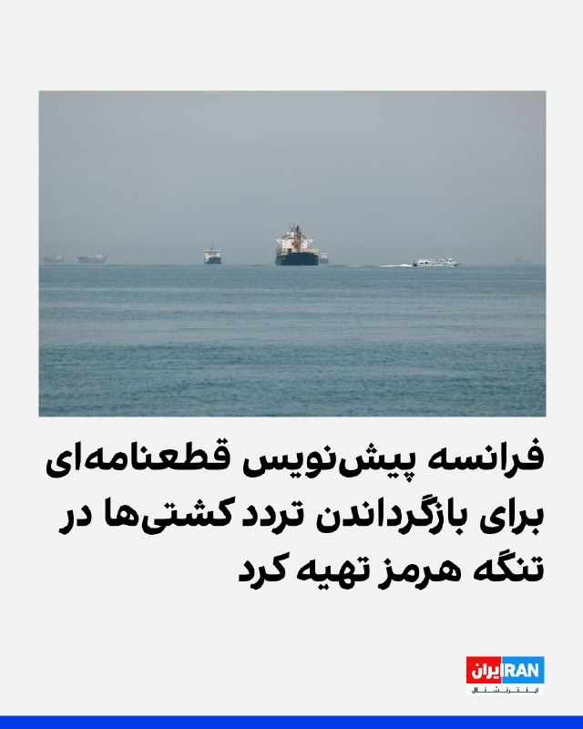

وزارت خارجه فرانسه اعلام کرد این کشور پیش‌نویس قطعنامه‌ای را برای شورای امنیت سازمان ملل تهیه کرده که هدف آن تشکیل یک ماموریت بین‌المللی جهت بازگرداندن رفت‌وآمد کشتی‌ها در تنگه هرمز است و در صورت فراهم بودن شرایط، ممکن است آن را ارائه کند.

قطعنامه پیشنهادی آمریکا و بحرین درباره تنگه هرمز بیش از دو هفته است که در حال بررسی است، اما رای‌گیری درباره آن بارها به تعویق افتاده؛ زیرا چین و روسیه اعلام کرده‌اند ممکن است آن را وتو کنند.
https://iranintl.com/202605229433

## IranIntlTV — post 338439

  <a href="telegram/content/IranIntlTV_338439_1779467745.mp4" target="_blank">🎬 Download video</a>

سرخط خبرهای جمعه یک خرداد
@iranintltv

## IranIntlTV — post 338438

  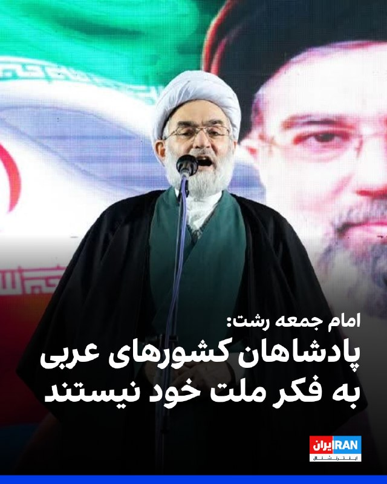

رسول فلاحتی، امام جمعه رشت گفت: «کشورهای عربی منطقه به درگیری دوباره آمریکا با جمهوری اسلامی علاقه‌مندند و پادشاهان این کشورها به فکر ملت خود نیستند.»

او افزود: «اگر موشک هایمان را علیه دشمنان به کار بگیریم، روزگارشان سیاه خواهد شد؛ همانگونه که اسرائیل را شخم زدیم.»

او ادامه داد: «آمریکا سوخت خود را از عربستان و امارات تامین می کند و اگر این زیرساخت ها آسیب ببیند، آمریکا دچار مشکل می شود.»
https://iranintl.com/202605225893

## IranIntlTV — post 338437

  

دادستانی بریتانیا اعلام کرد مردی به دلیل مجموعه‌ای از تهدیدهای یهودستیزانه علیه اعضای جامعه یهودیان در شمال لندن، به پنج‌سال زندان محکوم شده است.

پیش‌تر بریتانیا سطح تهدید تروریسم در این کشور را از «قابل توجه» به «شدید» افزایش داده است.

کی‌یر استارمر، نخست‌وزیر بریتانیا، گفته است که یهودیان این کشور در ترس زندگی می‌کنند و وعده داد اقدامات برای حفاظت از آنان تقویت شود.
https://iranintl.com/202605220677

## IranIntlTV — post 338436

  <a href="telegram/content/IranIntlTV_338436_1779467747.mp4" target="_blank">🎬 Download video</a>

تازه‌واردهای پایگاه آموزشی تفنگداران دریایی پاریس آیلند در کارولینای جنوبی گفتند تنش‌های جهانی، از جمله حملات آمریکا به ایران، از دلایل اصلی تصمیم آن‌ها برای پیوستن به ارتش بوده است. هم‌زمان، شاخه‌های مختلف نیروهای مسلح آمریکا از افزایش شمار داوطلبان خبر داده‌اند. سرهنگ کنت جیمز دل ماتسو، مسئول جذب نیرو در تفنگداران دریایی، گفت این نیرو پیش از هدف‌گذاری رشد پنج‌درصدی برای کل ارتش آمریکا نیز روند افزایشی جذب نیرو را تجربه می‌کرد.
@iranintltv

## Shin_Persian — post 6148

  

↩️ Quoted tweet: Shin ✓ @hey_itsmyturn Fri, 22 May 2026 15:38:46 UTC It's A7-MHH and it landed in Mehrabad a few hours ago, witness on the ground tells me. ↩️ توییت نقل‌قول شده — برای پاسخ، پست زیر را ببینید. فارسی هواپیما A7-MHH است و طبق گفته‌های یک…

## Shin_Persian — post 6147

↩️ Quoted tweet:
Shin ✓ @hey_itsmyturn
Fri, 22 May 2026 15:38:46 UTC

It's A7-MHH and it landed in Mehrabad a few hours ago, witness on the ground tells me.

↩️ توییت نقل‌قول شده — برای پاسخ، پست زیر را ببینید.

فارسی

هواپیما A7-MHH است و طبق گفته‌های یک شاهد عینی در محل، چند ساعت پیش در مهرآباد به زمین نشست.

𝕏 · @shin_persian

## Shin_Persian — post 6146

↩️ Quoted tweet: Shin ✓ @hey_itsmyturn Fri, 22 May 2026 15:24:02 UTC A Qatari delegation landed in Tehran as per some rumors (which I believe they’re true) ↩️ توییت نقل‌قول شده — برای پاسخ، پست زیر را ببینید. فارسی بر اساس برخی شایعات (که معتقدم صحت دارند)،…

## Shin_Persian — post 6145

↩️ Quoted tweet:
Shin ✓ @hey_itsmyturn
Fri, 22 May 2026 15:24:02 UTC

A Qatari delegation landed in Tehran as per some rumors (which I believe they’re true)

↩️ توییت نقل‌قول شده — برای پاسخ، پست زیر را ببینید.

فارسی

بر اساس برخی شایعات (که معتقدم صحت دارند)، یک هیئت قطری در تهران به زمین نشست.

𝕏 · @shin_persian

## Shin_Persian — post 6141

  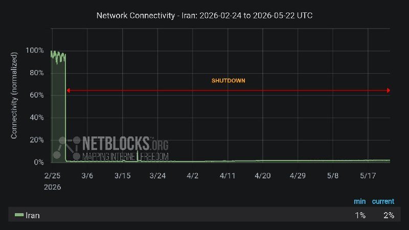

↩️ Quoted tweet:
NetBlocks ✓ @netblocks
Fri, 22 May 2026 15:21:07 UTC

2000 hours.

↩️ توییت نقل‌قول شده — برای پاسخ، پست زیر را ببینید.

فارسی

۲۰۰۰ زولو (۲۳:۳۰ به وقت تهران)

𝕏 · @shin_persian

## Shin_Persian — post 6140

Shin ✓ @hey_itsmyturn
Fri, 22 May 2026 15:24:02 UTC

A Qatari delegation landed in Tehran as per some rumors (which I believe they’re true)

فارسی

بر اساس برخی شایعات (که معتقدم حقیقت دارند)، یک هیئت قطری در تهران به زمین نشست.

𝕏 · @shin_persian

## Shin_Persian — post 6139

laurence norman @laurnorman
Fri, 22 May 2026 13:19:03 UTC

Source tells me the draft “deals” circulating are inaccurate.

فارسی

منبع به من می‌گوید پیش‌نویس «توافق‌هایی» که در حال انتشار است، دقیق نیستند.

𝕏 · @shin_persian

## Shin_Persian — post 6138

📦 mhrv-rs v1.9.34 released

• Migrate config from JSON to TOML with automatic upgrade support (PR #1317)

Files (Android APKs, Windows, macOS, Linux, OpenWRT) on the files channel:

👉 v1.9.34 — all files with SHA-256

Channel:
https://t.me/mhrv_rs
or: https://t.me/+R1OyoHX2boA1ZDgx

#v1934

## ManotoTV — post 105746

  <a href="telegram/content/ManotoTV_105746_1779467749.mp4" target="_blank">🎬 Download video</a>

پیام یک مخاطب منوتو درباره پایان پخش برنامه‌های این شبکه

## ManotoTV — post 105745

  <a href="telegram/content/ManotoTV_105745_1779467750.mp4" target="_blank">🎬 Download video</a>

پیام یک مخاطب منوتو درباره پایان پخش برنامه‌های این شبکه

## FarsiVOA — post 218373

قطعی اینترنت در ایران وارد هشتاد و چهارمین روز خود شد و دسترسی شهروندان به شبکه‌های بین‌المللی عملاً برای بیش از ۲۰۰۰ ساعت قطع شده است.

نت‌بلاکس، نهاد مستقل پایش دسترسی به اینترنت، در تازه‌ترین گزارش خود در این باره یادآور شده که با گذشت هر ساعت از خاموشی دیجیتال در ایران، شکاف‌های اقتصادی و اجتماعی عمیق‌تر می‌شوند؛ چرا که هرگونه ارتباط با جهان خارج، تحت کنترل درآمده و مشروط به جایگاه، همسویی (هم‌صدایی با حکومت) و داشتن امتیاز ویژه شده است.

گزارش کامل را در وب‌سایت صدای آمریکا بخوانید.

@FarsiVOA

## FarsiVOA — post 218372

حکم اعدام بیتا همتی و همسرش محمدرضا مجیدی اصل، دو معترض دی، در دیوان عالی کشور نقض شده است. با این حال غلامرضا خانی شکرآب در معرض اجرای قریب‌الوقوع اعدام است.

## FarsiVOA — post 218371

  <a href="telegram/content/FarsiVOA_218371_1779467751.mp4" target="_blank">🎬 Download video</a>

کاخ سفید ویدیویی با عنوان «شی ناشناس پرنده؛ دسامبر ۲۰۱۹، ساحل شرقی» منتشر کرد و اعلام کرد این تصاویر احتمالا توسط حسگر مادون قرمز یک پلتفرم نظامی آمریکا در محدوده مسئولیت فرماندهی شمالی ایالات متحده در سال ۲۰۱۹ ثبت شده‌اند.

@FarsiVOA

## FarsiVOA — post 218369

🔺روبیو درباره مذاکرات: ترجیح پرزیدنت ترامپ دیپلماسی است، اما باید برای گزینه‌های دیگر هم آماده باشیم

▪️وزیر امور خارجه ایالات متحده روز جمعه اول خردادماه، پس از شرکت در اجلاس وزیران امور خارجه عضو ناتو در سوئد به خبرنگاران گفت عدم دستیابی جمهوری اسلامی به سلاح هسته‌ای، تحویل همه اورانیوم‌های غنی‌شده، و بازگشایی تنگه هرمز، ارکان اصلی و خلل‌ناپذیر آمریکا در مذاکرات با رژیم ایران هستند.

⬇️ بیشتر بخوانید:

https://ir.voanews.com/a/nato-marco-rubio-us-euorpe-iran/8152766.html/?nocach=1

## FarsiVOA — post 218367

فرماندهی مرکزی ایالات متحده، سنتکام، اعلام کرد نیروهای تفنگدار دریایی آمریکا سامانه موشکی «هایمارس» را به یک ایستگاه سوخت‌گیری در خاورمیانه منتقل کرده‌اند. سنتکام می‌گوید این سامانه‌های متحرک که توسط ارتش و تفنگداران دریایی آمریکا استفاده می‌شوند، از قابلیت جابه‌جایی سریع برخوردارند.

@FarsiVOA

## FarsiVOA — post 218366

مارکو روبیو، وزیر امور خارجه آمریکا، روز جمعه ۲ خرداد در پایان نشست وزیران امور خارجه کشورهای عضو ناتو در سوئد و پیش از ترک آن کشور به مقصد هند، به پرسش‌های خبرنگاران پاسخ داد. صدای آمریکا این کنفرانس خبری را به طور زنده و با ترجمه همزمان پژواک کیومرثی پخش کرد.

## FarsiVOA — post 218365

مارکو روبیو، وزیر امور خارجه آمریکا، روز جمعه ۲ خرداد در پایان نشست وزیران امور خارجه کشورهای عضو ناتو در سوئد و پیش از ترک آن کشور به مقصد هند، به پرسش‌های خبرنگاران پاسخ داد. صدای آمریکا این کنفرانس خبری را به طور زنده و با ترجمه همزمان پژواک کیومرثی پخش کرد.

## FarsiVOA — post 218364

مارکو روبیو، وزیر امور خارجه آمریکا، روز جمعه ۲ خرداد در پایان نشست وزیران امور خارجه کشورهای عضو ناتو در سوئد و پیش از ترک آن کشور به مقصد هند، به پرسش‌های خبرنگاران پاسخ داد. صدای آمریکا این کنفرانس خبری را به طور زنده و با ترجمه همزمان پژواک کیومرثی پخش کرد.

## FarsiVOA — post 218363

  <a href="telegram/content/FarsiVOA_218363_1779467752.mp4" target="_blank">🎬 Download video</a>

کاخ سفید ویدیویی با عنوان «چهار شی ناشناس پرنده بر فراز آب‌های ایران» منتشر کرد و اعلام کرد این تصاویر احتمالا توسط حسگر مادون قرمز یک پلتفرم نظامی آمریکا در محدوده مسئولیت فرماندهی مرکزی ایالات متحده، سنتکام، در چهارم شهریور ۱۴۰۱ ثبت شده‌اند.

@FarsiVOA

## FarsiVOA — post 218362

  

فرماندهی مرکزی ایالات متحده، سنتکام، اعلام کرد یک ملوان آمریکایی از ناو «یواس‌اس کامستاک» در جریان اجرای محاصره دریایی علیه جمهوری اسلامی، یک کشتی تجاری را زیر نظر دارد.

سنتکام گفت از آغاز این محاصره، نیروهای آمریکایی مسیر ۹۷ کشتی تجاری را تغییر داده و ۴ کشتی را نیز از کار انداخته‌اند.

@FarsiVOA

## FarsiVOA — post 218360

مارکو روبیو، وزیر امور خارجه آمریکا، پس از دیدار با دبیرکل ناتو اعلام کرد اعضای این ائتلاف باید در نشست آینده آنکارا به‌طور جدی متعهد شوند که به‌سرعت تولیدات و صنایع دفاعی خود را گسترش دهند و تعهدات مالی خود را به «قابلیت‌های واقعی جنگی» تبدیل کنند. او گفت: «اروپای قوی‌تر به معنای ناتوی قوی‌تر است.»

@FarsiVOA

## DW_Farsi — post 125017

🎥 جنگ ایران، کابوس تازه صنعت الماس هند

جنگ ایران، بحران صنعت الماس هند را تشدید کرده؛ اختلال در زنجیره تأمین، کاهش صادرات و موج بیکاری، فعالان این صنعت را با چالش جدی روبه‌رو کرده است.
@dw_farsi

## DW_Farsi — post 125016

  

🔶 ایران: ۳۵ کشتی از تنگه هرمز عبور کردند

بنا بر اعلام مقام‌های ایران، در ۲۴ ساعت گذشته ۳۵ فروند کشتی از تنگه هرمز که شاهراهی حیاتی برای تجارت انرژی به شمار می‌رود عبور کرده‌اند. رادیو و تلویزیون دولتی ایران به نقل از بیانیه نیروهای مسلح اعلام کرد که این ترددها با هماهنگی نیروی دریایی سپاه پاسداران انقلاب اسلامی انجام شده است. بر اساس این گزارش، کشتی‌های مذکور شامل نفتکش‌ها، کشتی‌های باربری و سایر کشتی‌های تجاری بوده‌اند.

نیروهای مسلح ایران مدت کوتاهی پس از آغاز جنگ، کنترل تنگه هرمز را که نقشی کلیدی در تجارت جهانی انرژی دارد، به دست گرفتند. در پی تهدیدها، بازرسی‌ها و حمله به کشتی‌ها، رفت‌وآمد در این آبراه استراتژیک تا حد زیادی متوقف شد؛ امری که افزایش چشمگیر قیمت انرژی و سوخت در سراسر جهان را به همراه داشت. علاوه بر این، به گفته ایران، این تنگه در حال حاضر مین‌گذاری شده است.

نیروی دریایی سپاه پاسداران در بیانیه خود اما مدعی است که این نیرو در تنگه هرمز یک آبراه ایمن برای کشتیرانی و استمرار تجارت جهانی ایجاد کرده است.
@dw_farsi

## DW_Farsi — post 125015

  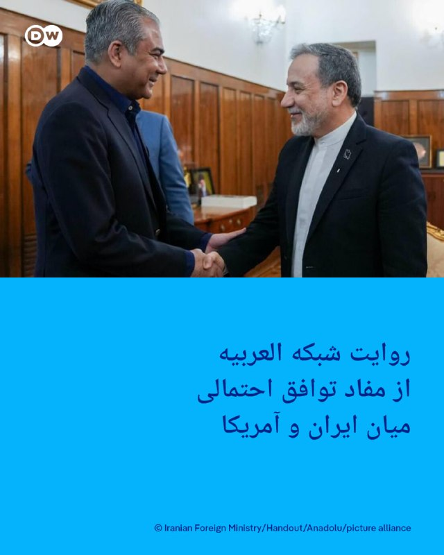

🔶روایت شبکه العربیه از مفاد توافق احتمالی میان ایران و آمریکا

شبکه عربستانی العربیه متنی را منتشر کرده است که ادعا می‌کند "پیش‌نویس نهایی" یک توافق "احتمالی" میان آمریکا و ایران با میانجیگری پاکستان برای پایان دادن به جنگ است.

بنا بر این گزارش، انتظار می‌رود توافق مذکور، که ظاهراَ یک توافق موقت با "مسائل حل‌نشده‌ای" است که باید پس از اجرایی شدن مورد مذاکره قرار گیرند، ظرف چند ساعت آینده اعلام شود.

العربیه ولی تاکید دارد که این توافق "در انتظار تایید" هر دو طرف است.

این گزارش به نقل از منابع ناشناس می‌گوید توافق به محض اعلام رسمی از سوی هر دو طرف، بلافاصله اجرایی خواهد شد.

پیش‌نویس توافق گزارش‌شده، به صراحت به خواست‌های کلیدی ایالات متحده اشاره‌ای نکرده است؛ خواسته‌هایی از جمله برچیدن برنامه هسته‌ای ایران و صادرات ذخیره اورانیوم ۶۰ درصد غنی‌شده آن، محدود کردن موشک‌های بالستیک و پایان دادن به حمایت از گروه‌های نیابتی.

بنا بر این گزارش، مذاکرات درباره "مسائل حل‌نشده" نامشخص، قرار است ظرف هفت روز پس از اجرایی شدن توافق آغاز شود.
@dw_farsi

## DW_Farsi — post 125014

🔶 چرا پرونده تجاوز پژمان جمشیدی به حکم شلاق ختم شد؟

🔻گزارشی از میترا خلعتبری

فضای رسانه‌ای و هنری ایران از پاییز سال گذشته تا کنون با یکی از جنجالی‌ترین پرونده‌ها دست‌وپنجه نرم می‌کند.

نام پژمان جمشیدی ستاره سال‌های نه چندان دور فوتبال و بازیگر پرکار سینما و تلویزیون، ماه‌هاست که نه برای هنرنمایی روی پرده، بلکه به خاطر یک پرونده جنجالی قضایی در صدر اخبار قرار گرفته است. اتهام اولیه "تجاوز به عنف" و "آدم‌ربایی" که با شکایت یک هنرجوی جوان بازیگری مطرح شد، جامعه را در بهت و حیرت فرو برد.

چندین ماه پس از مطرح شدن این شکایت جنجالی، حالا حکم پرونده صادر و مجازات "۹۹ ضربه شلاق تعزیری" اعلام شده است.

اما پرونده این چهره سرشناس با صدور این رای، نه تنها به نقطه‌ای روشن و مشخص نرسیده، بلکه موج جدیدی از ابهامات، سوالات و تناقض‌ها را در افکار عمومی ایجاد کرده است.
@dw_farsi

## DW_Farsi — post 125013

  

🔶 قرقاش: کنترل ایران بر تنگه هرمز یک سابقه خطرناک ایجاد می‌کند

انور قرقاش، مشاور رئیس دولت امارات متحده عربی در سیاست خارجی، روز جمعه ۲۲ مه، اعلام کرد که شانس دستیابی به توافق صلح میان آمریکا و ایران "۵۰-۵۰" است، اما تاکید کرد که هرگونه حل‌وفصل سیاسی برای جلوگیری از درگیری‌های آینده، باید به ریشه‌های اصلی بی‌ثباتی در منطقه بپردازد.

پاکستان در حال میانجیگری برای برقراری یک آتش‌بس میان ایالات متحده و ایران است تا به جنگی که اقتصاد جهانی را تکان داده و تجارت را در تنگه هرمز ، شاهراه حیاتی برای انتقال حدود یک‌پنجم محموله‌های نفت و گاز طبیعی مایع (LNG) جهان، مختل کرده است، پایان دهد.

انور قرقاش، مشاور دیپلماتیک رئیس دولت امارات، در کنفرانس «گلوبسک» (Globsec) در پراگ گفت: «شانس دستیابی به توافق ۵۰-۵۰ است. نگرانی من این است که ایرانی‌ها همیشه در مذاکرات زیاده‌خواهی کرده‌اند.»

قرقاش افزود: «این موضوع جدیدی نیست. آن‌ها در طول سال‌ها به دلیل تمایل به دست‌بالا گرفتن برگ‌های بازی خود، فرصت‌های زیادی را از دست داده‌اند. امیدوارم این بار این کار را نکنند.»
@dw_farsi

## DW_Farsi — post 125012

🔶 "استفاده وسیع آمریکا از موشک‌های رهگیر برای دفاع از اسرائیل"

واشنگتن‌پست گزارش داد آمریکا در جریان جنگ اخیر با ایران، بیش از ۳۰۰ موشک رهگیر برای دفاع از اسرائیل شلیک کرده، در حالی که اسرائیل حدود ۱۹۰ رهگیر به کار برده است.

بر اساس این گزارش، واشنگتن بیش از ۲۰۰ سامانه پدافندی "تاد" و بیش از ۱۰۰ موشک "اس‌ام-۳" و "اس‌ام-۶" شلیک کرده، در حالی که اسرائیل کمتر از ۱۰۰ موشک رهگیر "پیکان" و حدود ۹۰ موشک از سامانه "فلاخن داوود" استفاده کرده است.
@dw_farsi

## DW_Farsi — post 125011

  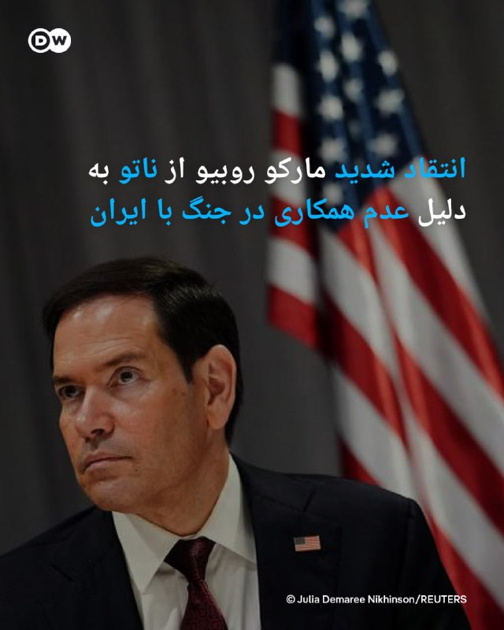

🔶 انتقاد شدید مارکو روبیو از ناتو به دلیل عدم همکاری در جنگ با ایران

مارکو روبیو، وزیر امور خارجه ایالات متحده، کمی پیش از پرواز به مقصد سوئد برای شرکت در نشست ناتو، انتقادها از این پیمان نظامی را مجددا تکرار کرد.

این سیاستمدار آمریکایی گفت: «فکر نمی‌کنم کسی از اینکه ایالات متحده و به ویژه شخص رئیس‌جمهور در حال حاضر تا این حد از ناتو و عملکرد آن ناامید شده‌اند، غافلگیر شده باشد.»

روبیو به عنوان دلیل مشخص این نارضایتی، به مخالفت و امتناع کشورهایی مانند اسپانیا از اجازه دادن به آمریکا برای استفاده از پایگاه‌های نظامی‌شان در جنگ علیه ایران اشاره کرد.

او در ادامه توضیحات خود افزود که عضویت ایالات متحده در یک ائتلاف باید برای این کشور ارزش و منفعتی داشته باشد و یکی از ارزش‌های محوری ناتو، پایگاه‌های نظامی موجود در اروپا هستند.

به گفته او، این پایگاه‌ها به ایالات متحده امکان می‌دهند تا در صورت بروز بحران در خاورمیانه یا هر جای دیگر، قدرت نظامی خود را اعمال کند.
@dw_farsi

## DW_Farsi — post 125010

  

🔶 دیوان عالی جمهوری اسلامی احکام اعدام محمدرضا مجیدی‌اصل و بیتا همتی را نقض کرد

بنا بر داده‌های منابع حقوق بشری دیوان عالی جمهوری اسلامی احکام اعدام محمدرضا مجیدی‌اصل و بیتا همتی را نقض کرده و آن را برای بررسی مجدد به شعبه هم‌عرض ارجاع داده است.

این زوج جوان ساکن تهران و از بازداشت‌شدگان اعتراضات دی‌ماه پیش‌تر در یک پرونده مشترک به همراه دو شهروند دیگر به اعدام محکوم شده بودند.

مجیدی‌‌اصل و همتی اواخر فروردین‌ماه سال جاری به همراه دو هم‌پرونده‌ای خود به‌نام‌های بهروز زمانی‌نژاد و کوروش زمانی‌نژاد توسط شعبه ۲۶ دادگاه انقلاب تهران به ریاست قاضی ایمان افشاری به اعدام، حبس و مصادره اموال محکوم شدند. یک متهم دیگر این پرونده نیز به نام امیر همتی به حبس محکوم شد.

"اقدام عملیاتی برای دولت متخاصم آمریکا و گروه‌های متخاصم" اتهاماتی بود که بر اساس آن برای محمدرضا مجیدی‌اصل، بیتا همتی، بهروز زمانی‌نژاد و کورش زمانی‌نژاد حکم اعدام صادر شد.

این چهار شهروند همچنین مشمول ۵ سال حبس تعزیزی به اتهام "اجتماع و تبانی علیه امنیت کشور" شده و به عنوان مجازات تکمیلی حکم مصادره کلیه اموال آنها نیز صادر شده است.
@dw_farsi

## Persian_Trend_Official — post 14677

  <a href="telegram/content/Persian_Trend_Official_14677_1779467755.mp4" target="_blank">🎬 Download video</a>

کلیپ «UAP نزدیک فرودگاه کاراگاندا» در پرونده‌های جدید یوفو ظاهر شد

ویدئو نشان می‌دهد «یک پدیده نورانی با ردپاهایی از روشنایی کاهنده که از مرکز گسترش می‌یابد»

«آن هواپیما نیست» — شاهد در ویدئو

👩‍💻:PhantomDirective

🆔 @persian_trend_official
پرشین ترند | متفاوت‌ترین کانال نظامی

## Persian_Trend_Official — post 14676

UAP از ساحل شرقی

فیلم گرفته شده توسط حسگر مادون قرمز روی سکوی نظامی آمریکا در سال ۲۰۱۹

👩‍💻:PhantomDirective

🆔 @persian_trend_official
پرشین ترند | متفاوت‌ترین کانال نظامی

## Persian_Trend_Official — post 14675

  <a href="telegram/content/Persian_Trend_Official_14675_1779467756.mp4" target="_blank">🎬 Download video</a>

کلیپ «تشکیل UAP بر فراز ایران» در دومین دسته از پرونده‌های یوفو پیدا شد

فیلم سال ۲۰۲۲ احتمالاً از حسگر مادون قرمز نصب شده روی یک سکوی نظامی آمریکا گرفته شده و در سال ۲۰۲۴ به شبکه‌ای محرمانه آپلود شده است.

👩‍💻:PhantomDirective

🆔 @persian_trend_official
پرشین ترند | متفاوت‌ترین کانال نظامی

## Persian_Trend_Official — post 14674

  <a href="telegram/content/Persian_Trend_Official_14674_1779467758.mp4" target="_blank">🎬 Download video</a>

یک شیء ناشناس پرنده (UFO) توسط جنگنده اف-۱۶ نیروی هوایی آمریکا سرنگون شد

ویدئویی با عنوان «نیروی هوایی ملی گارد اف-۱۶ سی آمریکا یک شیء پرنده ناشناس را بر فراز دریاچه هورون در ۱۲ فوریه ۲۰۲۳ سرنگون می‌کند» احتمالاً با استفاده از حسگر مادون قرمز نصب شده روی یک سکوی نظامی آمریکا ضبط شده است

## Persian_Trend_Official — post 14673

کلیپ «شیء پرنده ناشناس کروی در ابرها» در دومین دسته از پرونده‌های یوفو منتشر شد

تصویری از سال ۲۰۲۳ احتمالاً از حسگر مادون قرمز نظامی آمریکا بالای دریای زرد گرفته شده است — AARO

از نظر بصری، با اندازه یک هواپیمای معمولی مطابقت ندارد و حرکت آن با موشک عادی همخوانی ندارد

👩‍💻:PhantomDirective

🆔 @persian_trend_official
پرشین ترند | متفاوت‌ترین کانال نظامی

## Persian_Trend_Official — post 14672

💢هواپیما گلف استریم ارتش پاکستان به سمت تهران در حرکت است. 🫆:Tony 📌 @persian_trend_official پرشین ترند | متفاوت‌ترین کانال نظامی

## Persian_Trend_Official — post 14671

  <a href="telegram/content/Persian_Trend_Official_14671_1779467759.mp4" target="_blank">🎬 Download video</a>

💢فیلم منتشر شده در دومین دسته از پرونده‌های مرتبط با یوفو ها

💢پنتاگون، یک جسم پرنده را بر فراز سوریه نشان می‌دهد که با شتاب لحظه ای زیاد نا‌پدید میشود.

🫆:Tony

📌 @persian_trend_official
پرشین ترند | متفاوت‌ترین کانال نظامی

## Persian_Trend_Official — post 14670

  <a href="telegram/content/Persian_Trend_Official_14670_1779467760.webm" target="_blank">🎬 Download video</a>

‼️همزمان با ورود فرمانده ارتش پاکستان.
وزیر کشور پاکستان اندکی قبل تهران را ترک کرد،

👩‍💻:PhantomDirective

🆔 @persian_trend_official
پرشین ترند | متفاوت‌ترین کانال نظامی

## Persian_Trend_Official — post 14669

  <a href="telegram/content/Persian_Trend_Official_14669_1779467761.mp4" target="_blank">🎬 Download video</a>

💢 روبیو، وزیرخارجه آمریکا: ما در ارتباط مداوم با فیلد مارشال عاصم منیر در بالاترین سطوح دولت خود هستیم.

👩‍💻:PhantomDirective

📣 @persian_trend_official
پرشین ترند | متفاوت‌ترین کانال نظامی

## Persian_Trend_Official — post 14668

  

🔴فرمانده ارتش پاکستان راهی تهران شد؟؟؟ 💢به گزارش الحدث به نقل از منابع خود گزارش داد که عاصم منیر فرمانده ارتش پاکستان عازم تهران شد. 🫆:Tony 📌 @persian_trend_official پرشین ترند | متفاوت‌ترین کانال نظامی

## Persian_Trend_Official — post 14667

🔴 آکسیوس: چند کشور منطقه در تلاش برای نهایی‌کردن توافق اولیه میان ایران و آمریکا هستند

💢وب‌سایت آکسیوس گزارش داد پاکستان، قطر، عربستان سعودی، مصر و ترکیه در تلاش‌های میانجیگرانه میان تهران و واشینگتن مشارکت دارند.

بر اساس این گزارش:
▪️ هدف این مذاکرات، نهایی‌کردن «نامه اعلام نیت» میان ایران و آمریکا است
▪️ این توافق شامل پایان جنگ و آغاز ۳۰ روز مذاکره درباره توافقی گسترده‌تر بر سر برنامه هسته‌ای ایران خواهد بود
▪️ مذاکرات بر روی اصول اولیه کاهش تنش و چارچوب ادامه گفت‌وگوها متمرکز است
آکسیوس همچنین نوشت:
▪️ هنوز مشخص نیست تهران حاضر به امضای چنین توافقی خواهد شد یا نه
▪️ برخی جریان‌ها در ایران معتقدند در شرایط فعلی، اهرم فشار به نفع تهران است
🫆:Tony

📌 @persian_trend_official
پرشین ترند | متفاوت‌ترین کانال نظامی

## Persian_Trend_Official — post 14666

  <a href="telegram/content/Persian_Trend_Official_14666_1779467763.webm" target="_blank">🎬 Download video</a>

🔴 روبیو: پاکستان همچنان مذاکره‌کننده اصلی پرونده ایران است

💢مارکو روبیو، وزیر خارجه آمریکا، اعلام کرد پاکستان نقش اصلی در مذاکرات مرتبط با ایران را بر عهده داشته و همچنان این نقش را حفظ کرده است.

او گفت:
▪️ «مذاکره‌کننده اصلی درباره ایران، پاکستان بوده و همچنان هست»
▪️ فیلد مارشال «عاصم منیر» به‌زودی به ایران سفر خواهد کرد
▪️ واشینگتن به‌صورت مداوم و در بالاترین سطوح با او در ارتباط است
🫆:Tony

📌 @persian_trend_official
پرشین ترند | متفاوت‌ترین کانال نظامی

## RadioFarda — post 157458

  <a href="https://t.me/radiofarda/157458" target="_blank">📎 Download file</a>

🔸 در این کافه فردا به انتخاب علی خامنه‌ای به عنوان «شهید شاخص سال» توسط نظام، عدم دسترسی حداد عادل به دامادش مجتبی خامنه‌ای، زندگی و آثار مهدی سپهر خواننده تازه درگذشته، رکورد شکنی در حراج کریستی، دادگاه صادق ساعدی‌نیا و کاهش نرخ ازدواج در ایران به نصف در سال‌ها اخیر می‌پردازیم.

🔸 برای تماس با ما می‌توانید به شناسه کافه فردا در تلگرام صوت و متن بفرستید.

📻 کافه فردا

## RadioFarda — post 157457

🔸فیلم «تمرین‌هایی برای یک انقلاب» ساخته پگاه آهنگرانی، بازیگر و فیلمساز ایرانی، که درباره دهه‌ها سرکوب سیاسی در ایران است، روز جمعه جایزه «چشم طلایی»، مهم‌ترین جایزه مستند جشنواره کن، را به دست آورد.

🔸خانم آهنگرانی هنگام دریافت جایزه در حضور تی‌یری فرمو، مدیر این جشنواره، جایزه خود را به مردم ایران تقدیم کرد.

🔸هیئت داوران این جایزه به ریاست مستیلاو چرنوف، فیلمساز برنده جایزه اسکار، فیلم «تمرین‌هایی برای یک انقلاب» را از میان ۲۱ فیلم حاضر در جشنواره و بخش‌های جنبی آن انتخاب کرد.

🔸اعضای هیئت داوران در بیانیه‌ای درباره اهدای جایزه به «تمرین‌هایی برای یک انقلاب» گفتند: «این فیلم از طریق درهم‌تنیدگی سینمای شخصی، تاریخی و شاعرانه، به ما اجازه می‌دهد وارد واقعیت پیچیده و چندلایه ایران معاصر شویم. این فیلم در تلاش برای یافتن زبانی جهت بیان حقیقت‌های این لحظه، از زیر سؤال بردن شیوه‌های خودش، تردید کردن به خود و آسیب‌پذیر بودن هراسی ندارد.»

🔸پگاه آهنگرانی هنگام اکران این فیلم مستند بلند در جشنواره کن، آن را به مادرانی تقدیم کرد که فرزندان خود را در راه آزادی دست‌ داده‌اند.

@RadioFarda

## RadioFarda — post 157456

  

🔸خبرگزاری رویترز به نقل از یک منبع آگاه نوشت که یک تیم مذاکره‌کننده قطری روز جمعه با «هماهنگی» ایالات متحده وارد تهران شد.

🔸این گزارش، هدف از این سفر را «کمک» به دستیابی به توافقی برای پایان دادن به جنگ با ایران و حل مسائل باقی‌مانده عنوان کرده است.

🔸دوحه که پیش‌تر در جنگ غزه و دیگر تنش‌های بین‌المللی نقش میانجی را ایفا کرده بود، تا کنون از ایفای نقش میانجی‌گری در جنگ ایران فاصله گرفته بود.

🔸این کشور در جریان درگیری‌های اخیر بارها هدف حملات موشکی و پهپادی ایران قرار گرفته بود.

@RadioFarda

## RadioFarda — post 157455

گزارش وال‌استریت جورنال از «کمک» بابک زنجانی به انتقال میلیون‌ها دلار پول برای ایران

🔸روزنامۀ وال‌استریت جورنال در گزارشی مفصل که پنجشنبه ۳۱ اردیبهشت‌ماه منتشر کرده، از نقش بابک زنجانی و شبکه‌اش در «تأمین منابع هنگفت مالی» برای سپاه پاسداران، آن‌هم با استفاده از بزرگترین صرافی رمزارز جهان خبر داده است.

🔸بر اساس این گزارش، اقدامات بابک زنجانی، دست‌کم تا همین چند ماه پیش هم ادامه داشته است.

🔸وال‌استریت جورنال با استناد به گزارش‌های داخلی صرافی «بایننس» در مورد انطباق تراکنش‌ها با قوانین ضد پولشویی و تأمین مالی تروریسم، می‌گوید شبکۀ مالی مخفی بابک زنجانی ظرف دو سال تا پایان سال میلادی گذشته، ۸۵۰ میلیون دلار تراکنش در این صرافی ارز دیجیتال داشته است؛ تراکنش‌هایی که عمدتاً هم از یک حساب کاربری انجام می‌شده‌اند.

🔸کارشناسان بایننس متوجه شده بودند که خواهر، یکی از دوستان نزدیک، و مدیر شرکت بابک زنجانی، همگی حساب‌هایی را در این صرافی «اداره» می‌کرده‌اند که در واقع از سخت‌افزارهای واحدی مدیریت می‌شده‌اند؛ الگویی که از نظر کارشناسان این صرافی، به‌عنوان مدرکی دال بر تلاش برای دور زدن تحریم‌های ایالات متحده شناخته شد.

🔸با وجود این حساب اصلی این شبکه، دست‌کم تا آغاز سال جاری میلادی، اواسط دی‌ماه گذشته همچنان باز و فعال بوده است.

🔸بر اساس یافته‌های بازرسان بایننس و گزارش‌های داخلی این صرافی، تحقیقات اف‌بی‌آی و نهادهای امنیتی‌ بین‌المللی که رد پول‌های مرتبط با تروریسم را دنبال می‌کنند، پژوهشگران رمزارز و داده‌های بلاک‌چِین، جابجایی این ۸۵۰ میلیون دلار، در قالب میلیاردها تراکنش ارز دیجیتال انجام شده که تا پیش از آغاز جنگ جاری آمریکا و اسرائیل با ایران، از طریق بایننس و با هدف تأمین مالی شبکه‌های مرتبط با سپاه پاسداران انجام می‌شده‌اند.

🔸جزئیات بیشتر را در وب سایت رادیوفردا بخوانید.

@RadioFarda

## RadioFarda — post 157454

فرمانده ارتش پاکستان «عازم ایران شده است»

🔸خبرگزاری جمهوری اسلامی، ایرنا، به نقل از منابع دیپلماتیک در اسلام‌آباد اعلام کرد که فیلد مارشال عاصم منیر، فرمانده ارتش پاکستان، روز جمعه «عازم ایران شده است».

🔸رسانه‌های ایران روز پنجشنبه گفته بودند که منیر قرار است به تهران برود اما این سفر با ۲۴ ساعت تأخیر انجام شده است.

🔸مارکو روبیو، وزیر خارجه آمریکا، که برای شرکت در اجلاس وزاری ناتو به سوئد سفر کرده است، نیز گفت که واشینگتن با فرمانده ارتش پاکستان در تماس است و انتظار می‌رود او خیلی زود وارد تهران شود.

🔸برخی رسانه‌ها می‌گویند سفر عاصم منیر به تهران نشانه «پیشرفت» مذاکرات است. روبیو نیز از برخی پیشرفت‌ها در گفت‌وگوهای آمریکا و ایران خبر داده و در عین حال افزوده که هنوز توافق نهایی نشده است.

🔸پاکستان از زمان برقراری آتش‌بس بعد از ۴۰ روز جنگ آمریکا و اسرائیل با ایران، در نقش میانجی ظاهر شده است و یک دور گفت‌وگو میان نمایندگان بلندپایه واشینگتن و تهران در پایتخت این کشور برگزار شد.

@RadioFarda

## RadioFarda — post 157453

مصاحبه اختصاصی با قرقاش: ایران در موقعیت ضعیفی است، دور دوم جنگ فاجعه‌بار خواهد بود

🔸انور قرقاش، مشاور رئیس امارات متحده عربی در امور خارجی، می‌گوید دور دیگر درگیری میان ایران، آمریکا و اسرائیل «فاجعه‌بار» خواهد بود.

🔸آقای قرقاش که در نشست امنیتی گلوبسک در پراگ حضور دارد، در گفتگویی اختصاصی با گلناز اسفندیاری از رادیو فردا، گفت که کشورش از یک راه‌حل سیاسی حمایت می‌کند، اما در صورت بروز یک دور دیگر از درگیری‌ها از خود دفاع خواهد کرد. او همچنین گفت جنگ کنونی نفوذ آمریکا در خلیج فارس را پررنگ‌تر خواهد کرد.

🔸رادیو فردا: آیا امارات از مذاکرات با ایران برای پایان دادن به جنگ حمایت می‌کند یا ترجیح می‌دهد آمریکا و اسرائیل فشار نظامی بیشتری بر ایران وارد کنند و همان‌طور که برخی می‌گویند «کار را تمام کنند»؟

🔸انور قرقاش: نه، ما به‌وضوح تلاش زیادی کردیم تا از وقوع جنگ جلوگیری کنیم، زیرا روابط ما با ایران در حدود ۴۰ سال گذشته همواره رابطه‌ای پیچیده بوده است. ما همسایه هستیم؛ تجارت، سرمایه‌گذاری و پیوندهای زیادی با یکدیگر داریم. موضع ما این است که حل این مسئله باید از طریق سیاسی باشد.
راه‌حل‌های نظامی، همان‌طور که امروز دیده‌ایم، پیچیدگی‌های بسیاری به همراه دارند. ما همچنان از یک راه‌حل سیاسی حمایت می‌کنیم، اما این نباید بهانه‌ای برای درگیری‌های آینده باشد. مسئله تنگه هرمز روابط را پیچیده‌تر می‌کند، به‌ویژه در مورد دسترسی آزاد برای تجارت و انرژی جهانی.

🔸رادیو فردا: پس در واقع، همه‌چیز به جزئیات بستگی دارد.

🔸انور قرقاش: بله، جزئیات بسیار مهم هستند، اما ما همچنان نمی‌خواهیم شاهد تشدید نظامی باشیم، چراکه می‌دانیم تشدید درگیری‌ها در منطقه همیشه به بن‌بست منجر می‌شود و آن بن‌بست مشکلات بیشتری ایجاد می‌کند. همچنین باید در نظر داشته باشیم که منطقه نیازمند ترمیم فراوان است. به‌طور مشخص، امارات هدف ۳۳۰۰ موشک قرار گرفته است.

🔸رادیو فردا: که حتی بیشتر از حملات ایران به اسرائیل بود.

🔸انور قرقاش: بله بیشتر از اسرائیل و ما همچنان در حال پیدا کردن پهپادهای زیادی هستیم، بنابراین شمار نهایی از ۳۰۰۰ فراتر خواهد رفت. کار زیادی برای ترمیم روابط باقی مانده و پل‌هایی که سوزانده شده‌اند باید دوباره بازسازی شوند.

🔸کامل این گفت‌وگو را در وب‌سایت رادیوفردا بخوانید.

@RadioFarda

## IranianMinds — post 20562

🔴 الحدث: فرمانده ارتش پاکستان، عاصم منیر، به سمت تهران حرکت کرد. @IranianMinds

## IranianMinds — post 20561

🔴 ترامپ :

خلاصه بهتون بگم ، خواهیم دید چه خواهد شد.

@IranianMinds

## IranianMinds — post 20560

🔴 ترامپ:

ما بزرگ‌ترین ارتش جهان را داریم و می‌خواهیم بودجه دفاعی ۱.۵ تریلیون دلاری داشته باشیم.

@IranianMinds

## IranianMinds — post 20559

🔴 ترامپ:

ما به ایران ضربات شدیدی وارد کردیم و گزینه دیگری نداشتیم.

@IranianMinds

## IranianMinds — post 20558

🔴 ترامپ:

ایران شدیدا مشتاق رسیدن به توافق است

خواهیم دید چه خواهد شد.

@IranianMinds

## IranianMinds — post 20557

🔴 ترامپ:

ما در ایران همان کاری را انجام می‌دهیم که در ونزوئلا کردیم.

@IranianMinds

## IranianMinds — post 20556

  <a href="telegram/content/IranianMinds_20556_1779467764.mp4" target="_blank">🎬 Download video</a>

🔴 ترامپ :

ایران داره میمیره برای اینکه توافق کنیم

@IranianMinds

## IranianMinds — post 20555

مهریه دخترانشان «پهپاد»
اسباب بازی کودکانشان «کلاشینکف»
لق‌لق‌ی زبانشان مرگ بر «این و ان»
اما هسته ای رو واسه تولید برق می‌خواهند!

بچه زرنگ‌های تروريست از در عقب :)
نه ببین داش اورانیوم ۶۰ درصد غنی کردیم برای کارای پزشکی🤡

@IranianMinds

## IranianMinds — post 20554

  

🔴 نت بلاکس: ۲ هزار ساعت ، ۸۴ روز از قطعی اینترنت ایران گذشت …

@IranianMinds

## IranianMinds — post 20553

  <a href="telegram/content/IranianMinds_20553_1779467766.mp4" target="_blank">🎬 Download video</a>

🔴 زمین گرده ، ایشون شهردار جدید بیرمنگام انگلیس هستند !

@IranianMinds

## IranianMinds — post 20552

  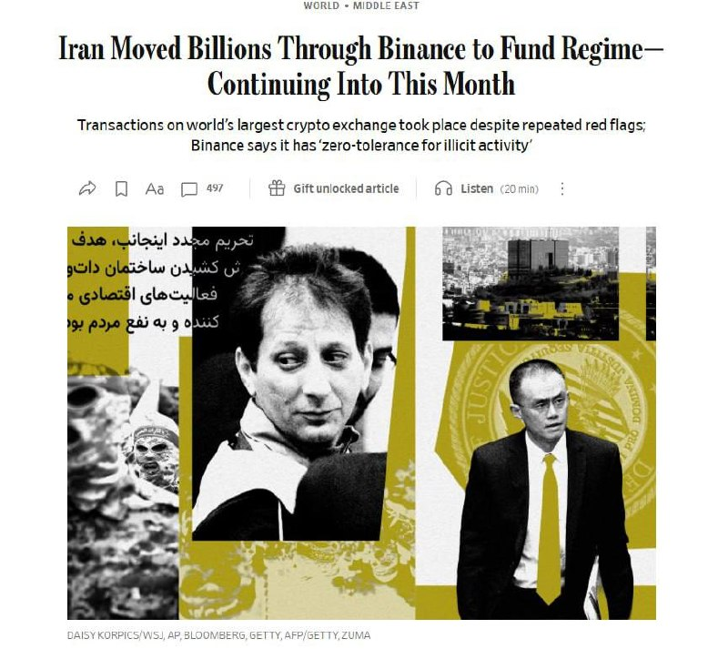

🔴 طبق گزارش وال استریت ژورنال، بایننس میلیاردها دلار تراکنش رمزارز مرتبط با شبکه‌های ایرانی تأمین‌کننده سپاه و گروه‌های نیابتی مثل حماس، حزب‌الله و انصارالله داشته است.

حساب‌های مرتبط با بابک زنجانی و خانواده‌اش به‌عنوان دور زدن تحریم و پول‌شویی برای جمهوری اسلامی شناسایی شدند، اما ماه‌ ها در این صرافی باز ماندند.

@IranianMinds

## IranianMinds — post 20551

❌دیگه فریب بونوس سایت های متفرقه رو نخورید!

💖توی این سایت که مورد #تایید ماست، با عضویت 500 هزارتومان بگیر!

🌐 Winro.io

🌐 Winro.io

## IranianMinds — post 20550

  <a href="telegram/content/IranianMinds_20550_1779467768.webm" target="_blank">🎬 Download video</a>

👍 
👍 #اختصاصی #وینرو :

✅ ثبت نام کن 
🤩 
🤩 
🤩 هزارتومان شارژ بی قیدوشرط بگیر!

💵 
💬 به مدت محدود 
📣

😮 تنها سایتی که با عضویت بدون واریز 500,000 تومان شارژ بی قیدو شرط میده #وینرو هست
💰

👑 #معتبرترین سایت ایرانی 
⬇️

🌐 Winro.io

🌐 Winro.io

📱کانال اخبار و هدایا g1 
🎁

📱 @winro_io

## IranianMinds — post 20548

  

🔴نورمن، خبرنگار وال‌استریت‌ژورنال:

یک منبع میگه هر چیزی درباره پیش‌نویس توافق که داره می‌چرخه، دروغه و صحت نداره.

@IranianMinds

## IranianMinds — post 20547

  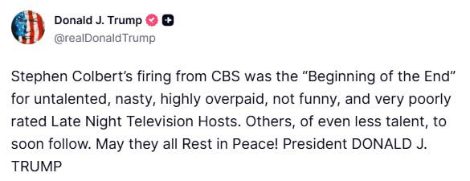

🔴 ترامپ:

اخراج استیون کولبرت از CBS «آغاز پایان» مجریان تلویزیون شبانه بی‌استعداد، بدجنس، پول‌پرست، خنده‌دار نبودن و با رتبه پایین است. بقیه کم‌استعدادها هم به زودی دنبال می‌شوند. روح همه‌شان شاد!

@IranianMinds

## IranianMinds — post 20546

🔴 آکسیوس :

میانجی‌ ها در حال آماده کردن نامه‌ای برای پایان جنگ ایران و آغاز ۳۰ روز مذاکرات درباره توافق جامع هسته‌ای هستند.

@IranianMinds

## IranianMinds — post 20545

🔴 مارکو روبیو وزیر خارجه آمریکا:

می‌خواهیم با ایران به توافقی برسیم که شامل باز کردن تنگه هرمز و کنار گذاشتن برنامه هسته‌ای آن باشد.

@IranianMinds

## IranianMinds — post 20544

🔴 مارکو روبیو وزیر امور خارجه آمریکا:

فکر میکنم پیشرفت‌هایی در مورد ایران وجود دارد، اما هنوز به پایان نزدیک نشده‌ایم.

@IranianMinds

## IranianMinds — post 20543

  

🔴 الحدث: فرمانده ارتش پاکستان، عاصم منیر، به سمت تهران حرکت کرد. @IranianMinds

## IranianMinds — post 20542

  

🔴مارک لوین:

زمان نابودی رژیم ایران فرا رسیده است. بیایید کار را تمام کنیم، بگذارید کار را به انجام برسانیم.

@IranianMinds

## BBCPersian — post 281800

🔻ایران خطاب به آلمان: منشور ملل متحد مفهومی با عنوان جنگ ضروری نمی‌شناسد

سخنگوی وزارت خارجه ایران گفته است حمله آمریکا و اسرائیل به ایران و جنگی که در پی آن رخ داد، «نقض آشکار» منشور سازمان ملل متحد بوده است.

اسماعیل بقایی در پیامی در ایکس خطاب به فرانک‌والتر اشتاین‌مایر، رئیس‌جمهور آلمان، نوشت: «منشور سازمان ملل هیچ مفهومی تحت عنوان “جنگ ضروری” را به رسمیت نمی‌شناسد که به [آمریکا] حق دهد بر اساس تصمیمات خودسرانه و دلبخواهی متجاوزان، علیه یک کشور مستقل از زور استفاده کند.»

رئیس جمهور آلمان اخیرا درباره جنگ آمریکا و اسرائیل درباره ایران اظهارنظر کرده بود. او در مصاحبه با یک پادکست آلمانی گفته بود که جنگ اخیر با ایران غیر ضروری و قابل اجتناب بود.

سخنگوی وزارت خارجه ایران امروز در واکنش به این اظهارات گفته است «حمله آمریکا و اسرائیل به ایران را نمی‌توان کم‌اهمیت جلوه داد یا صرفا به‌عنوان یک "جنگ غیرضروری" بازتعریف کرد.»

آقای اشتاین‌مایر، در زمان توافق اتمی برجام، وزیر خارجه آلمان و یکی از حامیان به دست آمدن این توافق با جمهوری اسلامی ایران بود.

https://bbc.in/4v3pH4G
@BBCPersian

## BBCPersian — post 281799

ویدیوی خوانندگی و نوازندگی گروهی از زنان در موزه هنرهای معاصر مورد توجه قرار گرفت.

در جریان برنامه چهارم «موزیک تک» که روز پنجشنبه ۳۱ اردیبهشت در فضای باز و داخلی موزه هنرهای معاصر تهران برگزار شد، گروه‌های مختلف موسیقی جنوب ایران را اجرا کردند.

در این میان تک‌خوانی یک خواننده زن به همراه گروه نوازندگان که همه زن بودند با استقبال حاضران روبرو شد و انتشار ویدیوی آن هم مورد استقبال قرار گرفت.

برای ممنوعیت تک‌خوانی زنان در قوانین جمهوری اسلامی هیچ بند و ماده صریحی وجود ندارد. اما همیشه با ممنوعیت‌ها و محدودیت‌های اجرایی روبرو بوده است. بارها از نوازندگی زنان روی صحنه‌ کنسرت‌ها جلوگیری شده است.

این محدودیت‌ها برخلاف اصول حقوق بشر و حقوق زنان است. بسیاری از زنان خواننده در ایران بدون توجه به این ممنوعیت، صدایشان را منتشر کرده‌اند.
@BBCPersian

## BBCPersian — post 281798

🔻دادگستری ایلام می‌گوید اموال هفت نفر را توقیف کرده است

رئیس دادگستری استان ایلام اعلام کرده است که «اموال و دارایی‌های» هفت نفر از شهروندان یکی از شهرستان‌های این استان را به دلیل آنچه که او «خائنین به وطن» خوانده «به نفع حقوق عامه» توقیف کرده است.

عمران علی‌محمدی به خبرگزاری قوه قضائیه گفت این توقیف «در راستای اعمال مجازات مصادره اموال موضوع قانون تشدید مجازات جاسوسی و نیز قانون نحوه اجرای اصل ۴۹ قانون اساسی» و پس از «تشکیل پرونده قضایی برای متهمین» انجام شده است.

به گفته رئیس دادگستری ایلام این اموال توقیف شده «شامل مسکن، خودرو، دارایی های بانکی و سایر اموال بوده است.»

در روزها و هفته‌های اخیر دادگستری‌ها در استان‌های مختلف ایران اعلام کرده‌اند که اموال شهروندان را با چنین اتهاماتی توقیف کرده‌اند.

در برخی موارد نام افراد نیز منتشر شده است.

https://bbc.in/4v3pH4G
@BBCPersian

## BBCPersian — post 281797

🔻رویترز: یک هیئت قطری در هماهنگی با آمریکا در تهران است

رویترز به نقل از یک منابع آگاه گزارش داده است که هیئتی از قطر در هماهنگی با آمریکا، وارد تهران شده است.

بر اساس گزارش این خبرگزاری، هدف این هیئت از سفر به تهران، کمک به حصول توافقی برای پایان دادن به جنگ با ایران و حل اختلافات باقی‌مانده است.

قطر که پیشتر در جنگ غزه و دیگر تنش‌های بین‌المللی نقش میانجی را ایفا می‌کرد، از زمان آغاز جنگ اخیر آمریکا و اسرائیل با ایران، از میانجیگری فاصله گرفته بود.

این کشور در جریان حملات اخیر آمریکا و اسرائیل به ایران، هدف حملات موشکی و پهپادی جمهوری اسلامی قرار گرفت.

https://bbc.in/4v3pH4G
@BBCPersian

## BBCPersian — post 281796

  

🔻به گزارش رسانه‌های دولتی پاکستان، فیلد مارشال عاصم منیر،‌ فرمانده ارتش این کشور راهی تهران شده است.

خبرگزاری اسوشیتد پرس پاکستان به نقل از منابع امنیتی گزارش داده است که فیلد مارشال عاصم منیر در طول این سفر رسمی، درباره «مذاکرات جاری ایران و آمریکا و صلح و ثبات منطقه‌ و منافع دوجانبه دیگر» با مقام‌های ایران گفت‌و‌گو خواهد کرد.

فرمانده ارتش پاکستان چهل روز پیش هم در تهران بود و با محمدباقر قالیباف و اعضای تیم مذاکره‌ ایران و آمریکا دیدار و گفت‌وگو کرده بود.

این در حالی است که وزیر کشور پاکستان هم برای دومین بار طی هفته اخیر به تهران رفته و در حال گفت‌وگو با مقامات ایرانی است.

مارکو روبیو، وزیر خارجه آمریکا، امروز گفت که واشنگتن در انتظار شنیدن نتیجه این گفت‌وگوهاست.

📸 Getty

https://bbc.in/4v3pH4G
@BBCPersian

## BBCPersian — post 281794

فیلم مستند «تمرین‌هایی برای یک انقلاب»، ساخته پگاه آهنگرانی جایزه «چشم طلایی» هفتاد و نهمین جشنواره فیلم کن را از آن خود کرد.

 «لوئی دور» یا چشم طلایی، مهم‌ترین جایزه بخش مستند جشنواره فیلم کن است.
 پگاه آهنگرانی جایزه‌اش را به مردم ایران تقدیم کرد و گفت: «(مردم ایران) با وجود تمام سرکوب‌هایی که در طول این سال‌ها تحمل کرده‌اند، هرگز از تلاش برای حقوقشان، آزادی‌شان و آرزوهایشان دست نکشیده‌‌اند و مطمئنم که آنها هرگز تسلیم نخواهند شد. مطمئنم و یک آرزو دارم که می‌خواهم اینجا بگویم: این‌که روزی دختر کوچکم لی‌لی و همه بچه‌های ایران در آینده‌ای نزدیک در ایرانی آزاد و دموکراتیک زندگی کنند.»

به گفته خانم آهنگرانی او با استفاده از آرشیوهای شخصی، ویدئوهای خانگی، تصاویر اعتراضات خیابانی، روزنامه‌ها و صداهای ضبط‌ شده، بیش از ۴۰ سال از تاریخ ایران را بازخوانی ‌کرده است.
@BBCPersian

## BBCPersian — post 281793

🔻روبیو: جابه‌جایی نیروهای آمریکایی در اروپا برای تنبیه متحدان مخالف جنگ با ایران نیست

وزیر خارجه آمریکا می‌گوید که جابه‌جایی نیروهای آمریکایی در اروپا با هدف «تنبیه» متحدان به‌دلیل حمایت نکردن از جنگ با ایران نیست.

مارکو روبیو روز جمعه در آستانه نشست ناتو در سوئد به خبرنگاران گفت: «آمریکا تعهداتی جهانی دارد که باید در زمینه استقرار نیروهایش به آنها عمل کند و همین موضوع به‌طور مداوم ما را وادار می‌کند که محل استقرار نیروها را دوباره بررسی کنیم. این اقدام تنبیهی نیست، بلکه یک روند جاری و معمول است.»

وزرای خارجه کشورهای عضو ناتو امروز در نشستی در سوئد در تلاش هستند تا درباره میزان تعهدات نظامی آمریکا در اروپا شفافیت بیشتری به دست آورند. آقای ترامپ پیشتر اعلام کرد که ۵ هزار نیروی نظامی به لهستان اعزام می‌کند.

آمریکا قبل از آن یک رزمایش بزرگ در لهستان را لغو کرده و گفته بود که قصد دارد هزاران سرباز خود را از آلمان خارج کند.

دونالد ترامپ بارها از موضع کشورهای عضو ناتو در قبال جنگ ایران و عدم حمایتشان از آمریکا در این جنگ علنا انتقاد کرده بود.

https://bbc.in/4v3pH4G
@BBCPersian

## Dirty_Kids — post 389960

اگه مادرجندگی یک سکه باشه، یه سمتش واشقانیه سمت دیگه‌ش شهبازی.

@Dirty_Kids 👻

## Dirty_Kids — post 389959

  

+ چرا اشک تو چشمات جمع شد این که فقط یه گل تو فوتبال

#رشید_مظاهری

@Dirty_Kids 👻

## Dirty_Kids — post 389958

  <a href="https://t.me/Dirty_Kids/389958" target="_blank">📎 Download file</a>

✅ اپلیکیشن اندروید سایت جهانی دربی بت

💰اولین سایت جهانی با امکان شارژ و برداشت ریالی(کارت به کارت)

🔗 برای ورود فیلترشکن روی کشور مناسب قرار دهید مانند فنلاند و المان و....

😀Telegram Channel
👇
https://t.me/+bcynkEgSW2dlYTc0

## Dirty_Kids — post 389957

  

😤دنبال یه سایت شرط بندی بین المللی بودی که به ایرانیا خدمات بده؟!
⛔

👍دربی بت همون انتخاب  100%

💎ویژگی های سایت جهانی Derby Bet:

⬅️امکان شارژ امن با کارت بانکی

⬅️واریز اول دوبل شارژ می شوید(بونوس۱۰۰٪)

⬅️پر اپشن ترین سایت فعال در ایران

⬅️تسویه حساب کمتر از 5 دقیقه

⬅️برگشت بخشی از باخت به صورت هفتگی

🚨کد هدیه ثبت نام:GG007

⚠️برای دانلود اپلکیشن کلیک کنید
👉

🔔کانال دربی بت :

🪙https://t.me/+bcynkEgSW2dlYTc0

## Dirty_Kids — post 389956

تمام ساید های زندگیم رو هواست؛ عاطفی، تحصیلی، کاری، کیرخری.

@Dirty_Kids 👻

## Dirty_Kids — post 389955

🔴 جدیدا دخترا دائم دارن پست میزنن که از پسرای نسل جدید و پسرایی که حداقل ۱۰ سال از خودشون کوچیک ترن خیلی خوششون میاد.

به این صورت که دخترای دهه ۶۰-۷۰ عاشق پسرای دهه ۸۰-۹۰ شدن!

@Dirty_Kids 👻

## Dirty_Kids — post 389954

  <a href="telegram/content/Dirty_Kids_389954_1779467773.mp4" target="_blank">🎬 Download video</a>

ترامپ:

ایران داره از شدت نیاز، برای توافق له‌له می‌زنه؛

ما ضربه سنگینی بهشون زدیم، چاره‌ای هم نداشتیم، چون ایران نباید به سلاح هسته‌ای دست پیدا کنه.

@Dirty_Kids 👻

## Dirty_Kids — post 389953

  

‏شیلی با یه همچین جغرافیای عجیبی چجور میتونه کشور باشه؟

مردم شیلی دور هم جمع نمیشن، همیشه کنار همن

@Dirty_Kids 👻

## Dirty_Kids — post 389952

  <a href="telegram/content/Dirty_Kids_389952_1779467774.mp4" target="_blank">🎬 Download video</a>

لباس بدن نما ، سوتین به سمت کعبه! آرایش غلیظ و بی حجاب و پروژه خفن!😂
لوازم کار جنده های نظام در نزدیکیهای سقوط
چقدر شما مادرقحبه اید؟! انتها نداره.

@Dirty_Kids 👻

## Dirty_Kids — post 389951

  

🌪وقتی اینترنت طوفانیه فقط کافیه بادبان ها رو بکشی

⚫️100 هزار تومان تخفیف خرید اول 
🎁

⚫️پایین ترین قیمت گیگی 180 هزار تومان
🌐 

⚫️پورسانت %10 دائمی برای هر معرفی
💼

با بادبان، میتونی یه اتصال سریع، پایدار و امن
همراه با پشتیبانی ۲۴ ساعته داشته باشی
🚀

🛒کد تخفیف: badban4k

بادبان راهتو باز می‌کنه
⛵️
G1

🛡@BadBan_VPN | کانال 

🤖@BadBan_VPNBot | ربات 

📞@BadBan_VPNSupport | پشتیبانی

## Dirty_Kids — post 389950

  <a href="telegram/content/Dirty_Kids_389950_1779467775.mp4" target="_blank">🎬 Download video</a>

چرا رژیم چنج برای ترامپ حیاتی هست

@Dirty_Kids 👻

## Dirty_Kids — post 389949

  <a href="telegram/content/Dirty_Kids_389949_1779467777.mp4" target="_blank">🎬 Download video</a>

آخر شب در خیابونای مملکت چه میگذرد:

@Dirty_Kids 👻

## Dirty_Kids — post 389947

دختر آیت‌الله vs طرفداران آیت‌الله

@Dirty_Kids 👻

## Dirty_Kids — post 389946

  <a href="telegram/content/Dirty_Kids_389946_1779467777.mp4" target="_blank">🎬 Download video</a>

مردم ایران برای چکش کردند هوا باید به وی پی ان وصل شوند
لعنت بر ج ا

@Dirty_Kids 👻

## Dirty_Kids — post 389942

  <a href="telegram/content/Dirty_Kids_389942_1779467779.mp4" target="_blank">🎬 Download video</a>

چالش Booty Transition🍑 تو کمترین زمان ممکن به ترند ترین چالش کل فضای مجازی تبدیل شد؛

طوری که حتی پسرای خارجی هم صداشون دراومده:

@Dirty_Kids 👻

## Hranews — post 113095

  

معاون وزیر راه‌وشهرسازی و مدیرعامل شرکت بازآفرینی شهری کشور نسبت به وضعیت بافت‌های فرسوده و ناپایدار در ایران هشدار داد. به گفته علیرضا گلپایگانی، نزدیک به ۵ میلیون نفر در واحدهای مسکونی به‌شدت ناپایدار سکونت دارند و حدود ۲۰ میلیون شهروند نیز در بافت‌های فرسوده و ناکارآمد شهری زندگی می‌کنند. این در حالی است که این شهروندان از نظر تاب‌آوری، سرانه‌های خدماتی و کیفیت فضای زندگی با مشکلات زیادی مواجه هستند.

وی با تأکید بر ضرورت توجه به بازآفرینی شهری اعلام کرد که بی‌توجهی به وضعیت این مناطق می‌تواند هزینه‌های سنگینی را برای کشور به همراه داشته باشد.

↘️
@hranews_bot تماس ✉️ - @Hranews کانال هرانا 🆑

## Hranews — post 113094

  

ایران در محاصره بحران‌های محیط‌ زیستی؛ مروری بر رویدادهای دو هفته گذشته

❗️
❗️
❗️
❗️
❗️– حق بر #محیط_زیست و برخورداری از منابع طبیعی سالم، از بنیادی‌ترین حقوق انسانی به شمار می‌رود. با این حال، تداوم بهره‌برداری بی‌رویه از منابع طبیعی، کاهش نظارت مؤثر، گسترش آلاینده‌ها، خشکسالی‌های پی‌درپی و تخریب زیستگاه‌های طبیعی، محیط زیست ایران را با بحران‌های گسترده‌ای روبه‌رو کرده است. گزارش پیش‌رو حاصل ثبت ۸۴ گزارش و رویداد محیط زیستی منتشرشده در دو هفته اخیر است که با هدف آگاه‌سازی افکار عمومی گردآوری شده است.

به گزارش خبرگزاری هرانا، ارگان خبری مجموعه فعالان حقوق بشر در ایران، در دو هفته‌ای که گذشت، دست‌کم ۷۸ شکارچی، صیاد، متخلف محیط زیستی و قاچاقچی چوب بازداشت و شناسایی شدند. همچنین، بیش از ۴۳ تن چوب قاچاق و مقادیر قابل توجهی گیاهان کوهی و محصولات طبیعی کشف و ضبط شد. افزون بر این، شاخص کیفیت هوا در دست‌کم ۴۲ شهر در وضعیت ناسالم، بسیار ناسالم و خطرناک قرار گرفت. از سوی دیگر، گزارش‌های متعددی درباره تشدید تنش آبی، خشکسالی، تهدید گونه‌های جانوری، تخریب زیستگاه‌ها، بحران پسماند و اثرات جنگ و آلاینده‌های صنعتی بر محیط زیست منتشر شد که در ادامه به بخشی از آنها پرداخته می‌شود.

آسیب رسانی به جنبه‌های مختلف محیط زیست در ایران کماکان ادامه دارد. از یک سو، فقر، نبود آموزش‌های محیط زیستی و سودجویی موجب تخریب منابع طبیعی و حیات وحش شده و از سوی دیگر، نهادهای متولی با محدودیت امکانات و کمبود نیرو در تلاش برای کاهش ابعاد این بحران‌ها هستند؛ هرچند به نظر نمی‌رسد حجم اقدامات انجام‌شده متناسب با شدت بحران‌های محیط زیستی کشور باشد.

ادامه مطلب

↘️
@hranews_bot تماس ✉️ - @Hranews کانال هرانا 🆑

## manototv — post 105746

  <a href="telegram/content/manototv_105746_1779467782.mp4" target="_blank">🎬 Download video</a>

پیام یک مخاطب منوتو درباره پایان پخش برنامه‌های این شبکه

## manototv — post 105745

  <a href="telegram/content/manototv_105745_1779467783.mp4" target="_blank">🎬 Download video</a>

پیام یک مخاطب منوتو درباره پایان پخش برنامه‌های این شبکه

## alonews — post 121829

  <a href="telegram/content/alonews_121829_1779467784.webm" target="_blank">🎬 Download video</a>

👈العربی الجدید به نقل از منبعی در وزارت خارجه پاکستان: واشنگتن و تهران انعطاف کافی در پرونده‌های اصلی از خود نشان نمی‌دهند

✅ @AloNews خبر جنگ

## alonews — post 121828

  <a href="telegram/content/alonews_121828_1779467784.webm" target="_blank">🎬 Download video</a>

👈ایسنا: عاصم منیر وارد تهران شد

✅ @AloNews خبر جنگ

## alonews — post 121827

  <a href="telegram/content/alonews_121827_1779467784.mp4" target="_blank">🎬 Download video</a>

👈کوین وارش رسماً به عنوان هفدهمین رئیس فدرال رزرو سوگند یاد کرد

✅ @AloNews خبر جنگ

## alonews — post 121826

  <a href="telegram/content/alonews_121826_1779467786.webm" target="_blank">🎬 Download video</a>

👈العربی الجدید به نقل از منبعی در وزارت خارجه پاکستان: واشنگتن و تهران انعطاف کافی در پرونده‌های اصلی از خود نشان نمی‌دهند.

🔴سفر فرمانده ارتش (پاکستان) به تهران ممکن است آخرین تلاش برای جلوگیری از بازگشت منطقه به جنگ باشد

✅ @AloNews خبر جنگ

## alonews — post 121825

  <a href="telegram/content/alonews_121825_1779467786.mp4" target="_blank">🎬 Download video</a>

👈ترامپ : من اینو زیاد میگم پادشاه عربستان به من گفت ما داغ ترین کشور دنیا هستیم

✅ @AloNews خبر جنگ

## alonews — post 121824

  <a href="telegram/content/alonews_121824_1779467788.webm" target="_blank">🎬 Download video</a>

👈ترامپ: ما بزرگترین ارتش جهان را داریم و بودجه دفاعی ۱.۵ تریلیون دلاری می‌خواهیم

✅ @AloNews خبر جنگ

## alonews — post 121823

  <a href="telegram/content/alonews_121823_1779467788.webm" target="_blank">🎬 Download video</a>

👈ترامپ : خواهیم دید که اوضاع چگونه پیش خواهد رفت.

✅ @AloNews خبر جنگ

## alonews — post 121822

  <a href="telegram/content/alonews_121822_1779467788.webm" target="_blank">🎬 Download video</a>

👈ترامپ: ضربات سختی به ایران زدیم و چاره دیگری نداشتیم

✅ @AloNews خبر جنگ

## alonews — post 121821

  <a href="telegram/content/alonews_121821_1779467788.webm" target="_blank">🎬 Download video</a>

👈ترامپ: ایران به شدت خواهان توافق است!

🔴همان کاری را که در ونزوئلا انجام دادیم، در ایران انجام می دهیم

✅ @AloNews خبر جنگ

## alonews — post 121820

  <a href="telegram/content/alonews_121820_1779467788.mp4" target="_blank">🎬 Download video</a>

👈ترامپ : من با رئیس جمهور شی بودم و بهش گفتم ما بهترین ارتش دنیا رو داریم اون واقعاً مخالفت نکرد جلسه خوبی داشتیم در واقع با من مخالفت هم نکرد

✅ @AloNews خبر جنگ

## alonews — post 121819

  <a href="telegram/content/alonews_121819_1779467789.mp4" target="_blank">🎬 Download video</a>

👈ترامپ : ما یه مقدار بدهی داریم که باید حلش کنیم و راهش رشد اقتصادیه قراره با رشد خیلی سریع از این بدهی خارج بشیم

✅ @AloNews خبر جنگ

## alonews — post 121818

  <a href="telegram/content/alonews_121818_1779467791.mp4" target="_blank">🎬 Download video</a>

👈 جمعیت: *تشویق برای کوین وارش*

🔴 ترامپ: فکر کردم این تشویق برای من است. خیلی ناراحت شدم. به اطراف نگاه کردم و دیدم که همه به شما نگاه می‌کنند. من از این موضوع خوشحال نبودم.

✅ @AloNews خبر جنگ

## alonews — post 121817

  <a href="telegram/content/alonews_121817_1779467792.webm" target="_blank">🎬 Download video</a>

👈رایزنی اولیانوف و گروسی درباره وضعیت خلیج فارس

✅ @AloNews خبر جنگ

## alonews — post 121816

  <a href="telegram/content/alonews_121816_1779467792.webm" target="_blank">🎬 Download video</a>

👈منابع خبری از سفر مارکو روبیو، وزیر خارجه آمریکا به دهلی نو، پایتخت هند خبر دادند.
 

🔴موضوع انرژی در بحبوحه جنگ علیه  ایران و فروش تسلیحات به هند از محورهای گفتگوی روبیو با مقام‌های هند خواهد بود.

✅ @AloNews خبر جنگ

## alonews — post 121815

  <a href="telegram/content/alonews_121815_1779467793.webm" target="_blank">🎬 Download video</a>

👈وال استریت ژورنال با استناد به داده‌های کپلر: ۹۰ درصد مخازن ذخیره‌سازی نفت ایران در خشکی پر شده است

✅ @AloNews خبر جنگ

## alonews — post 121814

  <a href="telegram/content/alonews_121814_1779467793.webm" target="_blank">🎬 Download video</a>

👈رئیس شورای عالی سیاسی یمن: هرگونه تجاوز جدید آمریکا یا اسرائیل با پاسخ قاطع مواجه خواهد شد

✅ @AloNews خبر جنگ

## alonews — post 121813

  <a href="telegram/content/alonews_121813_1779467793.webm" target="_blank">🎬 Download video</a>

👈الحدث: ژنرال عاصم منیر، فرمانده ارتش پاکستان، به تهران وارد شد.

✅ @AloNews خبر جنگ

## alonews — post 121812

  <a href="telegram/content/alonews_121812_1779467793.webm" target="_blank">🎬 Download video</a>

👈وال استریت ژورنال: صادرات نفت ایران از طریق دریا به دلیل محاصره به سطح صفر کاهش یافته است

✅ @AloNews خبر جنگ

## alonews — post 121811

  <a href="telegram/content/alonews_121811_1779467793.webm" target="_blank">🎬 Download video</a>

👈مقامات اتحادیه اروپا اعلام کردند که اروپایی‌ها می‌توانند انتظار داشته باشند که قیمت نفت و گاز حداقل تا پایان سال ۲۰۲۷ بالاتر از قیمت قبل از جنگ باقی بماند و قیمت سایر کالاها نیز روند صعودی را دنبال می‌کند

✅ @AloNews خبر جنگ

## alonews — post 121810

  <a href="telegram/content/alonews_121810_1779467793.webm" target="_blank">🎬 Download video</a>

👈العربیه: اگر تفاهمی بین آمریکا و ایران حاصل شود، توافق تک صفحه‌ای به نام «بیانیه اسلام‌آباد» خواهد بود

🔴پس از دستیابی به توافق احتمالی، مذاکرات جامعی در یک بازه زمانی مشخص انجام خواهد شد

✅ @AloNews خبر جنگ

<!-- MSG END -->

<!-- NAV START -->

<a href="https://github.com/ProAlit/aio-downloader/blob/main/telegram/content/archive_1.md" style="display:inline-block; padding:6px 12px; margin:0 4px; background-color:#2ea44f; color:white; text-decoration:none; border-radius:4px; font-weight:bold;">صفحه بعد</a>

<!-- NAV END -->
